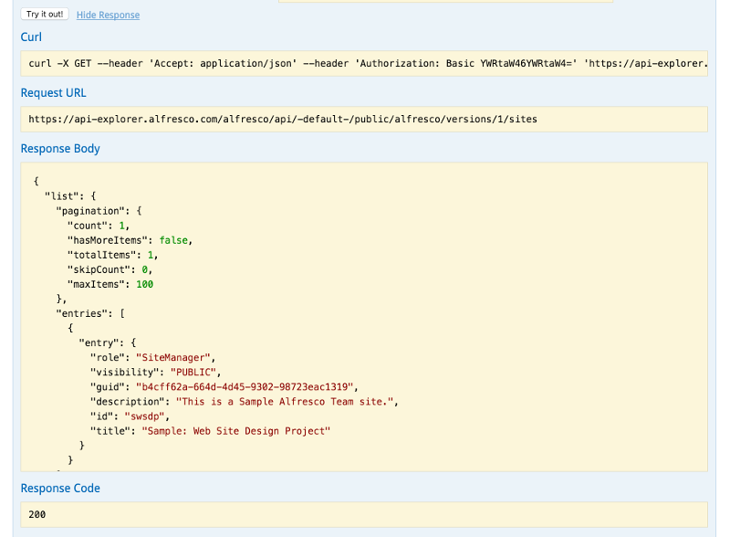

# REST API

The REST API lets you access content in an on-premise Alfresco repository, and in Alfresco cloud, from your own applications. The API is RESTful, which means each call is an HTTP request, so you don't even need a programming language to try it out. You can just type a URL address in a web browser.

The REST API consists of two parts, the CMIS REST API, which lets you manage and access folders and files in the repository, and the Alfresco REST API, which lets you manage Alfresco-specific features such as ratings and comments, that are not covered by the CMIS standard.

-   Use the [CMIS REST API](cmis-welcome.md) to manage files and folders and their generic properties in the repository. For example, if you want to read, write, modify, create, or delete a file, then this is the API you use.
-   Use the [Alfresco REST API](pra-welcome-aara.md) to manipulate Alfresco content features that are not part of the CMIS specification. Ratings and comments are two examples of such features, and you can find a full list [here](../concepts/pra-resources.md).

## Getting started

The quickest way to get started is to use our online [REST API Explorer](../concepts/pra-rest-api-explorer.md), based on the [OpenAPI initiative](https://openapis.org/). It gives you full documentation for each endpoint, and a **Try it out!** button so you can use each method.

You make API requests by sending a URL using one of five HTTP API methods, GET, POST, PUT, DELETE, and OPTIONS. Here's an example of a request to an Alfresco on-premise instance:

```

http://api-explorer.alfresco.com/alfresco/api/-default-/public/alfresco/versions/1/sites
```

You can use the REST API Explorer to make this request:

-   In your web browser, navigate to `https://api-explorer.alfresco.com/api-explorer/#!/sites/getSites`. You'll see full documentation for the **GET sites** API method, including the query and body parameter formats, and the expected and error response schemas.
-   At the end of the description you'll see the **Try it out!** button. Press it now.

    You've just made your first Alfresco REST API request. You will see the request URL you've just invoked, the corresponding Curl command, the JSON response body that the Alfresco repository has returned, the HTTP response code, and the response headers: 


Note this call returns a list of site **entries**. All lists returned by the Alfresco REST API are of this format.

-   **[How does an application do work on behalf of a user?](../../../pra/1/concepts/pra-authentication.md)**  
Your application must authenticate with the Alfresco server to work with Alfresco resources. If your application is using resources on an Alfresco on-premise repository it uses basic HTTP authentication. If your application is using resources on an Alfresco Cloud account it uses OAuth authentication.
-   **[CMIS REST API](../../../pra/1/topics/cmis-welcome.md)**  
Alfresco fully implements both the CMIS 1.0 and 1.1 standards to allow your application to manage content and metadata in an Alfresco repository or in Alfresco cloud. Here is a brief overview of the URL format for CMIS REST API calls, and explains the format of responses.
-   **[Alfresco REST API](../../../pra/1/topics/pra-welcome-aara.md)**  
The Alfresco REST API lets you manage alfresco-specific features of content in an on-premise Alfresco repository, and in Alfresco cloud from your own applications.

**Parent topic:**[Reference](../../../concepts/dev-reference-guide.md)

