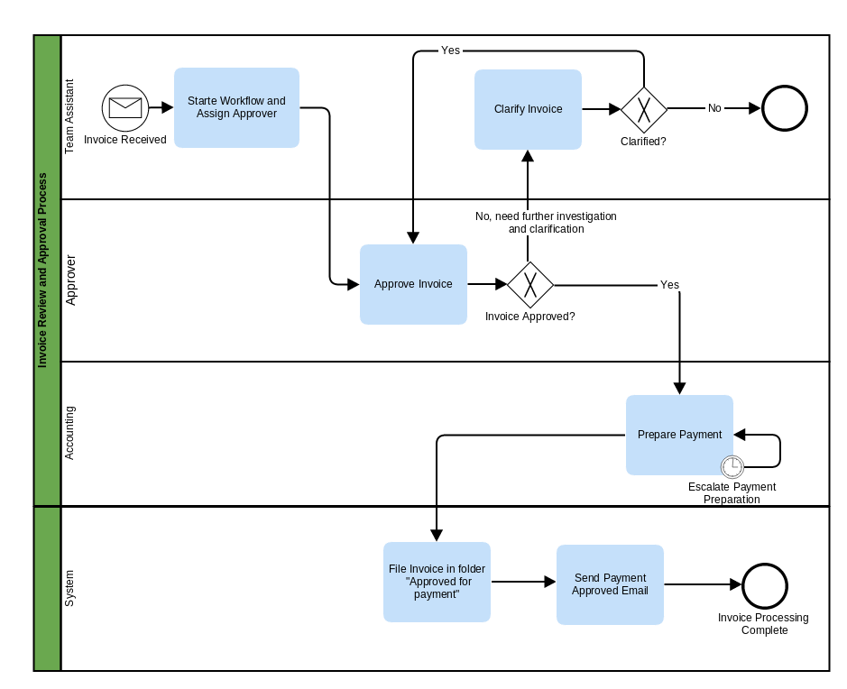
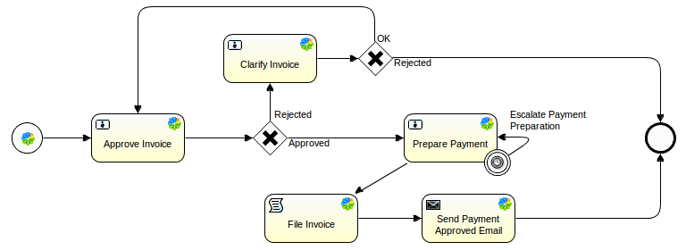
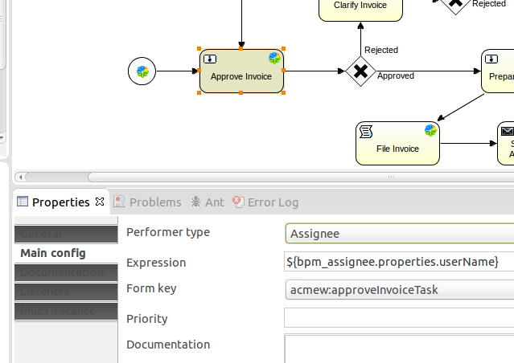
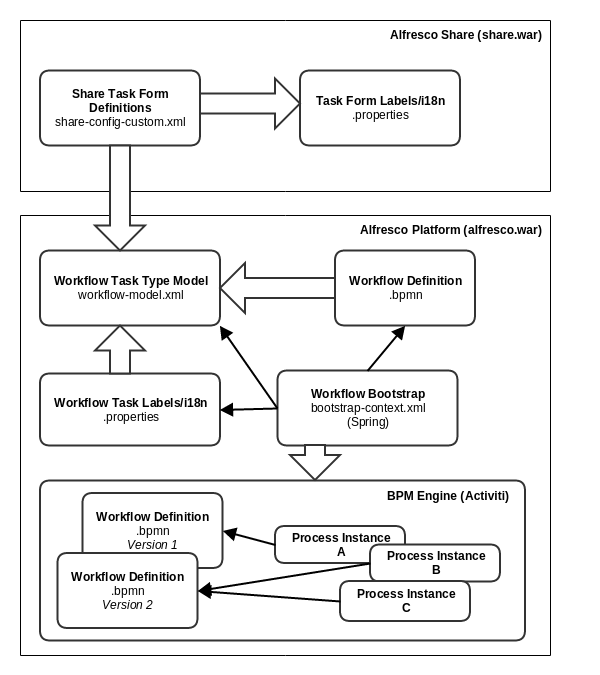

# Workflow

Alfresco One includes the Activiti Workflow Engine as standard. You can create custom workflows to manage your business processes.

|Information|Workflow|
|-----------|--------|
|Support Status|[Full Support](http://docs.alfresco.com/support/concepts/su-product-lifecycle.html)|
|Architecture Information|[Platform Architecture](../concepts/dev-platform-arch.md)|
|Description|Content often needs to be manipulated in different ways as part of a business process. This could be a simple review and approve process, or a more complex business process such as a loan application process. Alfresco comes with the [Activiti](http://activiti.org/) workflow engine built in to support business processes. Alfresco also provides a number of workflow implementations \(processes\) out-of-the-box:

 -   **New Task** - Assign a new task to yourself or a colleague
-   **Review and Approve \(group review\)** - Assign a review task to a group
-   **Review and Approve \(one or more reviewers\)** - Assign a review task to multiple reviewers
-   **Review and Approve \(pooled review\)** - Assign a review task to multiple reviewers, who can take ownership of the task
-   **Review And Approve \(single reviewer\)** - Assign a review task to a single reviewer

 If you need a simple Review and Approve workflow, then you might not need to implement a custom workflow, as you can use the out-of-the-box workflow. This extension point documentation describes the process of creating a custom workflow. It is advisable to [try out](../concepts/mytasks.md) the standard workflows before starting an implementation of a custom one.

 When implementing a custom workflow it is good practice to start with a [Swim-lane](https://en.wikipedia.org/wiki/Swim_lane) diagram as it provides an easy way to see what participant \(user, group, system\) should do what in the workflow. A swim-lane diagram is also easy to discuss around when you have many different types of stakeholders, such as developers, architects, business analysts, end-users.

 For example, consider the following Invoice Payment Approval Process:

 

 This process is initiated when a **Team Assistant** receives an invoice and uploads it to Alfresco. Then this workflow is started with the invoice attached. The first task is assigned to the **Team Assistant** themselves so he or she can pick who is going to be approving the invoice.

 The approver receives the approve invoice task, which will be completed with a `Yes` or `No` outcome. If the outcome is `No`, then the **Team Assistant** will get a task to investigate the invoice further and clarify if it really should be sent for approval or not. On the other hand, if the approve outcome is Yes, then the **Accounting** team will get a task to prepare the invoice for payment. After this a service task is created so the **System** \(that is Alfresco\) can file the invoice in the appropriate folder. Finally, an email will be sent to the team assistant that started the process informing them that the invoice has been approved for payment.

 It is now easy to move on and draw this business process with the designer tool that comes with the Activiti workflow engine. It is called Activiti Designer and runs as an Eclipse plug-in. Follow [these instructions](../topics/wf-activiti-designer-setup.md) to set it up. Once you have the Designer running you can create a new Activiti Project \(**File \| New \| Project \| Activiti Project**\) and an Activiti Diagram \(**src-\>main-\>resources \| diagrams \| New \| Other \| Activiti \| Activiti Diagram**\).

 Using the Palette to the right in the Designer you can drag and drop BPMN components onto the diagram area in the middle. The following shows an example design:

 

 This diagram uses the BPMN standard and notation but note that Alfresco specific components have been used for the user tasks and service tasks. By using the Alfresco specific components the BPMN XML will be pre-populated with Alfresco and Activiti specific syntax for assigning users \(`activiti:assignee`\), forms \(`activiti:formKey`\), and scripts \(`activiti:class`\). Note that this deviates from the BPMN standard and the workflow definition cannot now be deployed to any other workflow engine than Activiti.

 When you design and configure the workflow in Activiti Designer the corresponding BPMN XML is generated for you:

 ```
<?xml version="1.0" encoding="UTF-8"?>
<definitions xmlns="http://www.omg.org/spec/BPMN/20100524/MODEL" xmlns:xsi="http://www.w3.org/2001/XMLSchema-instance" xmlns:xsd="http://www.w3.org/2001/XMLSchema" xmlns:activiti="http://activiti.org/bpmn" xmlns:bpmndi="http://www.omg.org/spec/BPMN/20100524/DI" xmlns:omgdc="http://www.omg.org/spec/DD/20100524/DC" xmlns:omgdi="http://www.omg.org/spec/DD/20100524/DI" typeLanguage="http://www.w3.org/2001/XMLSchema" expressionLanguage="http://www.w3.org/1999/XPath" targetNamespace="http://www.activiti.org/test">
  <process id="invoiceProcess" name="Invoice Payment Approval and Preparation Process" isExecutable="true">
    <startEvent id="invoiceReceivedAlfrescoStartevent" name="Invoice Received Alfresco start"
                activiti:formKey="acmew:startInvoiceApprovalTask"></startEvent>
    <sequenceFlow id="flow1" sourceRef="invoiceReceivedAlfrescoStartevent" targetRef="approveInvoiceAlfrescoUsertask"></sequenceFlow>

    <userTask id="approveInvoiceAlfrescoUsertask" name="Approve Invoice"
              activiti:assignee="${bpm_assignee.properties.userName}"
              activiti:formKey="acmew:approveInvoiceTask">
      <extensionElements>
        <activiti:taskListener event="create" class="org.alfresco.repo.workflow.activiti.tasklistener.ScriptTaskListener">
          <activiti:field name="script">
            <activiti:string>
                if (typeof bpm_workflowDueDate != 'undefined') task.dueDate = bpm_workflowDueDate
                if (typeof bpm_workflowPriority != 'undefined') task.priority = bpm_workflowPriority;

                var invoiceFile = bpm_package.children[0];
                task.description = "Approve Invoice for payment: " + invoiceFile.name;
            </activiti:string>
          </activiti:field>
        </activiti:taskListener>
        <activiti:taskListener event="complete" class="org.alfresco.repo.workflow.activiti.tasklistener.ScriptTaskListener">
          <activiti:field name="script">
            <activiti:string>
                        execution.setVariable('acmew_invoiceApprovalOutcome', task.getVariable('acmew_invoiceApprovalOutcome'));
                        </activiti:string>
          </activiti:field>
        </activiti:taskListener>
      </extensionElements>
    </userTask>
    . . .
    
```

 The detail of the XML workflow definition depends on how much information you fill in when working from the Activiti Designer. You might simply draw up the basic process definition and then work directly in the XML, or you might fill in extra information for each task:

 

 To be able to select the Form key for the task, you need to define in Activiti Designer the tasks you are going to use in the Workflow Model. Form keys are added to preferences before they can be used \(**Window \| Preferences \| Activiti \| Alfresco settings**\). Each of the Form keys points to a workflow model task type that looks similar to the following:

 ```
<type name="acmew:approveInvoiceTask">
   <description>
       The task is assigned to the approver selected by the initiator.
   </description>
   <parent>bpm:workflowTask</parent>
   <properties>
       <property name="acmew:invoiceApprovalOutcome">
           <type>d:text</type>
           <default>Rejected</default>
           <constraints>
               <constraint name="acmew:invoiceApprovalOutcomeOptions" type="LIST">
                   <parameter name="allowedValues">
                       <list>
                           <value>Approved</value>
                           <value>Rejected</value>
                       </list>
                   </parameter>
               </constraint>
           </constraints>
       </property>
   </properties>
</type>
```

 The task type defines what data is going to be stored for the User task.

 The form key also points to the actual form that will display the task data:

 ```
<config evaluator="task-type" condition="acmew:approveInvoiceTask">
  <forms>
      <form>
          <field-visibility>
              <show id="message" />
              <show id="taskOwner" />
              <show id="bpm:priority" />
              <show id="bpm:dueDate" />
              <show id="bpm:taskId" />
              <show id="bpm:status" />
              <show id="packageItems" />
              <show id="bpm:comment" />

              <show id="acmew:invoiceApprovalOutcome" />
          </field-visibility>
          <appearance>
              <set id="" appearance="title" label-id="workflow.set.task.info" />
              <set id="info" appearance="" template="/org/alfresco/components/form/3-column-set.ftl" />
              <set id="progress" appearance="title" label-id="workflow.set.task.progress" />
              <set id="items" appearance="title" label-id="workflow.set.items" />
              <set id="response" appearance="title" label-id="workflow.set.response" />

              <field id="message">
                  <control template="/org/alfresco/components/form/controls/info.ftl" />
              </field>
              <field id="taskOwner" set="info" />
              <field id="bpm:taskId" set="info">
                  <control template="/org/alfresco/components/form/controls/info.ftl" />
              </field>
              <field id="bpm:priority" set="info" read-only="true">
                  <control template="/org/alfresco/components/form/controls/workflow/priority.ftl" />
              </field>
              <field id="bpm:dueDate" set="info" label-id="workflow.field.due">
                  <control template="/org/alfresco/components/form/controls/info.ftl" />
              </field>
              <field id="bpm:status" set="progress" />
              <field id="packageItems" set="items" />
              <field id="bpm:comment" label-id="workflow.field.comment" set="response">
                  <control template="/org/alfresco/components/form/controls/textarea.ftl" />
              </field>
              <field id="acmew:invoiceApprovalOutcome" label-id="workflow.field.outcome" set="response">
                  <control template="/org/alfresco/components/form/controls/workflow/activiti-transitions.ftl" />
              </field>
          </appearance>
      </form>
  </forms>
</config>
```

 Once the workflow implementation is complete it needs to be bootstrapped into the Alfresco server. This is done with the following Spring bean configuration:

 ```
<bean id="org.alfresco.tutorial.customworkflow.workflowBootstrap" parent="workflowDeployer">
     <property name="workflowDefinitions">
         <list>
             <props>
                 <prop key="engineId">activiti</prop>
                 <prop key="location">alfresco/module/${project.artifactId}/workflows/simple-invoice-process.bpmn</prop>
                 <prop key="mimetype">text/xml</prop>
                 <prop key="redeploy">true</prop>
             </props>
         </list>
     </property>
     <property name="models">
         <list>
             <value>alfresco/module/${project.artifactId}/model/workflow-model.xml</value>
         </list>
     </property>
     <property name="labels">
         <list>
             <value>alfresco/module/${project.artifactId}/messages/workflow-messages</value>
         </list>
     </property>
 </bean>
```

 This bootstraps the process definition, workflow task model, and task labels in one go.

 The following picture summarizes the components involved when designing and implementing a custom workflow:



|
|Deployment - App Server|-   tomcat/shared/classes/alfresco/extension - Workflow definition, Task Type Model, Properties
-   tomcat/shared/classes/alfresco/web-extension/share-config-custom.xml - Task Forms

|
|[Deployment - SDK Project](../tasks/alfresco-sdk-tutorials-amp-archetype.md)|-   repo-amp/src/main/amp/config/alfresco/module/repo-amp/context/boostrap-context.xml - Bootstrap workflow definition, task model, and labels
-   repo-amp/src/main/amp/config/alfresco/module/repo-amp/model/workflow-model.xml - Workflow Task Type Model
-   repo-amp/src/main/amp/config/alfresco/module/repo-amp/messages/workflow-messages.properties - Workflow Task Labels \(title and description\)
-   repo-amp/src/main/amp/config/alfresco/module/repo-amp/workflows/<workflow definition name\>.bpmn - Workflow Definition
-   share-amp/src/main/resources/META-INF/share-config-custom.xml - Task form definitions
-   share-amp/src/main/amp/config/alfresco/web-extension/messages/custom-workflow.properties - Task Form labels and headings

|
|More Information|-   [Out-of-the-box workflow definitions](https://github.com/Alfresco/community-edition/tree/master/projects/repository/config/alfresco/workflow)

|
|Sample Code|-   [Above Invoice Approval Workflow implementation \(Repo Side\)](https://github.com/Alfresco/alfresco-sdk-samples/tree/alfresco-51/all-in-one/custom-workflow-repo)
-   [Above Invoice Approval Workflow implementation \(Share Side\)](https://github.com/Alfresco/alfresco-sdk-samples/tree/alfresco-51/all-in-one/custom-workflow-share)

|
|Tutorials|-   [Jeff Potts Workflow tutorial - a must read!](http://ecmarchitect.com/alfresco-developer-series-tutorials/workflow/tutorial/tutorial.html)

|
|Alfresco Developer Blogs|None|

**Parent topic:**[Platform extension points](../concepts/dev-platform-extension-points.md)

