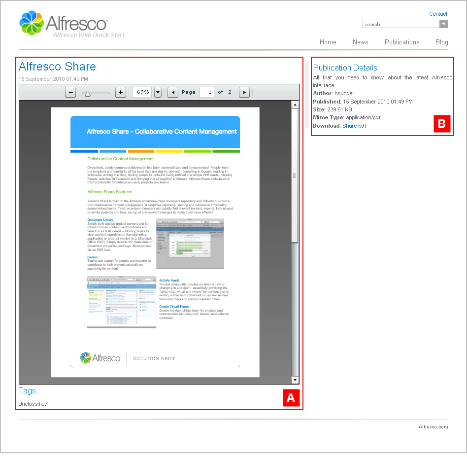

# publicationpage1

The section **Alfresco Quick Start \> Quick Start Editorial \> root \> publications** has the template mapping `cmis:document=publicationpage1`.

This is a page displaying an asset in a preview panel along with the asset details. This template page has a two column layout.

View any publication in the Publications section or its subsections \(Research Reports, White Papers\) on the Web Quick Start website to see a rendering of the `publicationpage1` template.

|A|Component: `/preview/web-preview`This component displays a Flash preview of a publication.

|
|B|Component: `/content/details`This component displays the asset details, such as the author, publication date, and file size.

|

**Parent topic:**[Templates](../references/qs-ref-templates.md)

