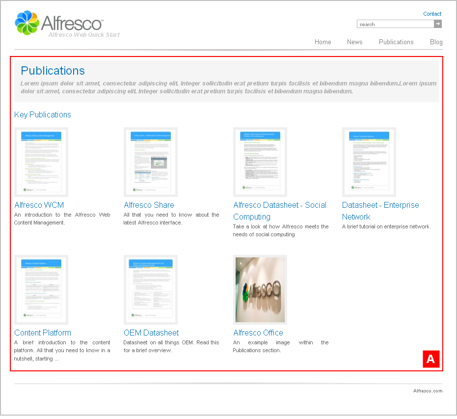

# sectionpage4

The section **Alfresco Quick Start \> Quick Start Editorial \> root \> publications** has the template mapping `ws:indexPage=sectionpage4`.

This is a section landing page template displaying thumbnails along with their titles and descriptions. This template page has a single column layout.

View the Publications landing page on the Web Quick Start website to see a rendering of the `sectionpage4` template.

|A|Component: `/list/thumbnails`This component displays a list of publications with thumbnail images.

The content is populated from:

**Quick Start Editorial \> root \> publications \> collections \> section.articles**This is a static asset collection.

|

**Parent topic:**[Templates](../references/qs-ref-templates.md)

