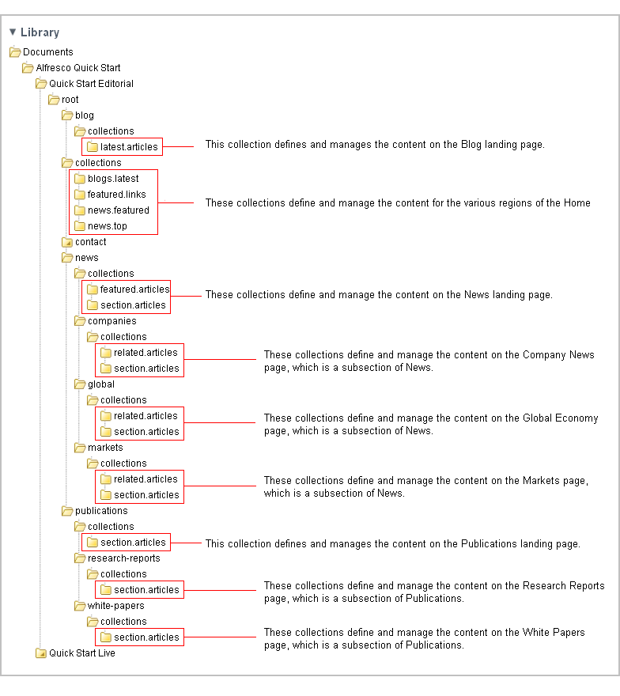

# Collections

Every section includes a **collections** subfolder, which is used to manage the asset collections for that section.

To define and manage an asset collection, edit the collection's metadata. You can specify:

-   how the web assets will be selected \(manually or by a query\)
-   how the selected assets will display on the website \(**Title** field\)
-   the maximum number of assets to display \(**Maximum Size** field\)
-   the time interval at which the query, if specified, is automatically run

The following image displays the collections in the Finance example of the Web Quick Start site in Share.

**Parent topic:**[Breaking down the Web Quick Start site structure](../references/qs-ref-anatomy.md)

