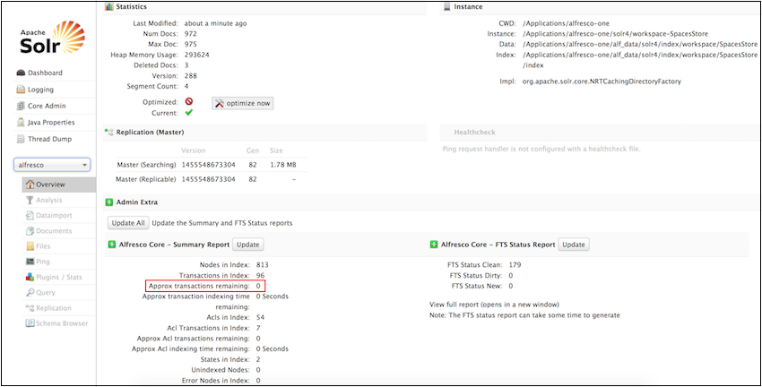

# Best practices for setting up sharded Solr indexes

Use these best practices for setting up and using a sharded Alfresco installation.

-   [Do I need sharding?](sharding-best-practices.md#1)
-   [Do I need dynamic shard registration?](sharding-best-practices.md#2)
-   [How many shards should I have?](sharding-best-practices.md#3)
-   [What are the reindexing recommendations for a sharded installation?](sharding-best-practices.md#4)
-   [Does sharding work with SSL enabled?](sharding-best-practices.md#5)
-   [What is the consideration for query load and number of documents?](sharding-best-practices.md#6)
-   [After upgrading, how do I use my current index while building a new sharded index?](sharding-best-practices.md#7)
-   [How do i know when this is done?](sharding-best-practices.md#8)
-   [Can different shards be inconsistent?](sharding-best-practices.md#9)

**Do I need sharding?**

If you plan to store 50 million + documents in your repository, you should consider sharding to maximize indexing performance and to enable horizontal scaling to massive content repositories.

[back to top](sharding-best-practices.md#)

**Do I need dynamic shard registration?**

You can set up sharding using either manual or dynamic shard registration. Alfresco recommends that you use dynamic shard registration because it is much more easier to implement than manual sharding.

[back to top](sharding-best-practices.md#)

**How many shards should I have?**

General rule of thumb is to divide the total number of documents by 50M \(million\). If you want to increase the query load or support more than 100 concurrent users, then check the memory specifications or the I/O specifications of the installation machine.

[back to top](sharding-best-practices.md#)

**What are the reindexing recommendations for a sharded installation?**

Alfresco recommends that existing customers should reindex using the `rerank` core. This has the following benefits:

-   Smaller index
-   Better query performance particularly for phrases and stop words
-   Improved cross-language search

This should allow the user to store anywhere between 50 million - 80 million documents in a single shard. For more information, see the [Alfresco Platform News](https://www.alfresco.com/blogs/how-alfresco-powered-a-1-2-billion-document-deployment-on-amazon-web-services/) and [Alfresco I billion documents press release with Amazon Aurora](https://www.alfresco.com/node/4141).

Note that changing the number of shards requires a reindex.

[back to top](sharding-best-practices.md#)

**Does sharding work with SSL enabled?**

Sharding only works if SSL is disabled. Make sure you configure the Solr and Alfresco SSL setting properly. For more information, see [Running Solr without SSL](../tasks/running-without-ssl.md).

[back to top](sharding-best-practices.md#)

**Are there any considerations for query load and number of documents?**

Before sharding your Solr index, it is important to consider your query load and the size of your repository. You need to create machines to host Solr. For more information, see [Installing and configuring Solr 4](../tasks/solr4-install-config.md). For example, if you need 5 shards, you need to setup those 5 machines, and have Solr instances running on all the 5 machines. Once your machines are ready, you are ready to set up or register shards.

For more information, see [Dynamic shard registration](../concepts/dynamic-sharding.md).

[back to top](sharding-best-practices.md#)

**After upgrading, can I use my current index while building a new sharded index?**

Yes. After upgrading to Alfresco One 5.1.5, continue to use the old search index server as before, setup a new sharded Solr server with the `rerank` template to reindex the data, and finally, switch over to the new sharded index once the indexing is done and the sharded Solr server is up-to-date.

**Upgrading from Alfresco One 5.0 and earlier versions with Solr 4 to Alfresco One 5.1.5 \(with zero downtime\)**

1.  Upgrade to Alfresco One 5.1.5 and continue to use the Solr 4 search service as before.
2.  Configure a separate sharded Solr 4 index with the [`rerank` template](../concepts/solr-core-templates.md) to track the repository. For details, see [Installing and configuring Solr shards](../tasks/install-solr-shards.md).
3.  While the new sharded Solr 4 builds its indexes, you can monitor the progress using the Solr Admin Web interface. For details, see [the next question](sharding-best-practices.md#8).
4.  When the sharded Solr 4 index is updated, enable the sharded Solr 4 index by setting the `solr.host` property. For more information, see [Activating Solr](../tasks/solr4-alfresco-config.md).

**Upgrading from Alfresco One 4.x and earlier versions with Lucene to Alfresco One 5.1.5 \(search service will be unavailable while the indexes are being built**

1.  Upgrade to Alfresco One 5.1.5 with a sharded Solr 4 installation to track the repository. Use the [`rerank` template](../concepts/solr-core-templates.md) when configuring the new Solr core. For details, see [Installing and configuring Solr shards](../tasks/install-solr-shards.md).

    **Note:** While the Solr 4 indexes are being built, you can continue to use Alfresco but the search service will not be available until the Solr 4 indexes are up-to-date.

2.  Enable the sharded Solr 4 index by setting the `solr.host` property. For more information, see [Activating Solr](../tasks/solr4-alfresco-config.md).
3.  While the new sharded Solr 4 builds its indexes, you can monitor the progress using the Solr Admin Web interface. For details, see [the next question](sharding-best-practices.md#8).

**Upgrading from Alfresco One 5.0 and earlier versions with Solr 1 to Alfresco One 5.1.5 \(with zero downtime\)**

1.  Upgrade to Alfresco One 5.1.5 and continue to use the Solr 1 search service as before.
2.  Configure a separate sharded Solr 4 index with the [`rerank` template](../concepts/solr-core-templates.md) to track the repository. For details, see [Installing and configuring Solr shards](../tasks/install-solr-shards.md).
3.  While the new sharded Solr 4 builds its indexes, you can monitor the progress using the Solr Admin Web interface. For details, see [the next question](sharding-best-practices.md#8).
4.  When the sharded Solr 4 index is updated, enable the sharded Solr 4 index by setting the `solr.host` property. For more information, see [Activating Solr](../tasks/solr4-alfresco-config.md).

[back to top](sharding-best-practices.md#)

**How do i know the new sharded index is up-to-date?**

Go to the Solr Admin Web interface at https://localhost:8443/solr4/\#/alfresco and monitor the value of `Approx transactions remaining`. If the value is `0`, it indicates that the index up-to-date.

[back to top](sharding-best-practices.md#)

**Can different shards be inconsistent?**

Yes. In a sharded setup, eventual consistency can introduce additional query inconsistencies.

A node can move between shards either by:

-   Moving the node, or
-   Adding a new access control list to a node that did not previously have any ACLs defined.

When this happens, the shards may index at different rates. It is possible to see:

-   Two copies of the node if it is added to a new shard before it is deleted from the original shard.
-   No node if it is deleted from the original shard before being added to a new shard.

Indexing is eventually consistent. When updates happen at the same time, no inconsistency is seen.

[back to top](sharding-best-practices.md#)

**Parent topic:**[Solr sharding](../concepts/solr-shard-overview.md)

