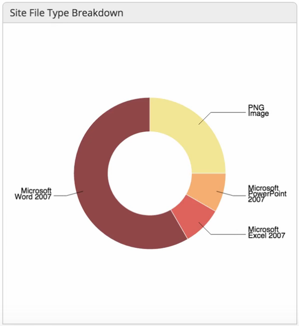
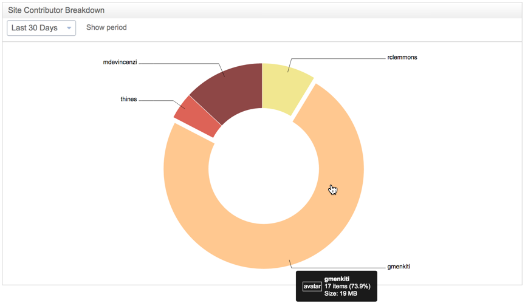

# Analyzing a site

Alfresco provides you with two site dashlets that give you great visibility on who uses your site and what content they're adding.

These two dashlets, the Site File Type Breakdown and the Site Contributor Breakdown dashlets are simple to add to a site when you [customize the site dashboard](../tasks/site-customize-dashboard.md).

These dashlets are interactive, so all site members can not only see the dashlets, but hover over them to see more detail, as well as changing the date range on the Site Contributor Breakdown dashlet.

-   **Site File Type Breakdown**

    Displays a detailed breakdown of all files stored in the site's library.

    -   Hover over a section of the breakdown chart to see more details.
    

-   **Site Contributor Breakdown**

    Displays a breakdown of all site members contributing content to the site's library.

    -   Select a time period to view contributions for.
    -   Hover over a section of the breakdown chart to see more details on a specific contributor.
    -   Click on a section of the chart to open that users profile.
    

Further analytics dashlets are available with the Alfresco Analytics module.

**Parent topic:**[Managing a site](../concepts/site-build.md)

