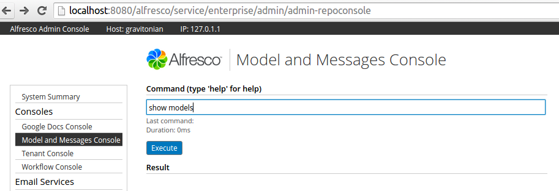

# Managing models using the Admin Console \(Enterprise ONLY\)

Use the Model and Messages Console in the Admin Console to manage models.

1.  Open the Admin Console \(http://\{host\}:\{port\}/alfresco/service/enterprise/admin\).

2.  In the **Consoles** section, click **Model and Messages Console**. You see the **Model and Messages Console** page.

    

3.  Perform the following as required for administering models:

    1.  To list all deployed models that are stored in the repository data dictionary, type show models.

    2.  To upload model to repository and load into runtime data dictionary, type deploy model.

        This command also sets the repository model as active. If a model is already deployed, then it will be updated and re-deployed.

        ```
        deploy model alfresco/extension/exampleModel.xml
        ```

    3.  To permanently delete model from repository \(all versions\) and unload from runtime data dictionary, type undeploy model.

        ```
        undeploy model exampleModel.xml
        ```

    4.  To set repository model to active and load into runtime data dictionary, type activate model.

        ```
        activate model exampleModel.xml
        ```

    5.  To set repository model to inactive and unload from runtime data dictionary, type deactivate model.

        ```
        deactivate model exampleModel.xml
        ```

4.  Perform the following as required for administering message resource bundles:

    1.  To list all deployed message resource bundles that are stored in the repository data dictionary, type show messages.

    2.  To upload message resource bundle to repository and runtime message service, type deploy messages.

        ```
        deploy messages alfresco/extension/lifecycle-messages
        ```

    3.  To remove message resource bundle from repository and from runtime message service, type undeploy messages.

        ```
        undeploy messages lifecycle-messages
        ```

    4.  To reload message resource bundle from repository into runtime message service, type reload messages.

        ```
        reload messages lifecycle-messages
        ```


**Parent topic:**[Deploying a content model](../concepts/content-model-deploy.md)

