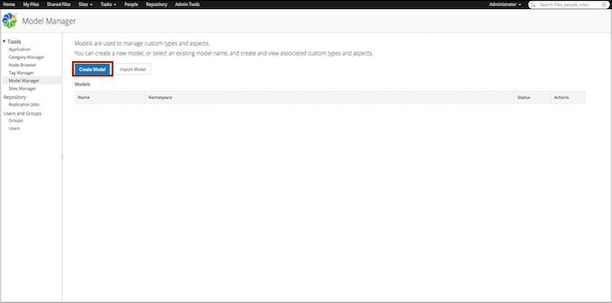

# Creating a new model

You can create new models using the **Model Manager** page.

1.  Click **Admin Tools**, and then click **Model Manager**.

    You can only see the **Admin Tools** option on the menu bar if you are an administrator user or a user who is a member of the `ALFRESCO_MODEL_ADMINISTRATORS` permission group.

    The **Model Manager** page is displayed.

2.  Click **Create Model**.

    

    The Create Model window appears. Fields marked with an asterisk \(\*\) are required.

3.  Enter the details for the new model.

    

    1.  Enter the model namespace.

        Namespaces provide a way to specify globally unique names for definitions within content models. All custom types, aspects, and properties have names which are made unique across the repository by using a namespace specific to the model. Using namespaces prevents name collisions when the models are shared across repositories. A namespace is composed of a URI and a prefix.

        Only alphanumeric characters or a URI, for example, http://www.mycompany.com/model/mynamespace/1.0, are allowed. Do not use spaces or special characters.

        **Important:** The namespace value **must** be unique within the Alfresco repository.

    2.  Enter a short prefix for the model.

        A prefix is just an abbreviation for the namespace identifier \(URI\), which is typically quite long. For example, if the namespace URI is http://example.org/contentmodels and associated prefix is ex, then the name `ex:customtype` means that `customtype` is a name defined within the namespace  http://example.org/contentmodels.

        Only alphanumeric characters, hyphens \(-\), and underscores \(\_\) are allowed. Do not use spaces. For example, finance.

        **Important:** The prefix value **must** be unique within the repository.

    3.  Enter a name for the model.

        For example, Finance.

        Only alphanumeric characters, hyphens \(-\), and underscores \(\_\) are allowed. Do not use spaces or special characters.

    4.  Specify an optional author for the model.

        If you leave this field blank, Alfresco Share will auto-fill it based on the current logged in user.

    5.  Enter an optional description for the model.

4.  Click **Create**.

    The new model appears in the **Custom Models** table on the **Model Manager** page. Additional information displayed in the table includes the model's name, namespace, status, and the actions that can be performed on the type.

The status of a model can either be **Active** or **Inactive**.

-   Inactive models: A new model is initially inactive. This means that the model is work in progress and will not be visible in Alfresco Share. A model can be moved from an inactive status to an active status.
-   Active models: Active models can be used by the end users of Alfresco Share and any custom types or aspects defined within the model can be applied to files. Active models can be moved back to the inactive status if there are no instances of the model's types or aspects in use within Alfresco Share.

**Parent topic:**[Managing models](../concepts/admintools-custom-model-intro.md)

