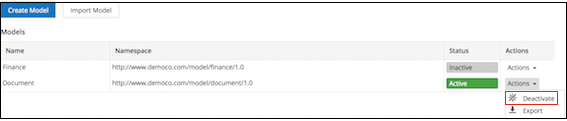

# Deactivating a model

Deactivate a model to make its associated custom type and aspect unavailable in Alfresco Share.

If you have applied a model's custom type or aspect to a file in Alfresco Share, you cannot deactivate the model directly from the **Model Manager**. Use the **Find Where Used** option to search and locate all the nodes in Alfresco to which the relevant type or aspect has been applied. For more information, see [Creating new custom types and aspects](admintools-custom-type-create.md#).

-   If you have applied a model's custom type to any files and folders in Alfresco Share, delete the files or folders that use the type from Alfresco Share and your trashcan, and then deactivate the model using **Model Manager**.
-   If you have applied a model's aspect to a file in Alfresco Share, remove the aspect from the node, then deactivate the model using **Model Manager**.
-   If you have applied a model's custom type and aspect to a file in Alfresco Share, delete the file from Alfresco Share and your trashcan, and then deactivate the model using **Model Manager**.

To deactivate a model, follow the instructions below:

1.  Click **Admin Tools**, and then click **Model Manager**.

    The **Model Manager** page is displayed. The status of the relevant model is **Active**.

2.  Click the **Actions** drop-down list for the model you want to deactivate.

3.  Click **Deactivate**.

    

    The status of the relevant model changes to **Inactive**. The types and aspects associated with this model are no longer available in Alfresco Share.

4.  Once you have deactivated the model, you can delete it by clicking **Delete** from the **Actions** drop-down list.

    **Note:** If you have created a filter for a custom model, remember to remove the filter from the [Search Manager](../concepts/super-search-manager.md) when you delete the model.

    The deleted model is removed from the Model Manager.

**Parent topic:**[Managing models](../concepts/admintools-custom-model-intro.md)

