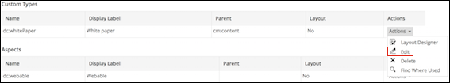
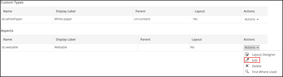

# Editing custom types and aspects

Use this information to edit a custom type and an aspect.

1.  Click **Admin Tools**, and then click **Model Manager**.

    The **Model Manager** page is displayed.

2.  Click the relevant model from the **Custom Models** list.

    The selected model page appears. This page shows the existing custom types and aspects associated with the selected model.

3.  To edit a custom type or aspect, perform the following action:

    -   For the type you want to edit, click **Edit** from the **Actions** drop-down list. The **Edit Custom Type** window appears.

        

    -   For the property type you want to edit, click **Edit** from the **Actions** drop-down list. The **Edit Aspect** window appears.

        

4.  Edit the relevant properties.

    -   **For custom type:** For an inactive model, you can edit all the fields except **Name**. If a model is active, you can edit all the fields except for **Name** and **Parent Type**.
    -   **For aspects:** For an inactive model, you can edit all the fields except **Name**. If a model is active, you can edit all the fields except for **Name** and **Parent Aspect**.
5.  Click **Save**.

**Parent topic:**[Managing custom types, aspects, and properties](../concepts/admintools-using-cmm.md)

