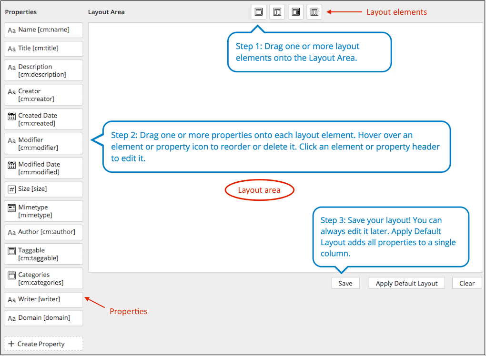

# Using the Layout Designer

Use the Layout Designer to define how the properties you create using the Model Manager are displayed on the **Edit Properties** page in Alfresco Share.

The Layout Designer provides a simple, visual representation of your page layout in the editor using horizontal sections and vertical columns. By adding multiple sections with different column configurations you can build quite complex layouts very easily. The Layout Designer consists of a layout area in the center, the layout elements on the top, and the properties arranged vertically on the left of the layout area.

**Components of the Layout Designer**

*Layout element*

The layout elements render heading text and panel arrangement with one, two or three rows. These elements are reusable and can be used multiple times on the layout area. There are four different options in the layout elements:

-   Single column panel
-   Double column panel
-   Wide left double column panel
-   Triple column panel

*Properties*

The properties are intended for single use only. To use the properties, drag them from the side onto the elements. Once the is used, it is automatically removed from the left panel.

For information on how to create properties, see [creating a new property for custom type or aspect](admintools-ct-properties-create.md).

*Create Property*

Enables you to create a new property from inside the Layout Designer using the **Create Property** window.

To use the Property Layout Designer, follow the steps below:

1.  Click **Admin Tools**, and then click **Model Manager**.

    The **Model Manager** page is displayed.

2.  Click the relevant model from the **Custom Models** list.

    The selected model page appears. This page shows the existing custom types and aspects associated with the selected model.

3.  To define how properties appear on the **Edit Properties** page in Alfresco Share, click **Layout Designer** from the **Actions** drop-down list for the relevant type or aspect.

    **Note:** If you do not apply the newly created property to the Layout Designer, then neither the type nor its property will be available for use in Alfresco Share.

    The Layout Designer page is displayed.

4.  Drag the required layout elements from top onto the layout area.

    After adding the layout elements onto the layout area, you can either edit, reorder, or delete the elements.

    -   Edit: To edit the layout elements, click anywhere on the element's top panel showing the element name. This displays the **Edit Properties** window, which enables you to change the column configuration, specify the panel label, and select the panel appearance.
    -   Reorder: To reorder the layout elements on the layout area, hover over  on the element's top right corner and select  or  to move the element up or down a place.
    -   Delete: To remove the layout element from the layout area, hover over  on the element's top right corner and select .
5.  Drag the required properties from the side onto the elements.

    After adding the properties onto the layout elements, you can either edit, reorder, or delete the elements.

    -   Edit: To edit the property, click anywhere on the property. This displays the **Edit Properties** page, which displays the property name, label, and type information. It also enables you to manage the following attributes:
        -   *Form control*: Select the type of form control shown to the end user in Alfresco Share. The form controls displayed in the Layout Designer depend on the data type of the property.

            |Form control|Description|Supported data type|
            |------------|-----------|-------------------|
            |Default|Allows the user to enter a value based on the selected data type. For example, if the selected data type is `d:int`, the user will have to specify an integer value.|            -   int
            -   text
|
            |Number|Allows the user to enter a number.|int|
            |Text field|Allows the user to type a small amount of text. If you need to obtain more than one line of input from the user, use a text area.|text|
            |Text area|Allows multi-line text input and can hold an unlimited number of characters.|text|
            |Rich text|Allows text to be formatted with common formatting options, such as bold and italics.|text|
            |Password field|Displays characters as masked, such as asterisks or circles.|text|
            |Mimetype|Enables you to identify files based on their nature and format.|mimetype|
            |Categories|Enables you to organize and categorize your content into related groups to form a hierarchy.|cm:categories|
            |Taggable|Enables tagging of content items using keywords.|cm:taggable|

        -   *View mode*: Specifies how the property should be displayed in Alfresco Share.

            |View mode options|Description|
            |-----------------|-----------|
            |Any|Displays the property on the details page under **Properties** and also on the **Edit Properties** page.|
            |View|Displays the property only on the details page under **Properties**.|
            |Edit|Displays the property only on the **Edit Properties** page.|

        -   *Style*: Enables you to impart text formatting options to the property when it is displayed in Alfresco Share. The following options are available: bold, underline, italics, font colour, and background colour.
        -   *Style class*: Enables you to add your own css class.
        -   *Read only*: Select this checkbox to make the property read-only in Alfresco Share. The **Read only** option overwrites the **View mode** option.
        -   *Force display*: For the 'standard' content type properties, **Force display** ensures that the property is visible on view/edit forms even if the type does not actually have that property applied from its aspect. An example of this is **titled**, which is a part of the `cm:titled` aspect that is not applied to a file until the property is first set.
        -   *Hidden*: Enables you to set the value of the property but it will not visible to the user in Alfresco Share. For example, you need a property with a default value that must always be applied. In this case, you can create a property with some default value and mark it as **Hidden** so it is not visible to the user but its value is still set by the system.
    -   Reorder: To reorder the property on the layout element, hover over  on the property and select  or  to move the property up or down a place.
    -   Delete: To remove the property from the layout element, hover over  on the property and select . The deleted property reappears in the **Properties** list on the Layout Designer.
6.  To save your design, click **Save** or click **Clear** to clear the layout area. To apply the default layout design, click **Apply Default Layout**.

To enable the properties layout design in Alfresco Share, you must activate and apply the relevant model to file\(s\) in Alfresco Share.

**Parent topic:**[Managing custom types, aspects, and properties](../concepts/admintools-using-cmm.md)

