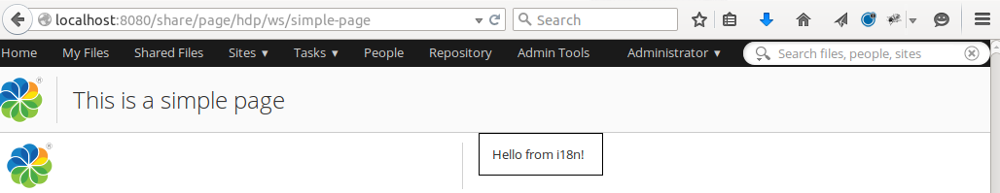
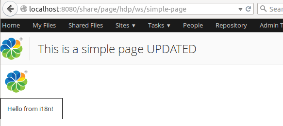

# Rapid Application Development in Eclipse \(Hot reloading\)

Hot reloading is the ability to modify your application's code, and view the changes without having to restart Alfresco Tomcat. This allows for significant savings in development time that would otherwise be wasted restarting Tomcat. Hot reloading is the key to enabling Rapid Application Development \(RAD\) and Test Driven Development \(TDD\).

You should have an extension project imported, see [importing a project into Eclipse](alfresco-sdk-rad-eclipse-import-projects.md).

In this tutorial you will see how changes to your code can be carried out without having to restart Alfresco Tomcat. This tutorial demonstrates hot reloading of JavaScript, FreeMarker template, and Java code. There are three components that work together to enable the best RAD experience:

1.  *Spring Loaded*: takes care of hot-reloading any Java class files that we have changed.
2.  *Refresh Repository Script*: This is a script that will POST a request to the Alfresco Repository Web Application \(i.e. alfresco.war\) telling it to refresh the Repo Web Script container, so any changes to files related to Web Scripts will be picked up.
3.  *Refresh Share Script*: This is a script that will POST a request to the Alfresco Share Web Application \(i.e. share.war\) telling it to refresh the Surf Web Script container, so any changes to files related to Surf Web Scripts will be picked up. This script will also clear the resource dependency caches, so JS changes etc are picked up.

1.  Start an instance of Alfresco Tomcat that will be used for hot-reloading.
2.  Use the run script to start the Application server with the Alfresco extension project deployed, for example:

    ```
    
    
    alfresco-extensions/all-in-one$ ./run.sh                        
                            
                        
    ```

    **Attention:** This is usually done outside the IDE.

3.  Test the custom Repository Web Script

    The All-in-One project \(and the Repository AMP project\) have a sample Web Script included. You can invoke it by pointing your web browser at `http://localhost:8080/alfresco/service/sample/helloworld`. If you need to login then use `admin` with password `admin`. Running this Web Script produces the output "Message: Hello World from JS! HelloFromJava".

4.  Test the custom Share Aikau Page

    The All-in-One project \(and the Share AMP project\) have a sample Aikau page included. You can display it by pointing your web browser at `http://localhost:8080/share/page/hdp/ws/simple-page`. If you need to login then use `admin` with password `admin`. The page should display as follows:

    

5.  Enabling Rapid Application Development \(RAD\) in Eclipse.
6.  This is enabled by default and there is no specific configuration needed. If you want to have more control over when web applications are refreshed, then see the last tutorial about Run Configurations.

7.  Testing RAD when doing Repository customizations \(alfresco.war\).
8.  In the Package Explorer, navigate to and expand the `all-in-one/repo-amp/src/main/amp/config/alfresco/extension/templates/webscripts` folder

9.  Locate the helloworld.get.js file and load it into the editor by double-clicking it.

    This is the controller for the Web Script that we tried after starting the server. Update the controller code by adding an 'UPDATED' string as follows:

    ```
    
    model["fromJS"] = "Hello World from JS! UPDATED";
                            
    ```

10. Now build\(Make\) the project by saving, i.e. click **Ctrl+S**

    The application server log should display messages about the web scripts being refreshed:

    ```
    
    2015-05-12 11:13:40,652  INFO  [extensions.webscripts.DeclarativeRegistry] [http-bio-8080-exec-9] Registered 407 Web Scripts (+0 failed), 549 URLs
     2015-05-12 11:13:40,653  INFO  [extensions.webscripts.DeclarativeRegistry] [http-bio-8080-exec-9] Registered 1 Package Description Documents (+0 failed) 
     2015-05-12 11:13:40,653  INFO  [extensions.webscripts.DeclarativeRegistry] [http-bio-8080-exec-9] Registered 0 Schema Description Documents (+0 failed) 
     2015-05-12 11:13:40,656  INFO  [extensions.webscripts.AbstractRuntimeContainer] [http-bio-8080-exec-9] Initialised Repository Web Script Container (in 2215.1865ms)
     2015-05-12 11:13:42,414  INFO  [extensions.webscripts.DeclarativeRegistry] [asynchronouslyRefreshedCacheThreadPool1] Registered 407 Web Scripts (+0 failed), 549 URLs
     2015-05-12 11:13:42,414  INFO  [extensions.webscripts.DeclarativeRegistry] [asynchronouslyRefreshedCacheThreadPool1] Registered 1 Package Description Documents (+0 failed) 
     2015-05-12 11:13:42,414  INFO  [extensions.webscripts.DeclarativeRegistry] [asynchronouslyRefreshedCacheThreadPool1] Registered 0 Schema Description Documents (+0 failed) 
                            
    ```

    Note that there is no output in the Eclipse console, or other window. Also, it is only the Repository Application \(i.e. alfresco.war\) that is being refreshed, the Share application is not touched.

11. Refresh the `http://localhost:8080/alfresco/service/sample/helloworld` Repository Web Script page from the Browser

    The output from the Web Script should change to "Message: Hello World from JS! UPDATED HelloFromJava". Note that there is no need to restart the application server, just a Make of the project, and a refresh of the Web Script page from the browser \(you are basically invoking the Web Script again and the update should be immediately visible\).

12. Now locate the helloworld.get.html.ftl file and load it into the editor by double-clicking it.

    This is the FreeMarker template for the Web Script. Update the template by adding an 'ExtraTemplateText' string as follows:

    ```
    
    Message: ${fromJS} ${fromJava} ExtraTemplateText                       
                            
    ```

13. Now build\(Make\) the project by clicking **Ctrl+S**

    The application server log should display messages about the web scripts being refreshed.

14. Refresh the `http://localhost:8080/alfresco/service/sample/helloworld` Repository Web Script page from the Browser

    The output from the Web Script should change to "Message: Hello World from JS! UPDATED HelloFromJava ExtraTemplateText ". Again, note that there is no need to restart the application server, only a Make of the project and a refresh of the Web Script page are necessary.

15. In the next demo we will add a properties file for the Web Script, create a helloworld.get.properties file next to the other files we have been working with.

    The properties file should have one property as follows:

    ```
    
    hello.word.extras=Extra Stuff From Props 
                            
    ```

16. Add this property to the template, open up helloworld.get.html.ftl.

    The FreeMarker template should now look like this:

    ```
    
    Message: ${fromJS} ${fromJava}  ExtraTemplateText
    ${msg("hello.word.extras")}                      
                            
    ```

17. Now build\(Make\) the project by clicking **Ctrl+S**

    The application server log should display messages about the web scripts being refreshed.

18. Refresh the `http://localhost:8080/alfresco/service/sample/helloworld` Repository Web Script page from the Browser

    The output of the Web Script should change to "Message: Hello World from JS! UPDATED HelloFromJava ExtraTemplateText Extra Stuff From Props". No restart of application server should be needed, just a Make of the project and a refresh of the Web Script page from the browser.

19. In the last Web Script demo we will change the Java controller

20. Open up all-in-one/repo-amp/src/main/java/\{your package path\}/demoamp/HelloWorldWebScript.java.

    Change the property text as follows:

    ```
    
    public class HelloWorldWebScript extends DeclarativeWebScript {
        protected Map<String, Object> executeImpl(
                WebScriptRequest req, Status status, Cache cache) {
            Map<String, Object> model = new HashMap<String, Object>();
            model.put("fromJava", "HelloFromJavaUPDATED");
            return model;
        }
    }                      
                            
    ```

21. Now build\(Make\) the project by clicking **Ctrl+S**

    The application server log should display messages about the web scripts being refreshed.

22. Refresh the `http://localhost:8080/alfresco/service/sample/helloworld` Repository Web Script page from the Browser

    The output of the Web Script should change to "Message: Hello World from JS! UPDATED HelloFromJavaUPDATED ExtraTemplateText Extra Stuff From Props". No restart of application server should be needed, just a Make of the project and a refresh of the Web Script page from the browser.

23. Test Driven Development \(TDD\) and RAD when doing Repository customizations \(alfresco.war\).
24. In the Package Explorer expand `all-in-one/repo-amp/src/test/java/{your package path}/demoamp/test` and then locate the DemoComponentTest.java source file.

25. Load it into the editor by double-clicking it.

26. Now set up a Run Configuration to run `repo-amp` tests. From the main menu select **Run** \> **Run Configurations...**.

27. In the Run Configurations dialog, select **Maven Build** in the left list. Then right click on it and select **New**.

28. Set the **Name** field of the configuration to "Test Repo AMP".

29. Set the **Base Directory** field of the configuration to "$\{workspace\_loc:/repo-amp\}".

30. Set the **Goals** field "test".

31. In the **JRE** tab set JDK 8.

32. Click **Apply**.

33. Now run the test by selecting **Run**.

    The test will run, and three tests will pass, the Console will have logs as follows:

    ```
    
                            
    [INFO] Scanning for projects...
    [INFO]                                                                         
    [INFO] ------------------------------------------------------------------------
    [INFO] Building Alfresco Repository AMP Module 1.0-SNAPSHOT
    [INFO] ------------------------------------------------------------------------
    [INFO] 
    [INFO] --- alfresco-maven-plugin:2.1.0-SNAPSHOT:set-version (default-set-version) @ repo-amp ---
    [INFO] Removed -SNAPSHOT suffix from version - 1.0
    [INFO] Added timestamp to version - 1.0.1505121136
    [INFO] 
    [INFO] --- build-helper-maven-plugin:1.9.1:add-test-resource (add-env-test-properties) @ repo-amp ---
    [INFO] 
    [INFO] --- maven-resources-plugin:2.7:resources (default-resources) @ repo-amp ---
    [INFO] Using 'UTF-8' encoding to copy filtered resources.
    [INFO] skip non existing resourceDirectory /home/martin/src/alfresco-extensions/all-in-one/repo-amp/src/main/resources
    [INFO] Copying 16 resources to ../repo-amp
    [INFO] 
    [INFO] --- yuicompressor-maven-plugin:1.5.1:compress (compress-js) @ repo-amp ---
    [INFO] nothing to do, /home/martin/src/alfresco-extensions/all-in-one/repo-amp/target/classes/../repo-amp/web/scripts/demoamp-min.js is younger than original, use 'force' option or clean your target
    [INFO] nb warnings: 0, nb errors: 0
    [INFO] 
    [INFO] --- alfresco-maven-plugin:2.1.0-SNAPSHOT:refresh (refresh-webscripts-repo-and-share) @ repo-amp ---
    [INFO] Successfull Refresh Web Scripts for Alfresco Repository
    [INFO] 
    [INFO] --- maven-compiler-plugin:3.2:compile (default-compile) @ repo-amp ---
    [INFO] Nothing to compile - all classes are up to date
    [INFO] 
    [INFO] --- maven-resources-plugin:2.7:testResources (default-testResources) @ repo-amp ---
    [INFO] Using 'UTF-8' encoding to copy filtered resources.
    [INFO] Copying 2 resources
    [INFO] Copying 1 resource
    [INFO] 
    [INFO] --- maven-resources-plugin:2.7:copy-resources (add-module-properties-to-test-classpath) @ repo-amp ---
    [INFO] Using 'UTF-8' encoding to copy filtered resources.
    [INFO] Copying 1 resource to alfresco/module/repo-amp
    [INFO] 
    [INFO] --- maven-resources-plugin:2.7:copy-resources (add-module-config-to-test-classpath) @ repo-amp ---
    [INFO] Using 'UTF-8' encoding to copy filtered resources.
    [INFO] Copying 11 resources
    [INFO] 
    [INFO] --- maven-compiler-plugin:3.2:testCompile (default-testCompile) @ repo-amp ---
    [INFO] Nothing to compile - all classes are up to date
    [INFO] 
    [INFO] --- maven-surefire-plugin:2.18:test (default-test) @ repo-amp ---
    [INFO] Surefire report directory: /home/martin/src/alfresco-extensions/all-in-one/repo-amp/target/surefire-reports
    
    -------------------------------------------------------
     T E S T S
    -------------------------------------------------------
    Running org.alfresco.allinone.demoamp.test.DemoComponentTest
    Tests run: 3, Failures: 0, Errors: 0, Skipped: 0, Time elapsed: 0.088 sec - in org.alfresco.allinone.demoamp.test.DemoComponentTest
    
    Results :
    
    Tests run: 3, Failures: 0, Errors: 0, Skipped: 0
    
    [INFO] ------------------------------------------------------------------------
    [INFO] BUILD SUCCESS
    [INFO] ------------------------------------------------------------------------
    [INFO] Total time: 7.232 s
    [INFO] Finished at: 2015-05-12T11:36:13+01:00
    [INFO] Final Memory: 27M/338M
    [INFO] ------------------------------------------------------------------------
    
                        
    ```

34. Now, in DemoComponentTest.java, modify one of the tests so that it will fail. For example, you could change the line `assertEquals(7, childNodeCount);` to `assertEquals(8, childNodeCount);`

35. Now run the test again by selecting **Run** from main menu and then from **Run History** select **Run 'Test Repo AMP'**.

    Note the test will run again and this time fail. But you did not need to restart Alfresco. This demonstrates hot reloading of Java code.

36. Change the code back and re-run the test.

    Now you will see that all tests pass. The code has re-run without any reloading of Alfresco! This allows for Test Driven Development with very low overhead.

37. Testing RAD when doing Share customizations \(share.war\).
38. In the Package Explorer, navigate to and expand the `all-in-one/share-amp/src/main/amp/config/alfresco/web-extension/site-webscripts/com/example/pages` folder

39. Locate the simple-page.get.js file and load it into the editor by double-clicking it.

    This is the controller for the Aikau Page Web Script that we tried after starting the server. Update the controller code by adding an 'UPDATED' string as follows to the page title, also change the layout from HorizontalWidgets to VerticalWidgets:

    ```
    
    model.jsonModel = {
        widgets: [{
            id: "SET_PAGE_TITLE",
            name: "alfresco/header/SetTitle",
            config: {
                title: "This is a simple page UPDATED"
            }
        },
            {
                id: "MY_HORIZONTAL_WIDGET_LAYOUT",
                name: "alfresco/layout/VerticalWidgets",
                config: {
                    widgetWidth: 50,
                    widgets: [
                        {
                            id: "DEMO_SIMPLE_LOGO",
                            name: "alfresco/logo/Logo",
                            config: {
                                logoClasses: "alfresco-logo-only"
                            }
                        },
                        {
                            id: "DEMO_SIMPLE_MSG",
                            name: "example/widgets/TemplateWidget"
                        }
                    ]
                }
            }]
    };                        
    ```

40. Now build\(Make\) the project by clicking **Ctrl+S**

    The Share web application will now have the web script container refreshed and the resouce cache cleared.

41. Refresh the `http://localhost:8080/share/page/hdp/ws/simple-page` Aikau Page from the Browser

    The page should now display as follows:

    

42. Now, let's update some HTML, CSS, and Properties for the sample widget that is used by the Aikau page, navigate to and expand the `all-in-one/share-amp/src/main/amp/web/js/example/widgets` folder

43. Locate the css/TemplateWidget.css file and load it into the editor by double-clicking it.

    This is the Stylesheet for the Aikau Widget. Update the widget style as follows:

    ```
    
    .my-template-widget {
        border: 2px #000000 solid;
        padding: 1em;
        width: 100px;
        color: white;
        background-color: blue;
    }                     
    ```

44. Then locate the i18n/TemplateWidget.properties file and load it into the editor by double-clicking it.

    This is the resource file for the Aikau Widget. Update the properties as follows:

    ```
    
    hello-label=Hello from i18n UPDATED!
    hello-test=Going to use this label too now!
    
    ```

45. Then locate the templates/TemplateWidget.html file and load it into the editor by double-clicking it.

    This is the HTML template file for the Aikau Widget. Update so it looks as follows:

    ```
    
    <div class="my-template-widget">${greeting} and ${greeting2}</div>
    
    ```

46. And finally, locate the TemplateWidget.js file and load it into the editor by double-clicking it.

    This is the main JavaScript implementation for the Aikau Widget. Update so it also sets the new property used in template:

    ```
    
    define(["dojo/_base/declare",
            "dijit/_WidgetBase",
            "alfresco/core/Core",
            "dijit/_TemplatedMixin",
            "dojo/text!./templates/TemplateWidget.html"
        ],
        function(declare, _Widget, Core, _Templated, template) {
            return declare([_Widget, Core, _Templated], {
                templateString: template,
                i18nRequirements: [ {i18nFile: "./i18n/TemplateWidget.properties"} ],
                cssRequirements: [{cssFile:"./css/TemplateWidget.css"}],
                
                buildRendering: function example_widgets_TemplateWidget__buildRendering() {
                    this.greeting = this.message('hello-label');
                    this.greeting2 = this.message('hello-test');
    
                    this.inherited(arguments);
    
                }
            });
    });
    
    ```

47. Now build\(Make\) the project by clicking **Ctrl+S**.

48. Refresh the `http://localhost:8080/share/page/hdp/ws/simple-page` Aikau Page from the Browser.

    The page should now display as follows:

    

49. Enabling RAD in Eclipse with Run Configurations.
50. Introduction

    In this article we have seen how we can achieve Rapid Application Development within Eclipse by having the alfresco maven plugin refresh goals executed automatically \(magically\) after a Make, which is triggered by saving the file. This auto-refresh feature is enabled by default when you use Eclipse. If you don't want that, and instead want to have more control over when web application refreshs happens etc, then you can use a Run Configuration instead and disable auto-refresh. In the following tutorial you will see how run configurations can be used for better control of when the refresh call is being made.

51. Start by disabling auto-refresh, set the following property in the top project POM \(i.e. in alfresco-extensions/all-in-one/pom.xml\):

    ```
    
                        
            ...
            <share.client.url>http://localhost:8080/share</share.client.url>
            
            <!--  Turn off auto-refresh of web applications -->
            <maven.alfresco.refresh.mode>none</maven.alfresco.refresh.mode>
        </properties>
     
                    
    ```

    Besides `none`, the other values for this property are:

    -   `auto` - \(**default**\) Checks packaging and app.amp.client.war.artifactId to determine if it should refresh Respository \(alfresco.war\) or Share \(share.war\)
    -   `both` - Will refresh both Respository and Share
    -   `share` - Refresh only Share
    -   `repo` - Refresh only Respository
    -   `none` - Disables refreshing all together
52. Then set up a Run Configuration to run `repo-amp` builds and Repository webapp refresh \(alfresco.war\). From the main menu select **Run** \> **Run Configurations...**.

53. In the Run Configurations dialog, select **Maven Build** in the left list. Then right click on it and select **New**.

54. Set the **Name** field of the configuration to "Make Repo AMP".

55. Set the **Base Directory** field of the configuration to "$\{workspace\_loc:/repo-amp\}".

56. Set the **Goals** field "compile alfresco:refresh-repo".

57. In the **JRE** tab set JDK 8.

58. Click **Apply**.

59. Now run the repo-amp build by selecting **Run**.

    The build will run with the following result, the Eclipse Console will output:

    ```
    
                            
    [INFO] Scanning for projects...
    [INFO]                                                                         
    [INFO] ------------------------------------------------------------------------
    [INFO] Building Alfresco Repository AMP Module 1.0-SNAPSHOT
    [INFO] ------------------------------------------------------------------------
    [INFO] 
    [INFO] --- alfresco-maven-plugin:2.1.0-SNAPSHOT:set-version (default-set-version) @ repo-amp ---
    [INFO] Removed -SNAPSHOT suffix from version - 1.0
    [INFO] Added timestamp to version - 1.0.1505121201
    [INFO] 
    [INFO] --- build-helper-maven-plugin:1.9.1:add-test-resource (add-env-test-properties) @ repo-amp ---
    [INFO] 
    [INFO] --- maven-resources-plugin:2.7:resources (default-resources) @ repo-amp ---
    [INFO] Using 'UTF-8' encoding to copy filtered resources.
    [INFO] skip non existing resourceDirectory /home/martin/src/alfresco-extensions/all-in-one/repo-amp/src/main/resources
    [INFO] Copying 16 resources to ../repo-amp
    [INFO] 
    [INFO] --- yuicompressor-maven-plugin:1.5.1:compress (compress-js) @ repo-amp ---
    [INFO] nothing to do, /home/martin/src/alfresco-extensions/all-in-one/repo-amp/target/classes/../repo-amp/web/scripts/demoamp-min.js is younger than original, use 'force' option or clean your target
    [INFO] nb warnings: 0, nb errors: 0
    [INFO] 
    [INFO] --- alfresco-maven-plugin:2.1.0-SNAPSHOT:refresh (refresh-webscripts-repo-and-share) @ repo-amp ---
    [INFO] Successfull Refresh Web Scripts for Alfresco Repository
    [INFO] 
    [INFO] --- maven-compiler-plugin:3.2:compile (default-compile) @ repo-amp ---
    [INFO] Nothing to compile - all classes are up to date
    [INFO] 
    [INFO] --- alfresco-maven-plugin:2.1.0-SNAPSHOT:refresh-repo (default-cli) @ repo-amp ---
    [INFO] Successfull Refresh Web Scripts for Alfresco Repository
    [INFO] ------------------------------------------------------------------------
    [INFO] BUILD SUCCESS
    [INFO] ------------------------------------------------------------------------
    [INFO] Total time: 8.440 s
    [INFO] Finished at: 2015-05-12T12:01:13+01:00
    [INFO] Final Memory: 29M/342M
    [INFO] ------------------------------------------------------------------------
    
                        
    ```

    **Note:** Note that only the `repo-amp` is built and only the Repository webapp is refreshed \(alfresco.war\), the Share application is not touched. This demonstrates how you can have better control of the build and refresh when you have a many different AMPs. You can create a similar run configuration for the `share-amp` project, and for any other AMP project.


In this tutorial you have seen how to add and modify code within Eclipse and and then see how these changes take effect immediately, without the need to manually restart or refresh any Alfresco Web Applications.

**Parent topic:**[Rapid Application Development \(RAD\)](../concepts/alfresco-sdk-rad.md)

