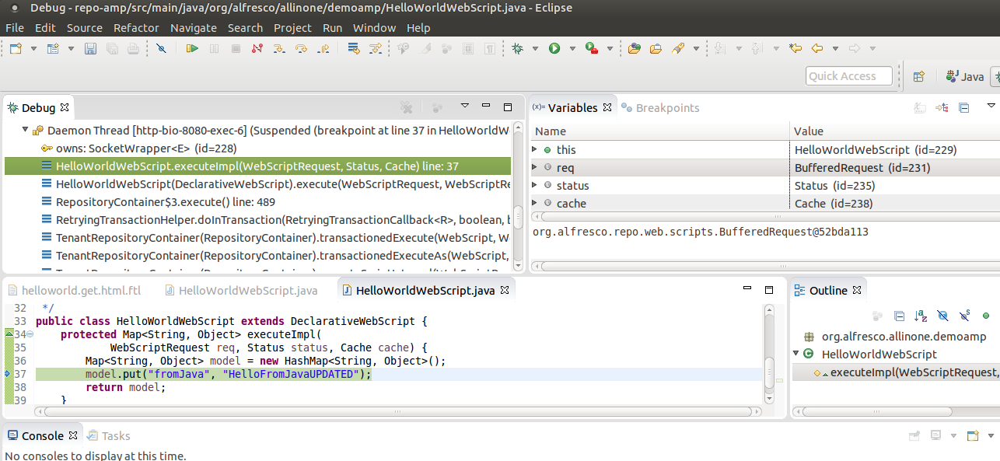

# Remote debugging with an IDE

It is possible to start an application ready for remote debugging by using the Maven `mvnDebug` command.Eclipse or another development environment such as IDEA can then connect to the running application for remote debugging.

You should have an extension project imported, see [importing a project into Eclipse](alfresco-sdk-rad-eclipse-import-projects.md).

It is quite common that you would need to debug Java code associated with an Alfresco extension you are developing. For example, if you are developing a Java backed Web Script. The command `mvnDebug` can be used to start the application in remote debugging mode, where it will listen on port 8000, ready for a remote debugger to attach.

1.  In this tutorial we assume that we are working with an All-in-One \(AIO\) project, change into the top directory \(alfresco-extensions/all-in-one\).

2.  Start the AIO project in debug mode.
3.  Run `mvnDebug` rather than the `mvn` command:

    ```
    
    $ mvnDebug clean install -Prun
    Preparing to Execute Maven in Debug Mode
    Listening for transport dt_socket at address: 8000
    ...
                            
                        
    ```

    The Maven project will start and listen for a remote debugger on port 8000.

    **Important:** This is usually done outside the IDE.

4.  Connect to the running application process from Eclipse
5.  In Eclipse, select **Run** \> **Debug Configurations** from the main menu.

6.  Select **Remote Java Application** and click the **New** icon on the top left of the dialog.

7.  Give the `Debug Configuration` a suitable name, such as "Debug Alfresco Extension".

8.  Click **Browse** and select the `repo-amp` project, the rest of the fields for host and port have suitable default values.

9.  Click **Apply**.

10. Click **Debug** to run the Debug Configuration and connect to the remote Alfresco server.

11. In Eclipse, enable the **Debug** perspective by selecting **Window** \> **Open Perspective** \> **Debug** from the main menu.

12. Set a breakpoint in the all-in-one/repo-amp/src/main/java/org/alfresco/allinone/demoamp/HelloWorldWebScript.java\) file.

13. Invoke the `http://localhost:8080/alfresco/service/sample/helloworld` Repository Web Script from the Browser

    You should now see the process stopping in the debugger as follows:

    


**Parent topic:**[Rapid Application Development \(RAD\)](../concepts/alfresco-sdk-rad.md)

