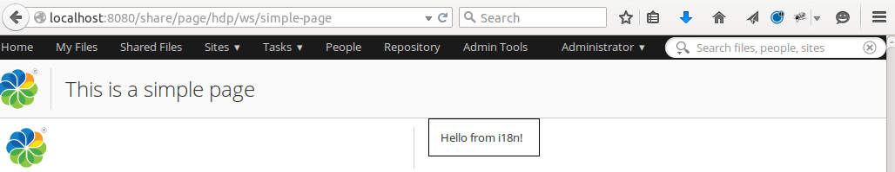
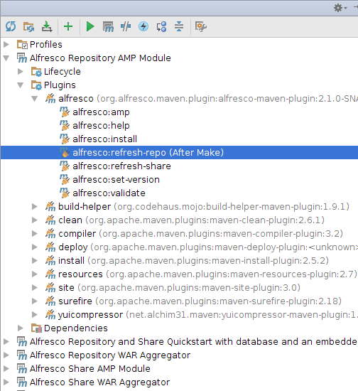
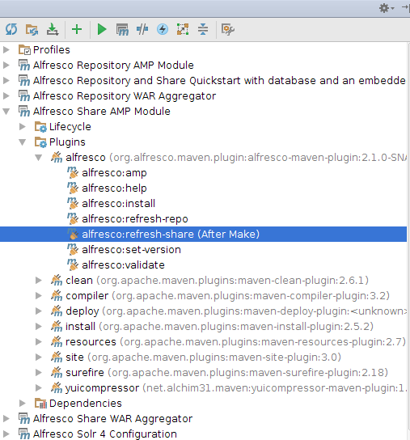
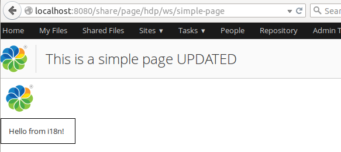
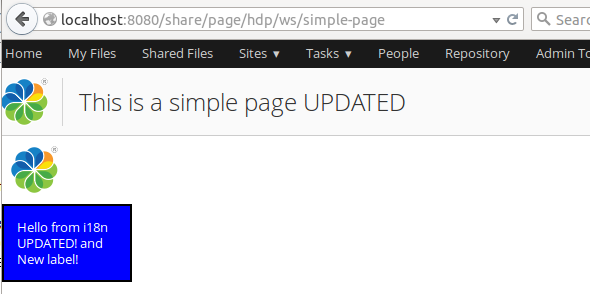

# Rapid Application Development in IntelliJ IDEA \(Hot reloading\)

Hot reloading is the ability to modify your application's code, and view the changes without having to restart Alfresco Tomcat. This allows for significant savings in development time that would otherwise be wasted restarting Tomcat. Hot reloading is the key to enabling Rapid Application Development \(RAD\) and Test Driven Development \(TDD\).

You should have an extension project imported, see [importing a project into IDEA](alfresco-sdk-rad-intellij-import-projects.md).

In this tutorial you will see how changes to your code can be carried out without having to restart Alfresco Tomcat. This tutorial demonstrates hot reloading of JavaScript, FreeMarker template, and Java code. There are three components that work together to enable the best RAD experience:

1.  *Spring Loaded*: takes care of hot-reloading any Java class files that we have changed.
2.  *Refresh Repository Script*: This is a script that will POST a request to the Alfresco repository web application \(that is, alfresco.war\) telling it to refresh the Repo web script container, so any changes to files related to web scripts will be picked up.
3.  *Refresh Share Script*: This is a script that will POST a request to the Alfresco Share web application \(that is, share.war\) telling it to refresh the Surf web script container, so any changes to files related to Surf web scripts will be picked up. This script will also clear the resource dependency caches, so JS changes etc are picked up.

1.  Start an instance of Alfresco Tomcat that will be used for hot-reloading.
2.  Use the run script to start the Application server with the Alfresco extension project deployed, for example:

    ```
    
    alfresco-extensions/all-in-one$ ./run.sh                        
                                               
    ```

    **Important:** This is usually done outside the IDE.

3.  Test the custom repository web script

    The All-in-One project \(and the repository AMP project\) have a sample web script included. You can invoke it by pointing your web browser at `http://localhost:8080/alfresco/service/sample/helloworld`. If you need to login then use `admin` with password `admin`. Running this web script produces the output "Message: Hello World from JS! HelloFromJava".

4.  Test the custom Share Aikau Page

    The All-in-One project \(and the Share AMP project\) have a sample Aikau page included. You can display it by pointing your web browser at `http://localhost:8080/share/page/hdp/ws/simple-page`. If you need to login then use `admin` with password `admin`. The page should display as follows:

    

5.  Enabling Rapid Application Development \(RAD\) in IDEA.
6.  Configure repository AMP projects to Refresh Webapp \(alfresco.war\)

    The All-in-One project has one Repository AMP project by default \(all-in-one/repo-amp\), we need to set up IDEA so that when we build via IDEA \(that is, not via Maven\) a script runs that will refresh the Repo Web Script container. In the **Maven Projects** tool view to the right expand the **Alfresco Repository AMP Module** folder, then expand the **Plugins** folder. Now expand the **alfresco** plugin folder. Right click on the **alfresco:refresh-repo** goal of the plugin. In the drop down menu select **Execute After Make**. You should now see a dialog looking something like this:

    

    If you are working with [multiple Repo AMPs](../concepts/alfresco-sdk-advanced-add-custom-amps.md), then you need to do this configuration for each one of them.

    **Important:** You **only** need to do this if you are doing customizations for the Alfresco repository webapp \(that is, customizing alfresco.war\). If you are just customizing the Share UI, see the next configuration.

7.  Configure Share AMP projects to Refresh Webapp \(share.war\)

    The All-in-One project has one Share AMP project by default \(all-in-one/share-amp\), we need to set up IDEA so that when we build via IDEA \(that is, not via Maven\) a script runs that will refresh the Surf Web Script container and clear dependency caches. In the **Maven Projects** tool view to the right expand the **Alfresco Share AMP Module** folder, then expand the **Plugins** folder. Now expand the **alfresco** plugin folder. Right click on the **alfresco:refresh-share** goal of the plugin. In the drop down menu select **Execute After Make**. You should now see a dialog looking something like this:

    

    If you are working with [multiple Share AMPs](../concepts/alfresco-sdk-advanced-add-custom-amps.md), then you need to do this configuration for each one of them.

    **Important:** You **only** need to do this if you are doing customizations for the Alfresco Share webapp \(that is, customizing share.war\). If you are just customizing the repository, see the previous configuration.

8.  Testing RAD when doing repository customizations \(alfresco.war\).
9.  In the Project Explorer, navigate to and expand the `all-in-one/repo-amp/src/main/amp/config/alfresco/extension/templates/webscripts` folder

10. Locate the helloworld.get.js file and load it into the editor by double-clicking it.

    This is the controller for the web script that we tried after starting the server. Update the controller code by adding an 'UPDATED' string as follows:

    ```
    
    model["fromJS"] = "Hello World from JS! UPDATED";
                            
    ```

11. Now build\(Make\) the project by clicking **Ctrl+F9**

    The message console in IDEA should display BUILD SUCCESS for both the `repo-amp` and `share-amp` modules as follows:

    ```
    
    [INFO] Scanning for projects...
    [INFO]                                                                         
    [INFO] ------------------------------------------------------------------------
    [INFO] Building Alfresco Repository AMP Module 1.0-SNAPSHOT
    [INFO] ------------------------------------------------------------------------
    [INFO] 
    [INFO] --- alfresco-maven-plugin:2.1.0-SNAPSHOT:refresh-repo (default-cli) @ repo-amp ---
    [INFO] Successfull Refresh Web Scripts for Alfresco Repository
    [INFO] ------------------------------------------------------------------------
    [INFO] BUILD SUCCESS
    [INFO] ------------------------------------------------------------------------
    [INFO] Total time: 3.854 s
    [INFO] Finished at: 2015-05-11T10:20:17+01:00
    [INFO] Final Memory: 15M/315M
    [INFO] ------------------------------------------------------------------------
    [INFO] Scanning for projects...
    [INFO]                                                                         
    [INFO] ------------------------------------------------------------------------
    [INFO] Building Alfresco Share AMP Module 1.0-SNAPSHOT
    [INFO] ------------------------------------------------------------------------
    [INFO] 
    [INFO] --- alfresco-maven-plugin:2.1.0-SNAPSHOT:refresh-share (default-cli) @ share-amp ---
    [INFO] Successfull Refresh Web Scripts for Alfresco Share
    [INFO] Successfull Clear Dependency Caches for Alfresco Share
    [INFO] ------------------------------------------------------------------------
    [INFO] BUILD SUCCESS
    [INFO] ------------------------------------------------------------------------
    [INFO] Total time: 4.173 s
    [INFO] Finished at: 2015-05-11T10:20:24+01:00
    [INFO] Final Memory: 18M/309M
    [INFO] ------------------------------------------------------------------------
    [INFO] Maven execution finished                       
                            
    ```

    Note the refresh calls to the web applications. If you would prefer to **only** refresh the repository webapp \(that is, alfresco.war\) have a look later on in this article for a different approach to refreshing the webapp via run configurations.

12. Refresh the `http://localhost:8080/alfresco/service/sample/helloworld` Repository Web Script page from the Browser

    The output from the web script should change to "Message: Hello World from JS! UPDATED HelloFromJava". Note that there is no need to restart the application server, just a Make of the project, and a refresh of the web script page from the browser \(you are basically invoking the web script again and the update should be immediately visible\).

13. Now locate the helloworld.get.html.ftl file and double-click it to load it into the editor.

    This is the FreeMarker template for the web script. Update the template by adding an 'ExtraTemplateText' string as follows:

    ```
    
    Message: ${fromJS} ${fromJava} ExtraTemplateText                       
                            
    ```

14. Now build\(Make\) the project by clicking **Ctrl+F9**

    The message console in IDEA should display BUILD SUCCESS

15. Refresh the `http://localhost:8080/alfresco/service/sample/helloworld` Repository Web Script page from the Browser

    The output from the web script should change to "Message: Hello World from JS! UPDATED HelloFromJava ExtraTemplateText ". Again, note that there is no need to restart the application server, only a Make of the project and a refresh of the web script page are necessary.

16. In the next demo we will add a properties file for the web script, create a helloworld.get.properties file next to the other files we have been working with.

    The properties file should have one property as follows:

    ```
    
    hello.word.extras=Extra Stuff From Props 
                            
    ```

17. Add this property to the template, open up helloworld.get.html.ftl.

    The FreeMarker template should now look like this:

    ```
    
    Message: ${fromJS} ${fromJava}  ExtraTemplateText
    ${msg("hello.word.extras")}                      
                            
    ```

18. Now build\(Make\) the project by clicking **Ctrl+F9**

    The message console in IDEA should display BUILD SUCCESS.

19. Refresh the `http://localhost:8080/alfresco/service/sample/helloworld` Repository Web Script page from the Browser

    The output of the web script should change to "Message: Hello World from JS! UPDATED HelloFromJava ExtraTemplateText Extra Stuff From Props". No restart of application server should be needed, just a Make of the project and a refresh of the web script page from the browser.

20. In the last web script demo we will change the Java controller

21. Open up all-in-one/repo-amp/src/main/java/\{your package path\}/demoamp/HelloWorldWebScript.java.

    Change the property text as follows:

    ```
    
    public class HelloWorldWebScript extends DeclarativeWebScript {
        protected Map<String, Object> executeImpl(
                WebScriptRequest req, Status status, Cache cache) {
            Map<String, Object> model = new HashMap<String, Object>();
            model.put("fromJava", "HelloFromJavaUPDATED");
            return model;
        }
    }                      
                            
    ```

22. Now build\(Make\) the project by clicking **Ctrl+F9**

    The message console in IDEA should display BUILD SUCCESS.

23. Refresh the `http://localhost:8080/alfresco/service/sample/helloworld` Repository Web Script page from the Browser

    The output of the web script should change to "Message: Hello World from JS! UPDATED HelloFromJavaUPDATED ExtraTemplateText Extra Stuff From Props". No restart of application server should be needed, just a Make of the project and a refresh of the web script page from the browser.

24. Test Driven Development \(TDD\) and RAD when doing Repository customizations \(alfresco.war\).
25. In the IntelliJ Project Explorer expand `all-in-one/repo-amp/src/test/java/{your package path}/demoamp/test` and then locate the DemoComponentTest.java source file.

26. Load it into the editor by double-clicking it.

27. Now set up a Run Configuration to run repo-amp tests. From the main menu select **Run** \> **Edit Configurations**.

28. In the Run/Debug Configurations dialog, click '+' to create a new configuration. Select **Maven** from the list of available configuration types.

29. Set the **Name** field of the configuration to "Test Repo AMP".

30. Set the **Working Directory** field of the configuration to "alfresco-extensions/all-in-one/repo-amp".

31. Set the **Command line** field "test".

32. Click **OK**.

33. Now run the test by selecting **Run** \> **Run 'Test Repo AMP'** from the main menu.

    The test will run, and three tests will pass:

    ```
    
                            
    /usr/lib/jvm/java-8-oracle/bin/java -Xms256m -Xmx1G -javaagent:/home/martin/libs/springloaded-1.2.3.RELEASE.jar -noverify -Dmaven.home=/usr/local/apache-maven-3.2.5 ....
    [INFO] Scanning for projects...
    [INFO]                                                                         
    [INFO] ------------------------------------------------------------------------
    [INFO] Building Alfresco Repository AMP Module 1.0-SNAPSHOT
    [INFO] ------------------------------------------------------------------------
    [INFO] 
    [INFO] --- alfresco-maven-plugin:2.1.0-SNAPSHOT:set-version (default-set-version) @ repo-amp ---
    [INFO] Removed -SNAPSHOT suffix from version - 1.0
    [INFO] Added timestamp to version - 1.0.1505120757
    [INFO] 
    [INFO] --- build-helper-maven-plugin:1.9.1:add-test-resource (add-env-test-properties) @ repo-amp ---
    [INFO] 
    [INFO] --- maven-resources-plugin:2.7:resources (default-resources) @ repo-amp ---
    [INFO] Using 'UTF-8' encoding to copy filtered resources.
    [INFO] skip non existing resourceDirectory /home/martin/src/alfresco-extensions/all-in-one/repo-amp/src/main/resources
    [INFO] Copying 14 resources to ../repo-amp
    [INFO] 
    [INFO] --- yuicompressor-maven-plugin:1.5.1:compress (compress-js) @ repo-amp ---
    [INFO] nothing to do, /home/martin/src/alfresco-extensions/all-in-one/repo-amp/target/classes/../repo-amp/web/scripts/demoamp-min.js is younger than original, use 'force' option or clean your target
    [INFO] nb warnings: 0, nb errors: 0
    [INFO] 
    [INFO] --- alfresco-maven-plugin:2.1.0-SNAPSHOT:refresh (refresh-webscripts-repo-and-share) @ repo-amp ---
    [INFO] Successfull Refresh Web Scripts for Alfresco Repository
    [INFO] 
    [INFO] --- maven-compiler-plugin:3.2:compile (default-compile) @ repo-amp ---
    [INFO] Nothing to compile - all classes are up to date
    [INFO] 
    [INFO] --- maven-resources-plugin:2.7:testResources (default-testResources) @ repo-amp ---
    [INFO] Using 'UTF-8' encoding to copy filtered resources.
    [INFO] Copying 2 resources
    [INFO] Copying 1 resource
    [INFO] 
    [INFO] --- maven-resources-plugin:2.7:copy-resources (add-module-properties-to-test-classpath) @ repo-amp ---
    [INFO] Using 'UTF-8' encoding to copy filtered resources.
    [INFO] Copying 1 resource to alfresco/module/repo-amp
    [INFO] 
    [INFO] --- maven-resources-plugin:2.7:copy-resources (add-module-config-to-test-classpath) @ repo-amp ---
    [INFO] Using 'UTF-8' encoding to copy filtered resources.
    [INFO] Copying 9 resources
    [INFO] 
    [INFO] --- maven-compiler-plugin:3.2:testCompile (default-testCompile) @ repo-amp ---
    [INFO] Nothing to compile - all classes are up to date
    [INFO] 
    [INFO] --- maven-surefire-plugin:2.18:test (default-test) @ repo-amp ---
    [INFO] Surefire report directory: /home/martin/src/alfresco-extensions/all-in-one/repo-amp/target/surefire-reports
    
    -------------------------------------------------------
     T E S T S
    -------------------------------------------------------
    Running org.alfresco.allinone.demoamp.test.DemoComponentTest
    Tests run: 3, Failures: 0, Errors: 0, Skipped: 0, Time elapsed: 0.085 sec - in org.alfresco.allinone.demoamp.test.DemoComponentTest
    
    Results :
    
    Tests run: 3, Failures: 0, Errors: 0, Skipped: 0
    
    [INFO] ------------------------------------------------------------------------
    [INFO] BUILD SUCCESS
    [INFO] ------------------------------------------------------------------------
    [INFO] Total time: 6.946 s
    [INFO] Finished at: 2015-05-12T07:57:24+01:00
    [INFO] Final Memory: 25M/443M
    [INFO] ------------------------------------------------------------------------                   
                            
                        
    ```

34. Now, in DemoComponentTest.java, modify one of the tests so that it will fail. For example, you could change the line `assertEquals(7, childNodeCount);` to `assertEquals(8, childNodeCount);`

35. Now run the test again by right-clicking the file in Project Explorer and selecting **Run 'Test Repo AMP'**.

    Note the test will run again and this time fail. But you did not need to restart Alfresco. This demonstrates hot reloading of Java code.

36. Change the code back and re-run the test.

    Now you will see that all tests pass. The code has re-run without any reloading of Alfresco! This allows for Test Driven Development with very low overhead.

37. Testing RAD when doing Share customizations \(share.war\).
38. In the Project Explorer, navigate to and expand the `all-in-one/share-amp/src/main/amp/config/alfresco/web-extension/site-webscripts/com/example/pages` folder

39. Locate the simple-page.get.js file and load it into the editor by double-clicking it.

    This is the controller for the Aikau Page web script that we tried after starting the server. Update the controller code by adding an 'UPDATED' string as follows to the page title, also change the layout from HorizontalWidgets to VerticalWidgets:

    ```
    
    model.jsonModel = {
        widgets: [{
            id: "SET_PAGE_TITLE",
            name: "alfresco/header/SetTitle",
            config: {
                title: "This is a simple page UPDATED"
            }
        },
            {
                id: "MY_HORIZONTAL_WIDGET_LAYOUT",
                name: "alfresco/layout/VerticalWidgets",
                config: {
                    widgetWidth: 50,
                    widgets: [
                        {
                            id: "DEMO_SIMPLE_LOGO",
                            name: "alfresco/logo/Logo",
                            config: {
                                logoClasses: "alfresco-logo-only"
                            }
                        },
                        {
                            id: "DEMO_SIMPLE_MSG",
                            name: "example/widgets/TemplateWidget"
                        }
                    ]
                }
            }]
    };                        
    ```

40. Now build\(Make\) the project by clicking **Ctrl+F9**

    The message console in IDEA should display BUILD SUCCESS for both the `repo-amp` and `share-amp` modules as follows:

    ```
    
    [INFO] Scanning for projects...
    [INFO]                                                                         
    [INFO] ------------------------------------------------------------------------
    [INFO] Building Alfresco Repository AMP Module 1.0-SNAPSHOT
    [INFO] ------------------------------------------------------------------------
    [INFO] 
    [INFO] --- alfresco-maven-plugin:2.1.0-SNAPSHOT:refresh-repo (default-cli) @ repo-amp ---
    [INFO] Successfull Refresh Web Scripts for Alfresco Repository
    [INFO] ------------------------------------------------------------------------
    [INFO] BUILD SUCCESS
    [INFO] ------------------------------------------------------------------------
    [INFO] Total time: 3.854 s
    [INFO] Finished at: 2015-05-11T10:20:17+01:00
    [INFO] Final Memory: 15M/315M
    [INFO] ------------------------------------------------------------------------
    [INFO] Scanning for projects...
    [INFO]                                                                         
    [INFO] ------------------------------------------------------------------------
    [INFO] Building Alfresco Share AMP Module 1.0-SNAPSHOT
    [INFO] ------------------------------------------------------------------------
    [INFO] 
    [INFO] --- alfresco-maven-plugin:2.1.0-SNAPSHOT:refresh-share (default-cli) @ share-amp ---
    [INFO] Successfull Refresh Web Scripts for Alfresco Share
    [INFO] Successfull Clear Dependency Caches for Alfresco Share
    [INFO] ------------------------------------------------------------------------
    [INFO] BUILD SUCCESS
    [INFO] ------------------------------------------------------------------------
    [INFO] Total time: 4.173 s
    [INFO] Finished at: 2015-05-11T10:20:24+01:00
    [INFO] Final Memory: 18M/309M
    [INFO] ------------------------------------------------------------------------
    [INFO] Maven execution finished                       
                            
    ```

    Also, note the refresh calls to the Web Applications to refresh. If you would prefer to **only** refresh the Share webapp \(that is, share.war\) have a look later on in this article for a different approach to refreshing the webapp via run configurations.

41. Refresh the `http://localhost:8080/share/page/hdp/ws/simple-page` Aikau Page from the Browser

    The page should now display as follows:

    

42. Now, let's update some HTML, CSS, and Properties for the sample widget that is used by the Aikau page, navigate to and expand the `all-in-one/share-amp/src/main/amp/web/js/example/widgets` folder

43. Locate the css/TemplateWidget.css file and load it into the editor by double-clicking it.

    This is the Stylesheet for the Aikau Widget. Update the widget style as follows:

    ```
    
    .my-template-widget {
        border: 2px #000000 solid;
        padding: 1em;
        width: 100px;
        color: white;
        background-color: blue;
    }                     
    ```

44. Then locate the i18n/TemplateWidget.properties file and load it into the editor by double-clicking it.

    This is the resource file for the Aikau Widget. Update the properties as follows:

    ```
    
    hello-label=Hello from i18n UPDATED!
    hello-test=Going to use this label too now!
    
    ```

45. Then locate the templates/TemplateWidget.html file and load it into the editor by double-clicking it.

    This is the HTML template file for the Aikau Widget. Update so it looks as follows:

    ```
    
    <div class="my-template-widget">${greeting} and ${greeting2}</div>
    
    ```

46. And finally, locate the TemplateWidget.js file and load it into the editor by double-clicking it.

    This is the main JavaScript implementation for the Aikau Widget. Update so it also sets the new property used in template:

    ```
    
    define(["dojo/_base/declare",
            "dijit/_WidgetBase",
            "alfresco/core/Core",
            "dijit/_TemplatedMixin",
            "dojo/text!./templates/TemplateWidget.html"
        ],
        function(declare, _Widget, Core, _Templated, template) {
            return declare([_Widget, Core, _Templated], {
                templateString: template,
                i18nRequirements: [ {i18nFile: "./i18n/TemplateWidget.properties"} ],
                cssRequirements: [{cssFile:"./css/TemplateWidget.css"}],
                
                buildRendering: function example_widgets_TemplateWidget__buildRendering() {
                    this.greeting = this.message('hello-label');
                    this.greeting2 = this.message('hello-test');
    
                    this.inherited(arguments);
    
                }
            });
    });
    
    ```

47. Now build\(Make\) the project by clicking **Ctrl+F9**.

48. Refresh the `http://localhost:8080/share/page/hdp/ws/simple-page` Aikau Page from the Browser.

    The page should now display as follows:

    

49. Enabling RAD in IDEA with run configurations.
50. Introduction

    In this article we have seen how we can achieve Rapid Application Development within IDEA by executing alfresco maven plugin refresh goals after a Make. This is an easy way to configure RAD in IDEA when you are only working with 1 or 2 AMPs. However, when you start to get a number of AMPs that you are working on simultaneously, then there will be a lot of refresh calls going on as every AMP's alfresco plugin goal config will be executed. This could be seen in the tutorials above where the `refresh-share` and `refresh-repo` goals were always executed even if we were just working with one of the associated AMPs. In the following tutorial you will see how run configurations can be used for better control of when the refresh call is being made.

51. Set up a Run Configuration to run `repo-amp` builds and Repository webapp refresh \(alfresco.war\). From the main menu select **Run** \> **Edit Configurations**.

52. In the Run/Debug Configurations dialog, click '+' to create a new configuration. Select **Maven** from the list of available configuration types.

53. Set the **Name** field of the configuration to "Make Repo AMP".

54. Set the **Working Directory** field of the configuration to "alfresco-extensions/all-in-one/repo-amp".

55. Set the **Command line** field "compile alfresco:refresh-repo".

56. Click **OK**.

57. Now do a Make\(build\) by selecting **Run** \> **Run 'Make Repo AMP'** from the main menu.

    The build will run with the following result:

    ```
    
                            
    /usr/lib/jvm/java-8-oracle/bin/java -Xms256m -Xmx1G -javaagent:/home/martin/libs/springloaded-1.2.3.RELEASE.jar -noverify -Dmaven.home=/usr/local/apache-maven-3.2.5 ....
    [INFO] Scanning for projects...
    [INFO]                                                                         
    [INFO] ------------------------------------------------------------------------
    [INFO] Building Alfresco Repository AMP Module 1.0-SNAPSHOT
    [INFO] ------------------------------------------------------------------------
    [INFO] 
    [INFO] --- alfresco-maven-plugin:2.1.0-SNAPSHOT:set-version (default-set-version) @ repo-amp ---
    [INFO] Removed -SNAPSHOT suffix from version - 1.0
    [INFO] Added timestamp to version - 1.0.1505120823
    [INFO] 
    [INFO] --- build-helper-maven-plugin:1.9.1:add-test-resource (add-env-test-properties) @ repo-amp ---
    [INFO] 
    [INFO] --- maven-resources-plugin:2.7:resources (default-resources) @ repo-amp ---
    [INFO] Using 'UTF-8' encoding to copy filtered resources.
    [INFO] skip non existing resourceDirectory /home/martin/src/alfresco-extensions/all-in-one/repo-amp/src/main/resources
    [INFO] Copying 14 resources to ../repo-amp
    [INFO] 
    [INFO] --- yuicompressor-maven-plugin:1.5.1:compress (compress-js) @ repo-amp ---
    [INFO] nothing to do, /home/martin/src/alfresco-extensions/all-in-one/repo-amp/target/classes/../repo-amp/web/scripts/demoamp-min.js is younger than original, use 'force' option or clean your target
    [INFO] nb warnings: 0, nb errors: 0
    [INFO] 
    [INFO] --- alfresco-maven-plugin:2.1.0-SNAPSHOT:refresh (refresh-webscripts-repo-and-share) @ repo-amp ---
    [INFO] Successfull Refresh Web Scripts for Alfresco Repository
    [INFO] 
    [INFO] --- maven-compiler-plugin:3.2:compile (default-compile) @ repo-amp ---
    [INFO] Nothing to compile - all classes are up to date
    [INFO] 
    [INFO] --- alfresco-maven-plugin:2.1.0-SNAPSHOT:refresh-repo (default-cli) @ repo-amp ---
    [INFO] Successfull Refresh Web Scripts for Alfresco Repository
    [INFO] ------------------------------------------------------------------------
    [INFO] BUILD SUCCESS
    [INFO] ------------------------------------------------------------------------
    [INFO] Total time: 6.389 s
    [INFO] Finished at: 2015-05-12T08:23:57+01:00
    [INFO] Final Memory: 30M/490M
    [INFO] ------------------------------------------------------------------------                        
                        
    ```

    **Note:** Note that only the `repo-amp` is built and only the repository webapp is refreshed \(alfresco.war\), the Share application is not touched. This demonstrates how you can have better control of the build and refresh when you have a many different AMPs. You can create a similar run configuration for the `share-amp` project, and for any other AMP project.


In this tutorial you have seen how to add and modify code within IntelliJ IDEA and then see how these changes take effect immediately, without the need to manually restart or refresh any Alfresco web applications.

**Parent topic:**[Rapid Application Development \(RAD\)](../concepts/alfresco-sdk-rad.md)

