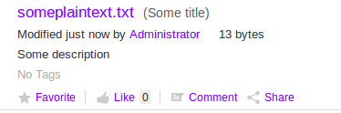
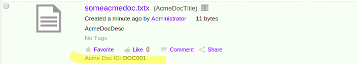
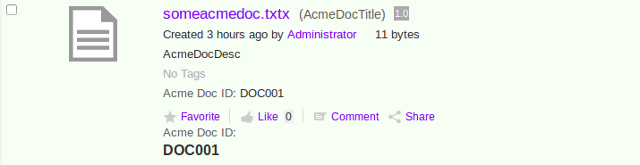

# Adding new metadata templates to the Document Library

|**Name**|Adding new metadata templates to the Document Library|
|**Extension Point**|[Document Library](../concepts/dev-extensions-share-doclib-actions.md)|
|**Description**|When custom content models are deployed to the Alfresco Repository it is sometimes a requirement to display properties from these in the Document Library Browse view. This can be done with so called Metadata Templates, which are tied to an evaluator that decides if the template is applicable or not to the content item in question, such as a folder or a file.

 If there is no specific Metadata Template defined for a content item type then it falls back on a `default` Metadata template that looks like this \(all out-of-the-box Metadata Templates can be found in alfresco/tomcat/webapps/share/WEB-INF/classes/alfresco/share-documentlibrary-config.xml\):

```
<template id="default">
    <banner index="10" id="lockBanner" evaluator="evaluator.doclib.metadata.hasLockBanner">{lockBanner}</banner>
    <banner index="20" id="syncTransientError" evaluator="evaluator.doclib.metadata.hasSyncTransientErrorBanner">{syncTransientError}</banner>
    <banner index="30" id="syncFailed" evaluator="evaluator.doclib.metadata.hasSyncFailedBanner">{syncFailed}</banner>
    <line index="10" id="date">{date}{size}</line>
    <line index="20" id="description" view="detailed">{description}</line>
    <line index="30" id="tags" view="detailed">{tags}</line>
    <line index="40" id="categories" view="detailed" evaluator="evaluator.doclib.metadata.hasCategories">{categories}</line>
    <line index="50" id="social" view="detailed">{social}</line>
 </template> 
```

 This template gives you the basic information for the node, such is in the following example for a file:

 

 This tutorial will demonstrate how to add a custom DocLib Metadata Template for a custom type from a content model that comes with the SDK Samples. This content model has a type called `acme:document` that contains a property called `acme:documentId` \(for more info see sdk-samples/all-in-one/repo-amp/src/main/amp/config/alfresco/module/repo-amp/model/content-model.xml\). We will create a new template that displays this custom property. The template will be based on the `default` template that you can see above and the property will use the default presentation rendering.

 The tutorial will also show how you can render a property in a custom way in your Metadata template.

|
|**Implementation Steps**|Adding a new Metadata Template to the Document Library involves the following steps: 1.  Configure the template so it is known to Share \(typically in a Surf Extension Module\)
2.  Add an evaluator that controls for what content nodes \(i.e. file, folder, etc.\) the template is applicable
3.  Add property labels to the i18n resource file\(s\)
4.  \(Optionally\) Implement custom client side JavaScript code that renders the property in a custom way

|
|**Related Information**|This tutorial assumes that you are familiar with the Document Library in Alfresco Share. If you are new to it read up on it [here](library-access.md) before starting this tutorial. Also, familiar yourself with how [Surf Extension Modules](../concepts/dev-extensions-share-surf-extension-modules.md) work as we will be creating one of those.|
|**Source Code**|[Go to code](https://github.com/Alfresco/alfresco-sdk-samples/tree/alfresco-51/all-in-one/add-metadata-template-doclib-share)|

This tutorial assumes that you have completed [Installing and Configuring software](../concepts/alfresco-sdk-installing-prerequisite-software.md) and generated [an AIO project](alfresco-sdk-tutorials-all-in-one-archetype.md). It also assumes that you have the content model defined in this [Repository AMP](https://github.com/Alfresco/alfresco-sdk-samples/tree/alfresco-51/all-in-one/repo-amp) project deployed.

This tutorial will demonstrate the following:

-   How to create a custom DocLib Metadata Template for the `acme:document` type. The template will be based on the `default` one but will also display the `acme:documentId` property.
-   How to define an evaluator for a custom content type
-   How to add another field to the custom template that displays the `acme:documentId` property in a custom way \(i.e. custom rendering\)

Tutorial implementation steps:

1.  Implementing the custom Metadata Template for the `acme:document` type.
2.  Add a new Share AMP module called `add-metadata-template-doclib-share` to the AIO project. Instructions for how to do that can be found [here](alfresco-sdk-advanced-add-custom-amps-aio.md) \(Note. do not add a Repository AMP\).

3.  Add a new Surf Extension Module file and define the Metadata Template

    Call the file add-metadata-template-doclib-extension-modules.xml and save it in the all-in-one/add-metadata-template-doclib-share/src/main/amp/config/alfresco/web-extension/site-data/extensions directory \(note. it is important to give this file a unique name when several Share AMPs are installed, otherwise the last one wins\).

    Then define the custom Metadata Template as follows:

    ```
    <extension>
        <modules>
            <module>
                <id>Add Acme Document Metadata Template</id>
                <version>1.0</version>
                <auto-deploy>true</auto-deploy>
                <configurations>
                    <config evaluator="string-compare" condition="DocumentLibrary">
                        <metadata-templates>
                            <template id="acmeDocMetadataTemplate">
                                <evaluator>alfresco.tutorials.evaluator.isAcmeDocument</evaluator>
                                <banner index="10" id="lockBanner" evaluator="evaluator.doclib.metadata.hasLockBanner">{lockBanner}</banner>
                                <banner index="20" id="syncTransientError" evaluator="evaluator.doclib.metadata.hasSyncTransientErrorBanner">{syncTransientError}</banner>
                                <banner index="30" id="syncFailed" evaluator="evaluator.doclib.metadata.hasSyncFailedBanner">{syncFailed}</banner>
                                <line index="10" id="date">{date}{size}</line>
                                <line index="20" id="description" view="detailed">{description}</line>
                                <line index="30" id="tags" view="detailed">{tags}</line>
                                <line index="40" id="categories" view="detailed" evaluator="evaluator.doclib.metadata.hasCategories">{categories}</line>
                                <line index="50" id="acmeDocId" view="detailed">{acme_documentId org.alfresco.tutorial.label.acme_documentId}</line>
                                <line index="60" id="social" view="detailed">{social}</line>
                            </template>
                        </metadata-templates>
                    </config>
                </configurations>
            </module>
        </modules>
    </extension> 
    ```

    What we have done here is basically copied the metadata template with the identifier `<template id="default">` from the /alfresco/tomcat/webapps/share/WEB-INF/classes/alfresco/share-documentlibrary-config.xml configuration file. Then added the `line` with `id="acmeDocId"` just before the social properties. We have also added a custom `evaluator` to the template that will only return `true` if the node in question has the type `acme:document` applied.

    The different attributes and sub-elements for the `template` element have the following meaning:

    |Name|Description|
    |----|-----------|
    |template `id`|The global identifier for this template. Make sure to change it after copying from out-of-the-box templates, otherwise you will override those. So change it from `default` to `acmeDocMetadataTemplate`.

|
    |`banner`

|Message banner that will display above the node name. A common message that you might see is the one about a node being locked by another user for editing.

|
    |banner `id`

|Unique identifier for this `banner` item.

|
    |`line`

|One line in the template displaying label and value for a property. The text content of the `line` element consist of the property value and optionally the label to use, such as `{lockBanner}` and `{acme_documentId org.alfresco.tutorial.label.acme_documentId}`. The Acme Doc Id line specifies the content model property we want to display \(i.e. `acme:documentId`, note that we use underscore instead of colon when specifying the type in the template\) and the label we want to use \(i.e. `org.alfresco.tutorial.label.acme_documentId`\).

|
    |line `id`

|Unique identifier for this `line` item.

|
    |`index`

|For `banner` items: determines the order the banner messages are displayed in. The lower the index the higher up it is displayed.

 For `line` items: determines the order the properties are displayed in. The lower the index the higher up it is displayed.

|
    |`evaluator`

|Determines the overall applicability of this template for a content node \(e.g. file, folder etc.\), if it evaluates to `false` then the template will not be used and it falls back on the `default` one. A `banner` or `line` item can also have a boolean evaluator associated with it that will determine if the item should be displayed or not.|
    |`view`

|Determines in what Browse view the `line` item should be displayed. Can be `simple` or `detailed`. If not specified the property will be displayed in both views \(e.g. `date` in above template\). So our `acmeDocId` line item will only be displayed in the `detailed` view.|

4.  Add an i18n resource file that will contain the property labels and messages for the Metadata Template.

    We can use the existing all-in-one/add-metadata-template-doclib-share/src/main/amp/config/alfresco/web-extension/messages/custom.properties file for this, we just need to update its name so it does not clash with other Share AMPs that might be deployed **\(Not needed if using SDK 2.1.1\)**. Change the name to add-metadata-template-doclib-custom.properties. Then add the following properties to it:

    ```
    org.alfresco.tutorial.label.acme_documentId=Acme Doc ID
    ```

5.  Update the name of the custom-slingshot-application-context.xml file **\(Not needed if using SDK 2.1.1\)**.

    Change it to all-in-one/add-metadata-template-doclib-share/src/main/amp/config/alfresco/web-extension/add-metadata-template-doclib-context.xml. This way it will not clash with the same file from other deployed Share AMPs. We also need to update the resource bundle name that it should load as we changed it in previous step:

    ```
    <property name="resourceBundles">
                <list>
                    <value>alfresco.web-extension.messages.add-metadata-template-doclib-custom</value>
    ```

6.  Define a custom evaluator for the custom Metadata Template.

    This evaluator should return `true` if the node is of type `acme:document`. This is also done in the add-metadata-template-doclib-context.xml Spring context file:

    ```
    ...
        <bean id="alfresco.tutorials.evaluator.isAcmeDocument" parent="evaluator.doclib.action.nodeType">
            <property name="types">
                <list>
                    <value>acme:document</value>
                </list>
            </property>
        </bean>
    </beans>
    ```

    Here we are using a built in evaluator called `evaluator.doclib.action.nodeType`. It can be used to evaluate if a node is of a specific type. We set the bean `id` so it matches what we specified above as `<metadata-template><evaluator>`. We add only the content type QName for the Acme Document type \(i.e. `acme:document`\) in the list.

    There are a number of predefined evaluators \(i.e. out of the box evaluators ready to use\):

    -   Has aspect
    -   Is mimetype
    -   Property not Null
    -   Site preset
    -   Site / No Site
    -   Container Type
    -   Node Type
    -   Always false
    -   Value-based
    -   Metadata value
    -   Is Browser \(type\)
    -   Is Portlet mode
    See the slingshot-documentlibrary-context.xml file located in the alfresco/tomcat/webapps/share/WEB-INF/classes/alfresco directory of your Alfresco 5 installation for more information about out-of-the-box evaluators.

7.  The implementation of the custom Metadata Template is now complete. However, before we start the server up we need to make sure we have the Share AMP installed that provides the [Create Acme Document](https://github.com/Alfresco/alfresco-sdk-samples/tree/alfresco-51/all-in-one/add-create-menuitem-doclib-share) feature. This will make it easy to create a new text document with the specific `acme:document` type so we can test our new Metadata Template. Download the source and include the AMP in your AIO project.

8.  Make sure web application resources are available when using `-Prun`.

    Because we got a lot of web application resources located under the all-in-one/add-metadata-template-doclib-share/src/main/amp/web directory, and this directory is not included in the AMP when using the `-Prun` profile for hot-reloading, we need another way of picking them up. This is done by adding the resource path to the virtual web application context, open the all-in-one/runner/tomcat/context-share.xml file and add the following configuration:

    ```
        <Resources className="org.apache.naming.resources.VirtualDirContext"
                   extraResourcePaths="/=${project.parent.basedir}/add-metadata-template-doclib-share/target/add-metadata-template-doclib-share/web" />
    
        <Loader className="org.apache.catalina.loader.VirtualWebappLoader"
                searchVirtualFirst="true"
                virtualClasspath="${project.parent.basedir}/add-metadata-template-doclib-share/target/classes;
                ${project.parent.basedir}/add-metadata-template-doclib-share/target/add-metadata-template-doclib-share/config;
                ${project.parent.basedir}/add-metadata-template-doclib-share/target/test-classes;
                ${project.parent.basedir}/share/target/test-classes" />
    ```

    If there are already other Share AMP configurations in the file then it would look something like this:

    ```
        <Resources className="org.apache.naming.resources.VirtualDirContext"
               extraResourcePaths="/=${project.parent.basedir}/add-theme-share/target/add-theme-share/web,/=${project.parent.basedir}/add-action-doclib-share/target/add-action-doclib-share/web,/=${project.parent.basedir}/add-metadata-template-doclib-share/target/add-metadata-template-doclib-share/web" />
    
        <Loader className="org.apache.catalina.loader.VirtualWebappLoader"
                searchVirtualFirst="true"
                virtualClasspath="${project.parent.basedir}/add-theme-share/target/classes;
                ${project.parent.basedir}/add-theme-share/target/add-theme-share/config;
                ${project.parent.basedir}/add-theme-share/target/test-classes;
                ${project.parent.basedir}/add-action-doclib-share/target/classes;
                ${project.parent.basedir}/add-action-doclib-share/target/add-action-doclib-share/config;
                ${project.parent.basedir}/add-action-doclib-share/target/test-classes;
                ${project.parent.basedir}/add-metadata-template-doclib-share/target/classes;
                ${project.parent.basedir}/add-metadata-template-doclib-share/target/add-metadata-template-doclib-share/config;
                ${project.parent.basedir}/add-metadata-template-doclib-share/target/test-classes;
                ${project.parent.basedir}/share/target/test-classes" /> 
    ```

9.  Build and start the application server as follows:

    ```
    /all-in-one$ mvn clean install -Prun
    ```

10. Now, login to Alfresco Share \(http://localhost:8080/share\) and you will see the new **Create... \| Create an Acme Text Document** menu item as follows:

    

    Clicking the new menu item brings up a form that looks like this:

    

    Note the custom field for the document identifier at the bottom of the form. Fill in some values for the `Name`, `Title`, and `Descriptor` fields. Give the Document Identifier a value of `DOC001` and then click the **Create** button.

11. The Acme Document file should now display in the Browse view with the custom metadata template:

    

12. Implementing custom rendering for the Document Identifier field.
13. Add an extra field representing the Acme Doc Id custom rendered

    Open the add-metadata-template-doclib-extension-modules.xml Surf Extension module file again, it is located in the all-in-one/add-metadata-template-doclib-share/src/main/amp/config/alfresco/web-extension/site-data/extensions directory.

    Then update the Metadata Template definition so it has the extra Acme Document Id field at the end:

    ```
    <extension>
        <modules>
            <module>
                <id>Add Acme Document Metadata Template</id>
                <version>1.0</version>
                <auto-deploy>true</auto-deploy>
                <configurations>
                    <config evaluator="string-compare" condition="DocumentLibrary">
                        <metadata-templates>
                            <template id="acmeDocMetadataTemplate">
                                <evaluator>alfresco.tutorials.evaluator.isAcmeDocument</evaluator>
                                <banner index="10" id="lockBanner" evaluator="evaluator.doclib.metadata.hasLockBanner">{lockBanner}</banner>
                                <banner index="20" id="syncTransientError" evaluator="evaluator.doclib.metadata.hasSyncTransientErrorBanner">{syncTransientError}</banner>
                                <banner index="30" id="syncFailed" evaluator="evaluator.doclib.metadata.hasSyncFailedBanner">{syncFailed}</banner>
                                <line index="10" id="date">{date}{size}</line>
                                <line index="20" id="description" view="detailed">{description}</line>
                                <line index="30" id="tags" view="detailed">{tags}</line>
                                <line index="40" id="categories" view="detailed" evaluator="evaluator.doclib.metadata.hasCategories">{categories}</line>
                                <line index="50" id="acmeDocId" view="detailed">{acme_documentId org.alfresco.tutorial.label.acme_documentId}</line>
                                <line index="60" id="social" view="detailed">{social}</line>
                                <line index="70" id="acmeDocIdCustom" view="detailed">{acmeDocumentIdCustomRendition org.alfresco.tutorial.label.acme_documentId}</line>
                            </template>
                        </metadata-templates>
                    </config>
    
                    <config evaluator="string-compare" condition="DocLibCustom">
                        <dependencies>
                            <js src="components/documentlibrary/custom-metadata-template-renderer.js"/>
                        </dependencies>
                    </config>
                </configurations>
            </module>
        </modules>
    </extension> 
    ```

    Here we have added an extra `line` identified with the `id="acmeDocIdCustom"` that will represent the custom rendered document identifier. The custom rendering will be done via some client side JavaScript code that is going to be associated with the `line` via the property name `acmeDocumentIdCustomRendition`. The custom JavaScript code will be loaded via the above `DocLibCustom` definition that loads a new JavaScript file called custom-metadata-template-renderer.js. This file needs to be created next.

14. Add custom JavaScript file with the rendering code

    Add a JavaScript file called custom-metadata-template-renderer.js to the all-in-one/add-metadata-template-doclib-share/src/main/amp/web/components/documentlibrary directory. Then add the following function:

    ```
    (function () {
        YAHOO.Bubbling.fire("registerRenderer",
            {
                propertyName: "acmeDocumentIdCustomRendition",
                renderer: function acmeDocumentId_renderer(record, label) {
                    var jsNode = record.jsNode,
                        properties = jsNode.properties,
                        html = "";
                    var acmeDocId = properties["acme:documentId"] || "";
                    html = '<span>' + label + '<h2>' + acmeDocId + '</h2></span>';
    
                    return html;
                }
            });
    })();
    ```

    The important thing here is that the `propertyName` matches what we got in the `line` element text content in the metadata template, which is `acmeDocumentIdCustomRendition`. There is not much of a fancy rendering going on here, we just change the presentation of the property value so it is displayed as header `<h2>`.

15. The implementation of the custom rendering of the property is now complete, build and start the application server as follows:

    ```
    /all-in-one$ mvn clean install -Prun
    ```

16. Now, login to Alfresco Share \(http://localhost:8080/share\) and look at the file previously created, you should see the extra Acme Doc Id field with the value in `h2` style:

    


**Parent topic:**[Document Library](../concepts/dev-extensions-share-tutorials-document-library.md)

