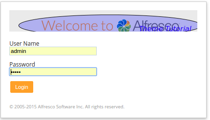
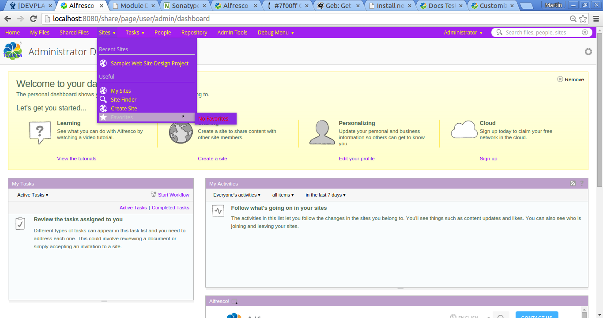
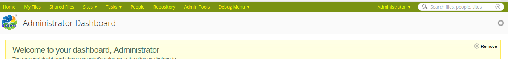

# Adding a custom Share Theme

|**Name**|Adding a custom Share Theme|
|**Extension Point**|[Share Themes](../concepts/dev-extensions-share-themes.md)|
|**Description**|This tutorial demonstrates how to customize the look and feel of the Share user interface by creating a custom theme. The Share user interface is currently implemented with both Aikau code and YUI code. This has an impact on what you need to do to style the whole Share UI, as Aikau components are styled differently from YUI components.|
|**Implementation Steps**|The following steps are usually needed to customize the Share UI using a custom theme:1.  Copy one of the existing out-of-the-box themes and use it as a basis for the new theme
2.  Give the new theme a name
3.  Update the CSS files with the new theme name
4.  Create an XML file <new theme name\>.xml to let Share know about the new theme
5.  Replace logos and other images
6.  Customize the look and feel of YUI components by updating presentation.css and skin.css
7.  Customize the look and feel of Aikau components by overriding LESS variables in <new theme name\>.xml

**Important:** If you are upgrading to a newer Alfresco version, and you are using a custom theme, then it is important to make sure that whatever out-of-the-box theme your custom theme is base on \(such as Green Theme\) has not changed between Alfresco versions. For example, upgrading from Alfresco version 5.0 to 5.1 will mean that all the out-of-the-box themes will have an extra images/logo-entreprise.png file. So if you upgrade to a newer Alfresco version you will also have to upgrade your custom theme to match.

|
|**Related Information**|This tutorial assumes that you are familiar with the Share architecture. If you are new to it then read up on it [here](../concepts/dev-extensions-share-architecture-extension-points.md) before starting this tutorial.|
|**Source Code**|[Go to code](https://github.com/Alfresco/alfresco-sdk-samples/tree/alfresco-51/all-in-one/add-page-content-share)|

This tutorial assumes that you completed [Installing and Configuring software](../concepts/alfresco-sdk-installing-prerequisite-software.md) and generated [an AIO project](alfresco-sdk-tutorials-all-in-one-archetype.md).

Tutorial implementation steps:

1.  Add a new Share AMP module called `add-theme-share` to the AIO project. Instructions for how to do that can be found [here](alfresco-sdk-advanced-add-custom-amps-aio.md) \(Note. do not add a Repository AMP\).

2.  Create a new themes directory under: all-in-one/add-theme-share/src/main/amp/web.

3.  Copy an existing theme, such as the Green Theme, from alfresco/tomcat/webapps/share/themes/greenTheme into the new all-in-one/add-theme-share/src/main/amp/web/themes directory.

    As you might have guessed, this requires you to actually download and install Alfresco. To avoid having to do that you can also run the all-in-one project once and you will have the required theme resources in all-in-one/share/target/share/themes

4.  Rename the theme directory to a custom theme name.

    Change the all-in-one/add-theme-share/src/main/amp/web/themes/greenTheme directory name to all-in-one/add-theme-share/src/main/amp/web/themes/tutorialTheme.

5.  Update the theme name in the CSS files.

    In both the `all-in-one/add-theme-share/src/main/amp/web/themes/tutorialTheme/presentation.css` file and the `all-in-one/add-theme-share/src/main/amp/web/themes/tutorialTheme/yui/assets/skin.css` file, search for the `greenTheme` name and replace it with `tutorialTheme`.

6.  Add a theme's descriptor file called tutorialTheme.xml to the all-in-one/add-theme-share/src/main/amp/config/alfresco/web-extension/site-data/themes directory \(you would have to create the themes directory too\):

    ```
    <?xml version='1.0' encoding='UTF-8'?>
    <theme>
       <title>Tutorial Theme</title>
       <title-id>theme.tutorialTheme</title-id>
       <css-tokens>
       </css-tokens>
    </theme>
    ```

    The theme ID will be determined by the file name, so from now on this theme is identified by `tutorialTheme`. The `title` elements determine the title of the theme in the UI. The `css-token` element will be covered later on in this tutorial.

7.  Optionally add an i18n resource file with the Theme title label.

    We can use the existing all-in-one/add-theme-share/src/main/amp/config/alfresco/web-extension/messages/custom.properties file for this, we just need to update its name so it does not clash with other Share AMPs that might be deployed **\(Not needed if using SDK 2.1.1\)**. Change the name to add-theme-custom.properties. Then add the following property to it:

    ```
    theme.tutorialTheme=Tutorial Theme
    ```

    The property name `theme.tutorialTheme` must match what you specified in the tutorialTheme.xml file as `title-id`. If you don't bother defining any resource label properties in this file, then the theme title will be taken from the `title` element in the tutorialTheme.xml file.

8.  Update the name of the custom-slingshot-application-context.xml file **\(Not needed if using SDK 2.1.1\)**.

    Change it to all-in-one/add-theme-share/src/main/amp/config/alfresco/web-extension/add-theme-context.xml. This way it will not clash with the same file from other deployed Share AMPs. We also need to update the resource bundle name that it should load as we changed it in previous step:

    ```
    <property name="resourceBundles">
                <list>
                    <value>alfresco.web-extension.messages.add-theme-custom</value>
    ```

9.  Optionally add an i18n resource file for the Theme title. We can use the existing all-in-one/add-theme-share/src/main/amp/config/alfresco/web-extension/messages/custom.properties file for this, add the following property:

    ```
    theme.tutorialTheme=Tutorial Theme
    ```

    The property name `theme.tutorialTheme` must match what you specified in the tutorialTheme.xml file as `title-id`. If you don't bother defining any resource label properties in this file, then the theme title will be taken from the `title` element in the tutorialTheme.xml file.

10. Replace logos.

    A basic customization of Share usually involves replacing the Alfresco logos with company specific logos. The following list explains where the different logo image files are displayed in the user interface:

    -   all-in-one/add-theme-share/src/main/amp/web/themes/tutorialTheme/images/app-logo-48.png - this is the logo that shows in the title of each page.
    -   all-in-one/add-theme-share/src/main/amp/web/themes/tutorialTheme/images/logo.png - this is the logo that shows up on the Login page.
    Replace these with whatever logos you want, and make sure to keep the same image sizes.

11. Customize the YUI components in the Share user interface.

    This is done by updating CSS styles in the all-in-one/add-theme-share/src/main/amp/web/themes/tutorialTheme/presentation.css file and the all-in-one/add-theme-share/src/main/amp/web/themes/tutorialTheme/yui/assets/skin.css file.

    For example, to get a theme with more of a purple touch go through and replace the greenish colours as follows:

    ```
    
    Green      Purple
    #92c15f -> #BDA0CB
    #00AE42 -> #7F00FF
    #5FAC34 -> #BF5FFF
    #3a6c38 -> #2E0854
    #009300 -> #A020F0
    #008F22 -> #A020F0
    #D4F8C4 -> #ECC8EC
    ```

    Replace only the `color` and `background-color` css tokens. To do more detailed customizations you will have to change the CSS classes in these files and see what the result looks like. This styling will not affect the Share Header with the menu and title, and any other Aikau components, how to do this is covered in the next step.

12. Customize the Aikau components in the Share user interface.

    This is done by overriding LESS variables in the all-in-one/add-theme-share/src/main/amp/config/alfresco/web-extension/site-data/themes/tutorialTheme.xml file. Update it to look like this:

    ```
    <?xml version='1.0' encoding='UTF-8'?>
    <theme>
       <title>Tutorial Theme</title>
       <title-id>theme.tutorialTheme</title-id>
       <css-tokens>
          <!-- Aikau related LESS variables (requires Aikau 1.0.18) -->
          <less-variables>
             @header-background-color: #A020F0;         <!-- Purple -->
             @header-font-color: yellow;
             @header-hover-background-color: #BDA0CB;   <!-- Purple candy -->
             @header-hover-font-color: #ccc;
             @header-focus-background-color: #8A2BE2;
             @header-focus-font-color: red;
             @header-menubar-font-color: yellow;
             @header-dropdown-menu-font-color: yellow;
    
             @dashlet-background: #fff;
             @dashlet-border: 1px solid #bababa;
             @dashlet-border-radius: 0;
             @dashlet-title-background: #92c15f linear-gradient(to bottom, #a3d07a, #92c15f);
             @dashlet-title-border-bottom: 0;
             @dashlet-title-border-radius: 0;
             @dashlet-title-color: #fff;
             @dashlet-toolbar-background: #A020F0;
             @dashlet-toolbar-border-bottom: 1px solid #d3d3d3;
             @dashlet-body-background: #f9fcfd;
             @dashlet-body-border-radius: 0;
          </less-variables>
       </css-tokens>
    </theme>
    
    ```

    Here we have done some customizations to the Share header style by overriding a number of LESS variables starting with `@header-`. We also customize the styling of Aikau Dashlets by overriding the `@dashlet-` LESS variables. Note that by default there are no Aikau dashlets on any of the Dashboards. You would have to install for example the Reporting and Analytics module to get some Aikau dashlets, which you could then style like this.

    You are probably wondering where all the LESS variable names are coming from, and what others there are that can be overridden? Have a look in the [defaults.less](https://github.com/Alfresco/Aikau/blob/master/aikau/src/main/resources/alfresco/css/less/defaults.less) file in the Aikau project. It contains the default values for all the LESS variables that are used by the Aikau components' CSS files.

    **Note:** The LESS variable substitution feature is only available in Aikau version 1.0.18 or newer. And Alfresco 5.0.d and 5.0.1 \(which is default in SDK 2.1\) uses Aikau version 1.0.8.1. So we need to upgrade to a newer version of Aikau for this to work, add the following dependency yo the all-in-one/add-theme-share/pom.xml file:

    ```
    <dependency>
        <groupId>org.alfresco</groupId>
        <artifactId>aikau</artifactId>
        <version>1.0.30</version>
    </dependency>
    ```

    This will work as the Spring Surf framework will automatically choose the newest version of Aikau that it can find. Unless you have manually disabled/enabled Surf Extension modules and the newer Aikau module is process before the older one.

13. Make sure web application resources are available when using `-Prun`.

    The implementation of this sample is now done. However, because we got a lot of web application resources located under the all-in-one/add-theme-share/src/main/amp/web directory, and this directory is not included in the AMP when using the `-Prun` profile for hot-reloading, we need another way of picking them up. This is done by adding the resource path to the virtual web application context, open the all-in-one/runner/tomcat/context-share.xml file and add the following configuration:

    ```
        <Resources className="org.apache.naming.resources.VirtualDirContext"
                   extraResourcePaths="/=${project.parent.basedir}/add-theme-share/target/add-theme-share/web" />
    
        <Loader className="org.apache.catalina.loader.VirtualWebappLoader"
                searchVirtualFirst="true"
                virtualClasspath="${project.parent.basedir}/add-theme-share/target/classes;
                ${project.parent.basedir}/add-theme-share/target/add-theme-share/config;
                ${project.parent.basedir}/add-theme-share/target/test-classes;
                ${project.parent.basedir}/share/target/test-classes" />
    ```

    If there are already other Share AMP configurations in the file then it would look something like this:

    ```
        <Resources className="org.apache.naming.resources.VirtualDirContext"
                   extraResourcePaths="/=${project.parent.basedir}/add-theme-share/target/add-theme-share/web,/=${project.parent.basedir}/add-action-doclib-share/target/add-action-doclib-share/web" />
    
        <Loader className="org.apache.catalina.loader.VirtualWebappLoader"
                searchVirtualFirst="true"
                virtualClasspath="${project.parent.basedir}/add-theme-share/target/classes;
                ${project.parent.basedir}/add-theme-share/target/add-theme-share/config;
                ${project.parent.basedir}/add-theme-share/target/test-classes;
                ${project.parent.basedir}/add-action-doclib-share/target/classes;
                ${project.parent.basedir}/add-action-doclib-share/target/add-action-doclib-share/config;
                ${project.parent.basedir}/add-action-doclib-share/target/test-classes;
                ${project.parent.basedir}/share/target/test-classes" /> 
    ```

14. Build and start the application server as follows:

    ```
    /all-in-one$ mvn clean install -Prun
    ```

15. Now, login to Alfresco Share \(http://localhost:8080/share\) and set the new theme.

    Do this by navigating to the `Admin Tools` page and then select the **Tutorial Theme** from the theme drop down, followed by a click on the **Apply** button. Then logout and you should see a custom logo in the login dialog:

    

    After logging in you should see the whole Dashboard page custom styled in a purple color:

    

    You should also see a custom logo on each page. If you are also running with the [Share header customization](dev-extensions-share-tutorials-customize-header-style.md) installed, then you will see that it overrides the theme customization:

    


**Parent topic:**[Styling](../concepts/dev-extensions-share-tutorials-styling.md)

