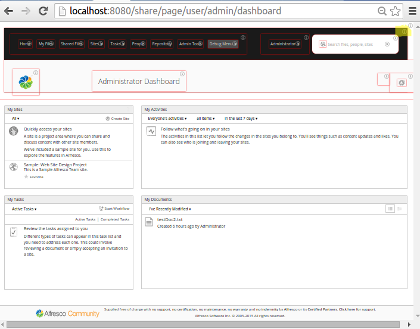
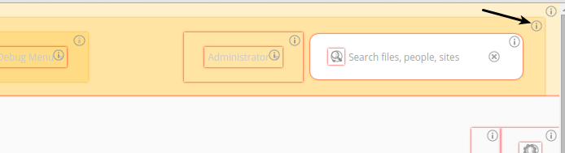
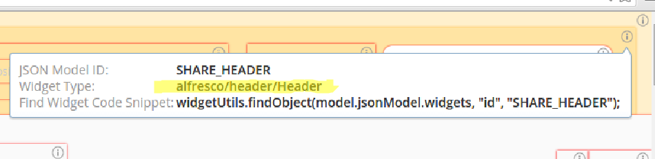
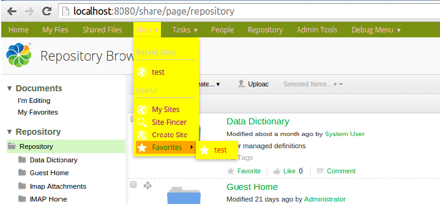

# Customizing the Share Header Style \(Aikau\)

|**Name**|Customize the Share Header Style|
|**Extension Point**|[Surf Extension Modules](../concepts/dev-extensions-share-surf-extension-modules.md)|
|**Description**|This tutorial demonstrates how the style used in the Alfresco Share Header can be changed in an easy way. We will see how the background colour, foreground colour, etc. can be customized for the main menu. This tutorial will also introduce you to the Aikau debug mode so you can find out what widgets are available, and the CSS files that they use. Which means you can find out what LESS variables are available to set custom values for.

The main takeaway from this tutorial is that you can easily customize an existing, or custom, Share Theme by redefining LESS variables. And you can easily find out what Aikau widgets that are used for different components in the UI.|
|**Implementation Steps**|A simple and effective way to customize the Share header, and other parts of the Share UI that uses Aikau widgets, is to follow these steps:1.  Enable Aikau Debug mode so you can inspect Aikau pages and widgets
2.  Identify what Aikau widgets that are used to produce the content that should be customized \(i.e. the Share Header\)
3.  Find out what CSS files that are used by the relevant widgets
4.  Inspect the CSS files and find out what LESS variables you can work with
5.  Override an out-of-the-box Theme, or create a custom Theme, by redefining one or more LESS variables

|
|**Related Information**|This tutorial assumes that you are familiar with the Alfresco Share Header, which contains the main menu and the title. The Header is implemented with the new Aikau development framework and it is possible to customize the CSS files used by the Header widgets via LESS variables.|
|**Source Code**|[Go to code](https://github.com/Alfresco/alfresco-sdk-samples/tree/alfresco-51/all-in-one/change-header-style-share)|

This tutorial assumes that you have completed [Installing and Configuring software](../concepts/alfresco-sdk-installing-prerequisite-software.md) and generated [an AIO project](alfresco-sdk-tutorials-all-in-one-archetype.md).

Tutorial implementation steps:

1.  Add a new Share AMP module called `change-header-style-share` to the AIO project. Instructions for how to do that can be found [here](alfresco-sdk-advanced-add-custom-amps-aio.md) \(Note. do not add a Repository AMP\).

2.  Identify what Aikau widgets that are used to produce the content that should be customized \(i.e. the Share Header with the Main Menu\).

    For this we use the *Developer View* in Alfresco Share. To enable it select the **Debug Menu \| Toggle Developer View** menu item from the top main menu. The Share UI should change so you see red boxes around Aikau widgets:

    

    Note that it is only the Share Header that has been implemented with Aikau so far, and a few other pages. So the red boxes are only marking content in the Header \(Menu and Title\), the rest of the Dashboard page, dashlets, footer, etc. is not implemented in Aikau, and hence not marked. To customize the background colour for the main menu we need to click the information icon \(i\) in the upper right corner of the big black box surrounding the main menu:

    

    Clicking this \(i\) icon brings up an information box as follows:

    

    This tells us that the Aikau widget we are looking for is `alfresco/header/Header`. To find out what stylesheet \(CSS\) it uses we can lookup the widget source code online \(Aikau is open source\). Navigate to the documentation site for Aikau \(`http://dev.alfresco.com/resource/docs/aikau-jsdoc/`\), and then search for the widget there. In the source code you should see what CSS file it uses by looking at the `cssRequirements: [{cssFile:"./css/Header.css"}]` variable.

    We can find out more about this CSS file by looking at the full source code on [GitHub](https://github.com/Alfresco/Aikau/blob/master/aikau/src/main/resources/alfresco/header/css/Header.css). Here we can see a number of CSS classes that control the style of the header, which contains the menu and title:

    ```
    .@{alfresco} .alf-home-icon {
       background: url("./images/home.png");
       background-repeat: no-repeat;
       height: 16px;
       width: 16px;
       display: block;
       float: left;
    }
    
    .@{alfresco} .navigation-menu {
       margin-top: 23px;
    }
    
    .@{alfresco} .title-menu {
       margin-top: 23px;
    }
    
    .@{alfresco} .alfresco-header-Header {
       background-color: @header-primary-background-color;
       color: @header-primary-font-color;
       font-family: Open Sans,arial,helvetica,clean,sans-serif;
       padding: 0;
       width: auto;
    }
    
    /* Sets the highlight on the menu bar items in the header bar ONLY */
    .@{alfresco} .alfresco-header-Header .alfresco-menus-AlfMenuBar .dijitMenuPassive .dijitMenuItemHover {
       background-color: @header-hover-background-color;
       color: @header-hover-font-color;
    }
    . . .
    ```

    What we should be looking for here are so called [LESS](http://lesscss.org/features/) variables. These are our way into customizing the Header component style.

    **Warning:** It might be tempting to override these CSS classes with a custom CSS file, such as this:

    ```
    .alfresco-share .alfresco-header-Header {
        background-color: #799212; /* Overriding the black background color */
    }
    ```

    This should be avoided as this will make upgrades very difficult and it is not supported. LESS variables and Share Themes are the supported way to change the style of Alfresco Share.

    Looking at the Header CSS file we can see that there are quite a few LESS variables that we can work with:

    ```
    @header-primary-background-color
    @header-primary-font-color
    @header-hover-background-color
    @header-hover-font-color
    @header-focus-background-color
    @header-focus-font-color
    @header-menubar-font-color
    @header-dropdown-menu-font-color
    
    ```

    What LESS variables that are available differs slightly between versions of Alfresco Share, and what Aikau version that is brought in. The best thing you can do is, find out what exact version of Aikau that is being used, for example aikau-1.0.25.2.jar \(check tomcat/webapps/share/WEB-INF/lib\). Then make sure it is a version that is newer than Aikau version 1.0.18, which was the first version to introduce LESS. If you have an older Aikau version, then you can upgrade version as described in this [article](https://www.alfresco.com/blogs/developer/2015/03/24/why-alfresco-5-0-d-will-be-a-game-changer-for-ui-development/). You can find the Header.css file in the /META-INF/js/aikau/<aikau version\>/alfresco/header/css/ directory in the JAR file, which means that you can check exactly what LESS variables are available for you to use.

3.  Decide if you want to customize an existing theme or use a custom Share theme.

    Customizing the style of the header can be done either by overriding an existing theme, such as the Green Theme, or by creating a new custom theme. In this exercise we will customize the out-of-the-box Green Theme. If we are just customization LESS variables, and we don't need to change anything else in the Green Theme, then it is enough to just create a Green Theme XML file and override the LESS variables. There is no need to copy over the complete theme directory like when [creating a custom theme](dev-extensions-share-tutorials-add-theme.md).

4.  Create a new themes directory under the all-in-one/change-header-style-share/src/main/amp/config/alfresco/web-extension/site-data directory.

    This is the standard directory in the Spring Surf model for theme files.

5.  Create a new Green Theme XML file called greenTheme.xml in the themes directory.

    This file will contain the overridden LESS variables. It is important that the file name is the same as it is for the Green Theme in the Share webapp, see tomcat/webapps/share/WEB-INF/classes/alfresco/site-data/themes. Otherwise we will not be overriding the Green Theme but instead start creating a custom theme.

6.  Override the required LESS variables.

    Overriding the default values for the LESS variables, which are defined in the [defaults.less](https://github.com/Alfresco/Aikau/blob/master/aikau/src/main/resources/alfresco/css/less/defaults.less) file in Aikau, is currently done by adding a particular element to the Share Theme XML file. A Share Theme is defined by an XML file that lives in the “themes” sub-folder of the client’s Surf configuration folder. In our example the greenTheme.xml file looks like this:

    ```
    <?xml version='1.0' encoding='UTF-8'?>
    <theme>
       <title>Green Theme Override</title>
       <title-id>theme.greenTheme</title-id>
       <css-tokens>
          <!-- Aikau related LESS variables (requires Aikau 1.0.18 or newer) -->
          <less-variables>
             @header-background-color: #799212;
             @header-font-color: #ccc;
             @header-hover-background-color: orange;
             @header-hover-font-color: green;
             @header-focus-background-color: yellow;
             @header-focus-font-color: red;
             @header-menubar-font-color: pink;
             @header-dropdown-menu-font-color: purple;
          </less-variables>
       </css-tokens>
    </theme> 
    ```

7.  The implementation of this sample is now done, build and start the application server as follows:

    ```
    /all-in-one$ mvn clean install -Prun
    ```

8.  Now, login to Alfresco Share \(http://localhost:8080/share\) and change them to Green Theme \(via Admin Tools\). You should then see the main menu with the green background colour, pink font colour, and other changes:

    


**Parent topic:**[Header with Menu and Title](../concepts/dev-extensions-share-tutorials-header-menu-title.md)

**Parent topic:**[Styling](../concepts/dev-extensions-share-tutorials-styling.md)

