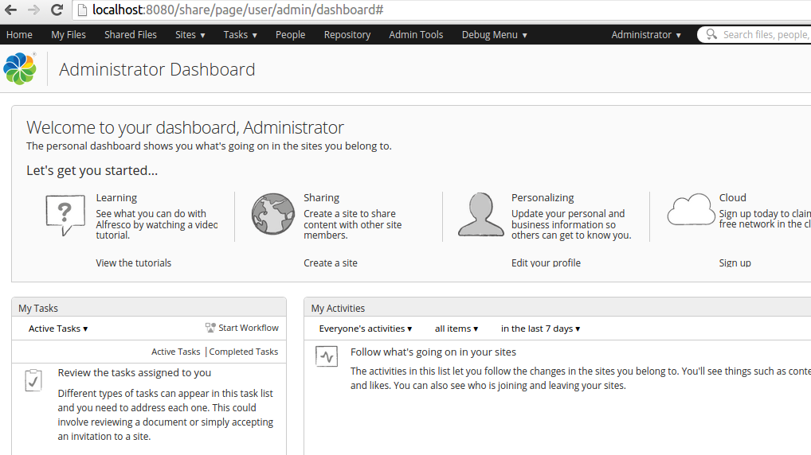

# Removing content from a Surf page

|**Name**|Remove Surf Page Content|
|**Extension Point**|[Surf Extension Modules](../concepts/dev-extensions-share-surf-extension-modules.md)|
|**Description**|This tutorial demonstrates how to prevent content from being rendered in a Surf page. This tutorial also shows how to use evaluations to decide whether content should be rendered or not.|
|**Implementation Steps**|A simple and effective way to remove content from a Surf page is to follow these steps:1.  Locate the component that corresponds to the content you want to remove from the page.
2.  Make a note of the region-id, source-id, and scope information for the component.
3.  Override the component definition and add an evaluator that resolves to not rendering the component.
4.  Use a Surf Extension module to deploy the overridden component definition.

|
|**Related Information**|This tutorial assumes that you are familiar with the Spring Surf development framework. If you are new to it then read up on it [here](../concepts/dev-extensions-share-architecture-extension-points.md) before starting this tutorial. If you have not already done so you should also review the [Introducing SurfBug](../concepts/dev-extensions-share-surfbug.md) topic as this tool is used in this tutorial.|
|**Source Code**|[Go to code](https://github.com/Alfresco/alfresco-sdk-samples/tree/alfresco-51/all-in-one/remove-page-content-share)|

This tutorial assumes that you have completed [Installing and Configuring software](../concepts/alfresco-sdk-installing-prerequisite-software.md) and generated [an AIO project](alfresco-sdk-tutorials-all-in-one-archetype.md).

Tutorial implementation steps:

1.  Add a new Share AMP module called `remove-page-content-share` to the AIO project. Instructions for how to do that can be found [here](alfresco-sdk-advanced-add-custom-amps-aio.md) \(Note. do not add a Repository AMP\).

2.  Identify which component that corresponds to the content that should be removed.

    For this we use the [SurfBug](../concepts/dev-extensions-share-surfbug.md) tool. Once the tool is activated \(from http://localhost:8080/share/page/surfBugStatus\) we can identify the component on the page as follows:

    

    In this case we have clicked on the "My Sites" dashlet, which brings up the above black information box where we can see the `region-id`, `source-id`, and `scope` values that we need to be able to hide the dashlet.

3.  Add a new Surf Extension Modules file called remove-page-content-extension-modules.xml to the all-in-one/remove-page-content-share/src/main/amp/config/alfresco/web-extension/site-data/extensions directory \(note. it is important to give this file a unique name when several Share AMPs are installed, otherwise the last one wins\):

    ```
    <extension>
        <modules>
            <module>
                <id>Remove content from Share (hide My Sites)</id>
                <version>1.0</version>
                <auto-deploy>true</auto-deploy>
                <components>
                    <component>
                        <region-id>component-1-1</region-id>
                        <source-id>user/{userid}/dashboard</source-id>
                        <scope>page</scope>
                        <sub-components>
                            <sub-component id="default">
                                <evaluations>
                                    <evaluation id="guaranteedToHide">
                                        <render>false</render>
                                    </evaluation>
                                </evaluations>
                            </sub-component>
                        </sub-components>
                    </component>
                </components>
            </module>
        </modules>
    </extension>
    ```

    What we are doing here is overriding the `default` sub-component and putting in a new evaluation for it. The targeted component is identified with the values we got via SurfBug. So we set region-id to `component-1-1`, source-id to `user/{userid}/dashboard`, and scope to `page`. Note that we are changing the source-id from the specific one for Administrators \(i.e. user/admin/dashboard\) to one that is valid for all user dashboards.

    The sub-component evaluation definition is quite simple, we just give it a unique "bogus" `id` and set rendering to `false`. This evaluation definition is guaranteed to hide the component.

    This module will be deployed automatically when the application server is started as we have the `auto-deploy` property set to `true`.

4.  The implementation of this sample is now done, build and start the application server as follows:

    ```
    /all-in-one$ mvn clean install -Prun
    ```

5.  Now, login to Alfresco Share \(http://localhost:8080/share\) and you will no longer see the "My Sites" dashlet on the Dashboard \(i.e. the "My Tasks" dashlet has taken its place\):

    

    **Note:** A Surf Extension module like this can be deployed and undeployed during runtime. And this means that an Administrator can control when different customizations should be visible or hidden. This is managed via the Module deployment page that can be found at: `http://localhost:8080/share/service/modules/deploy`.

6.  Further information

    Some features introduced in this tutorial are explained in more detail in the following sections:

    **Parametrized source-id mapping**: Every Alfresco Share user gets their own dashboard page, which enables them to customize the layout to suit their own needs, but each user dashboard is generated from a single preset. In this tutorial you specify `user/{userid}/dashboard`. Note the use of the `userid` variable. This allows you to change the appearance of the dashboard for any user, not just the admin user.

    **Extending existing sub-components:** When the dashboard pages were first created, the concept of sub-components in Surf did not exist. Consequently, if you search through the existing dashboard configuration files you will not find sub-components specified. Surf automatically converts these “legacy” components into the new extensible components containing a single sub-component with the ID “default”.

    This allows you to add new content to these legacy components through sub-components, or customize the original content without affecting any new content. In the previous configuration XML, you can change the behaviour of the components through modification of the default sub-component.

    Note that multiple modules can extend the same component, which is why the deployment order of modules is important.

    **Sub-component evaluations:** Every sub-component can optionally have zero or more evaluations. Each evaluation acts like an AND gate to a series of evaluators where an evaluation is considered successful if no evaluators fail. If an evaluation contains no evaluators, it is still considered to have evaluated successfully because nothing has failed.

    The purpose of an evaluation is to change the behaviour of a sub-component in one of three ways:

    -   Change the Web Script that renders the content by specifying a new URL.
    -   Change the default properties \(and/or provide new properties\) that are passed to the Web Script.
    -   Control whether or not the sub-component is actually rendered.
    In this example, you are simply overriding the default behaviour of the sub-component to prevent it from rendering by setting the `<render>` element to have a value of `false` \(this defaults to `true`\) if not defined.

    .


**Parent topic:**[Pages](../concepts/dev-extensions-share-tutorials-pages.md)

