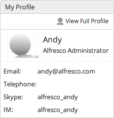

# Updating your profile

Alfresco user profiles help you to identify who a user is and what they do in your organization.

Your name is displayed at the top of the screen. When you click on the name a menu opens where you can update profile details, change your password, search the help, and log out.

**To update your profile:**

1.  Click your name and select **My Profile**, then click **Edit Profile**.

    **Tip:** You can also select **View My Profile** from the My Profile dashlet.

2.  Enter all the details that you want to show in your profile, including a picture if you like, then click **Save Changes**.

3.  Click **Home** and you can see the updated details in the My Profile dashlet.

When your colleagues view your profile they'll see all the details you've entered.

This video shows the steps in the tutorial.

  

**Parent topic:**[Personalizing Alfresco](../concepts/gs-personal-alfresco.md)

