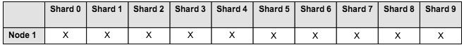

# Installing and configuring Solr shards

Follow these steps to set up sharding of a non-sharded index or change the number of instances of an already sharded index.

Do not use SSL with sharding.

1.  Create machines to host Solr shards.

    1.  These machines are basically application servers that hosts Solr webapp. If you install multiple Solr webapps on the same machine, each Solr instance must have a different configuration. In the solr4.xml file, edit the following parameters so that all Solr instances point to different root directories for each node:

        -   solr/home
        -   solr/model/dir
        -   solr/content/dir
        **Note:** All the Solr instances hosting shards on a given host must have separate model and index contentstore locations.

2.  Install and start Alfresco One 5.1. For more information, see [Installing Alfresco using setup wizards](../concepts/installs-eval-intro.md).

3.  Delete the existing Solr indexes from the installation.

    Delete the alfresco and archive cores using the following commands:

    ```
    https://localhost:8443/solr4/admin/cores?action=removeCore&storeRef=workspace://SpacesStore&coreName=alfresco
    https://localhost:8443/solr4/admin/cores?action=removeCore&storeRef=workspace://SpacesStore&coreName=archive
    ```

4.  Add any custom core templates. For more information, see [Core templates](../concepts/solr-core-templates.md).

5.  Configure the <SOLR\_HOME\>/conf/shared.properties file. For more information, see [About shared.properties file](../concepts/solr-shared-properties.md).

6.  Start the Solr server.

7.  Create your new index shards and instances by configuring the properties on the URL.

    

    ```
    http://localhost:8080/solr4/admin/cores?action=newCore&storeRef=workspace://SpacesStore&
    numShards=10&numNodes=1&nodeInstance=1&template=rerank&property.data.dir.root=<>
    ```

    This URL configures a sharded cluster that contains 10 shards, 1 node, and 1 instance of each shard. The following options must be used in the URL:

    -   `numShards` specifies the number of logical shards.
    -   `numNodes` specifies the total number of Solr nodes.
    -   `nodeInstance` is the actual Solr instance corresponding to that `host:port`.
    -   `template` defines the basic configuration for a new Solr core with some configuration properties. For more information, see [Core templates](../concepts/solr-core-templates.md).
    -   `storeRef` specifies reference to a node store.
    When you install Alfresco One 5.1.5 using the installer, the templates used to create shards do not use the port specified in the installer. Here's an example to show how to set a non-SSL port manually when creating a shard.

    **Example:** If you want a sharded Solr installation with a different Tomcat port \(8090\), set the `property.alfresco.port` property on the URL used to create the shard. The `property.alfresco.port` property specifies the port used to communicate with the repository \(or repositories through a load balancer\). This property can also be set if communicating through a different host or load balancer. In this example, we will set `property.alfresco.port=8090`, as shown below:

    ```
    http://localhost:8080/solr4/admin/cores?action=newCore&storeRef=workspace://SpacesStore&
    numShards=10&numNodes=1&nodeInstance=1&template=rerank&property.data.dir.root=<>&shardIds=0,1,2,3,4
    &property.alfresco.port=8090
    ```

8.  The Solr cores will register and start tracking the indexes.

    If there are two indexes for the same store, the old index will be used until both the indexes are at the same state. Thereafter, both the indexes will be used.

9.  Set the following properties in the alfresco-global.properties file.

    ```
    solr.secureComms=none
    solr.useDynamicShardRegistration=true
    ```

10. Restart Alfresco.

11. You can turn off any old indexes from tracking. To do so, wait for the instances to time out and let the new index to be up-to-date. Alternatively, navigate to the JMX sharding operations and clear out all the registered shards, and start again.


You have a new live index.

-   **[High availability configuration](../concepts/shard-ha-config.md)**  
Sharding a Solr index is a highly scalable approach for improving the throughput and overall performance of large repositories. It provides high availability in case a shard/node fails.

**Parent topic:**[Dynamic shard registration](../concepts/dynamic-sharding.md)

