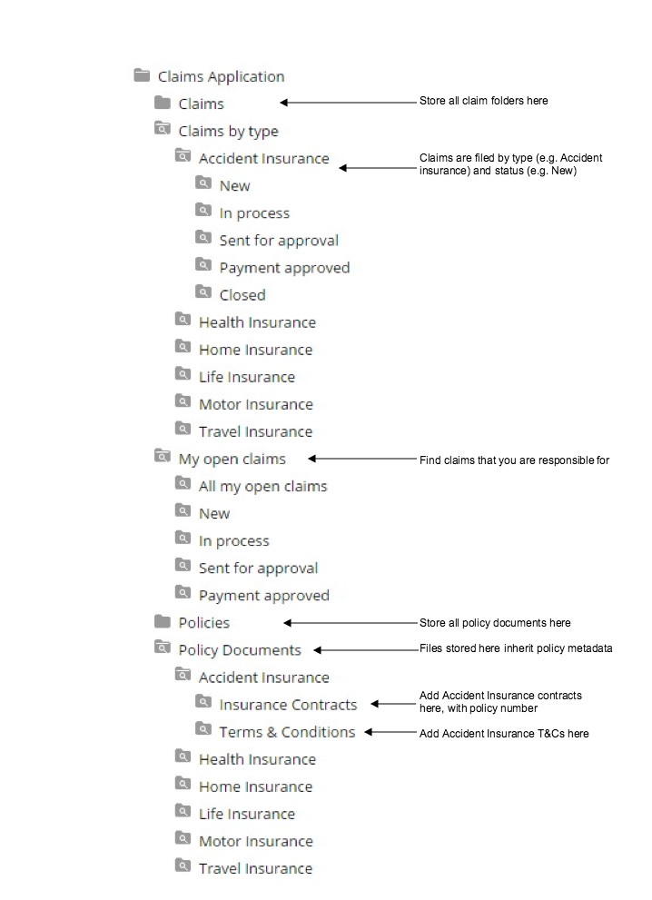

# 7. Adding policy files and reviewing the final claim structure

You can add files relating to the policy and review the Smart Folder structure that you have created for managing claims.

We have already created a new claim in previous steps, and built up the Smart Folder structure as part of the tutorial. In a real life scenario, the policy files would be created first, and the claim files linked to them afterwards. You can add any files you like to the Document Library for your policy. For convenience, a Terms and Conditions file and a policy file \(in PDF format\) are provided in the zip package: [Smart Folders tutorial files](https://github.com/vhemmert/smartfolders/tree/master/tutorial).

1.  Click the site Document Library and drill down to the Smart Folders Tutorial/Claims Application/Policies folder.

    You created a new Accident Insurance claim in the previous steps, and now you are going to add some policy files to the Accident Insurance type.

2.  Drill down to the Policy Documents/Accident Insurance folder.

    1.  Drag and drop a Terms and Conditions file into the Terms & Conditions Smart Folder.

        See [Smart Folders tutorial files](https://github.com/vhemmert/smartfolders/tree/master/tutorial) for an example file.

    2.  Drag and drop a Policy file into the Insurance Contracts Smart Folder.

        See [Smart Folders tutorial files](https://github.com/vhemmert/smartfolders/tree/master/tutorial) for an example file.

    3.  Edit the properties of the Policy file.

        Hover over the policy file, and from the menu click Edit Properties and All Properties. You will see a Policy Details section, where you can set the Document Type, Policy Number and Insurance Class. If you specify a certain policy number, this must be specified in any subsequent claims that you create in the Claims folder.

3.  Try creating a new folder in Claims, with a unique claim number, unique policy number \(relating to your new policy file\) and insurance class \(Accident Insurance, in this case\).

    The diagram shows the final folder structure that you have set up for your claims management: 

**Parent topic:**[Smart Folders tutorial](../tasks/sf-tutorial.md)

