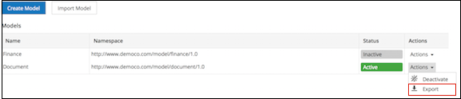
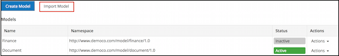

# Exporting/importing models

Model Manager provides a feature for exporting and importing models across different repositories.

You can export and import only those models which are created using the Model Manager.

**Exporting a model**

Model Manager allows you to export layouts, custom types, aspects, and their associated properties for use in other repositories.

To export a model, follow the steps below:

1.  Click **Admin Tools**, and then click **Model Manager**.

    The **Model Manager** page is displayed.

2.  Click the **Actions** drop-down list for the model you want to export.
3.  Click **Export**.

    

    This will save the model locally on your computer as a ZIP package.

**Importing a model**

You can import a model in Model Manager only as a ZIP package.

**Note:** You can't import models with the same name as the existing models in Model Manager. Model names must be unique.

To import a model, follow the steps below:

1.  Click **Admin Tools**, and then click **Model Manager**.

    The **Model Manager** page is displayed.

2.  Click the **Import Model** and select a ZIP file to import.

    

    **Note:** You can only import ZIP files that have been exported from Model Manager.

    The imported model appears in the **Custom Models** table on the **Model Manager** page.

**Parent topic:**[Managing models](../concepts/admintools-custom-model-intro.md)

