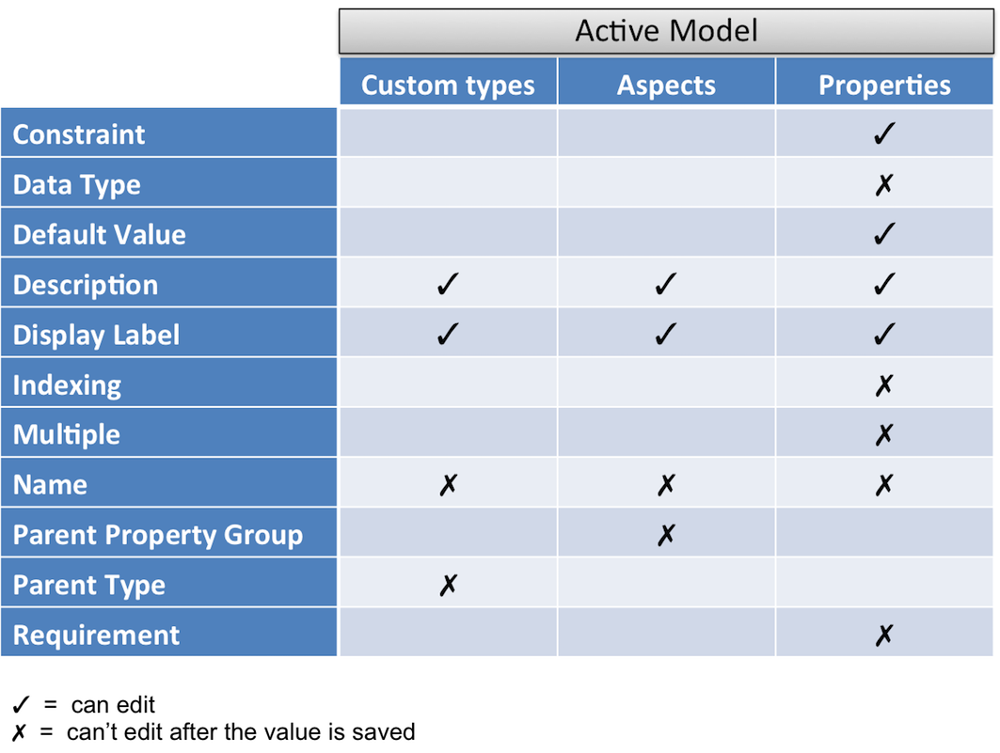

# Configuring models - custom types, aspects, and properties

Depending on the status of the model, the Model Manager tool limits which fields you can edit while configuring or editing models.

For an Inactive Model, you can edit all the fields except for `Name`. For an Active Model, the following table shows the list of fields that you can or can't edit for a given custom type, aspect, and property.

**Parent topic:**[Managing custom types, aspects, and properties](../concepts/admintools-using-cmm.md)

