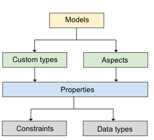

# Content modeling with Model Manager

Model Manager allows you to create and manage your own custom models in Alfresco Share. This is a user-friendly tool that enables you to add custom types, aspects, and properties to your models. Alfresco Content Services provides several out-of-the-box content models for specifying the core content types in the repository.

The Model Manager is available to users in the `ALFRESCO_MODEL_ADMINISTRATORS` permission group. To create or edit a model you must be a member of this group. By default, the System Administrator is a member of the `ALFRESCO_MODEL_ADMINISTRATORS` group and can create models.

This information is primarily aimed at business analysts who need to define and manage content models.

**Note:** The Model Manager does not allow editing existing dynamic models and content models that have been configured in XML and bootstrapped through Spring \(static models\).

**What is a model?**

A model is a fundamental building block of the content repository that provides a foundation for structuring content and working with content. A model has the following characteristics:

-   It describes the data being stored.
-   It allows the management of content metadata by applying custom types or aspects to the content and folders.
-   It is uniquely identified by its defined Namespace, Prefix, and Name.
-   It is defined using a small set of building blocks: custom types, aspects, properties, and constraints.

*Custom types*

A custom type enumerates the properties and relationships that a file of that type can support. Typically, types represents nodes with support for properties and the ability to inherit the definition of a parent type. `Content` and `Folder` are the two important types defined out-of-the-box.

*Aspects*

An aspect is a collection of properties that can encapsulate both data and behaviour, providing a flexible tool for modeling content. Aspects add extra functionality and properties to the models by attaching them to custom types. A file must be of a single type, but may have one or more aspects attached to it. By default, the content repository comprises of some out-of-the-box aspects, such as Classifiable, Versionable, and so on. To know more about aspects, see [About aspects](aspect-about.md).

*Properties*

Properties are metadata which describes the content. For example, **Author** is a property which specifies the person who wrote the content.

*Constraints*

Constraints control the input property values. For example, you can specify that the author name must not be more than 40 characters.

For more information on content modeling, see [Content Model metadata](metadata-model-define.md).

-   **[Managing models](../concepts/admintools-custom-model-intro.md)**  
You can create and manage your own business-specific models using the Model Manager tool.
-   **[Managing custom types, aspects, and properties](../concepts/admintools-using-cmm.md)**  
You can create and manage custom types, aspects, and properties for your models using the Model Manager tool.
-   **[Tutorial: creating and using models in Alfresco Share](../concepts/admintools-cmm-tutorial.md)**  
In this tutorial you will learn how to create custom models and implement content modeling using the Model Manager.
-   **[Model Manager video tutorials](../concepts/cmm-video-tutorials.md)**  
Watch these videos to see how you can create and use models, custom types, and aspects with the Model Manager.

**Parent topic:**[Configuring](../concepts/ch-configuration.md)

