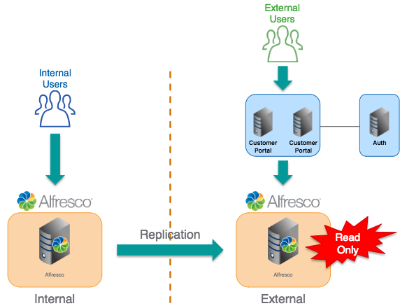
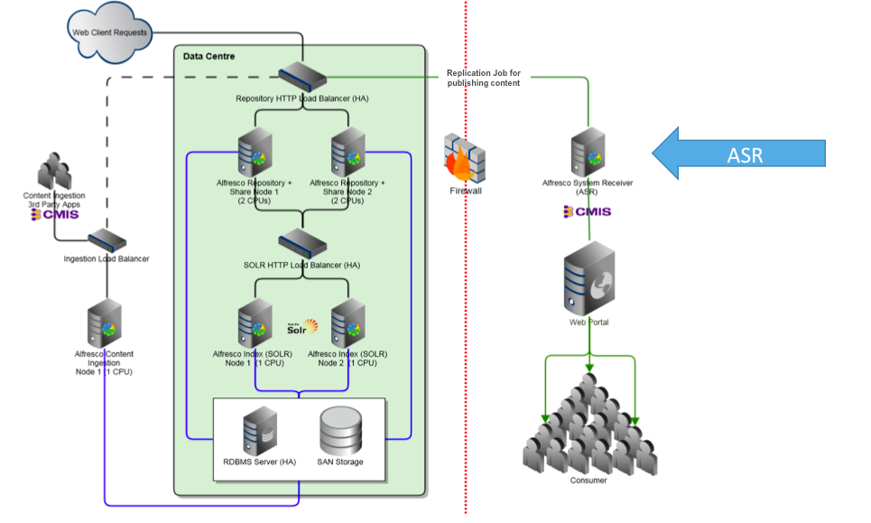

# Alfresco System Receiver \(ASR\)

An Alfresco System Receiver \(ASR\) is a deployment of Alfresco Content Services that uses Replication Jobs to transfer content from an authoring repository to a standard repository.

The repository receives content from the authoring environment, allowing the presentation tier to query the content to dynamically serve it.

To set up the ASR, use [Alfresco Replication Jobs](admintools-replication-intro.md). Replication jobs enables the content to be published from the authoring repository to the ASR in the delivery tier.

ASR is licensed separately and is limited to allow only an administrative user and a named user to search the content. It provides read-only system access.

ASR allows you to:

-   Synchronize \(or duplicate\) all or part of the content tree to an additional server
-   Choose the synchronization interval
-   Provide read-only content

An ASR does not allow you to:

-   Use Alfresco Share to manage the synchronized content
-   Manage user accounts \(a single generic account\)
-   Manage specific roles and rights \(one user\)

The following diagram shows an ASR as a content repository that is queried to publish a web project.

The ASR ensures that only the changes between versions are transmitted. The result of the deployment is a runtime version of the website.

**Parent topic:**[Setting up and managing content replication](../concepts/admintools-replication-config.md)

