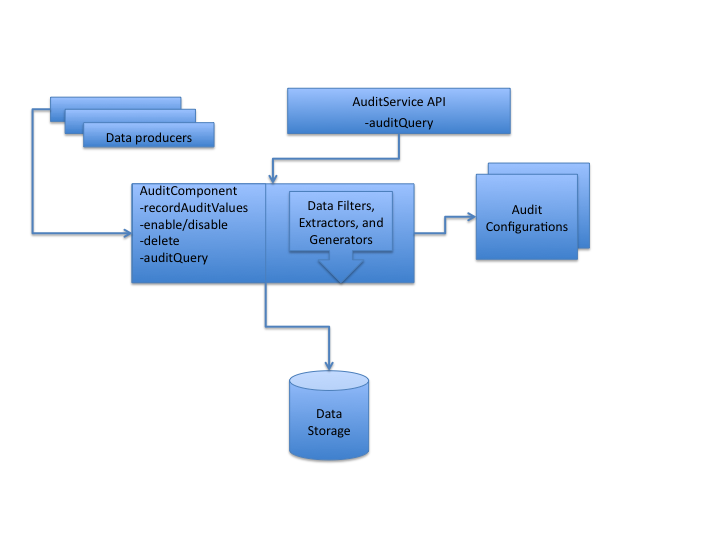
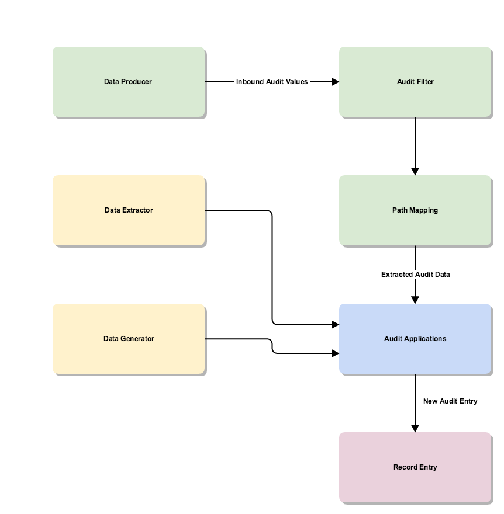

# Overview

Auditing in Alfresco Content Services is highly configurable. There are a number of components that interact with each other so that only the specific events that need to be audited are logged. This reduces the performance impact should auditing be required. The key components of the auditing system are described here.

The following diagram provides a basic overview of the auditing system:



Each of the components in the diagram are described in the following sections.

## Data Producer

A data producer generates data that can potentially be audited. Data is generated from repository services and methods and sent to the Audit Component by calling its `AuditComponent.recordAuditValues()` method. The only requirement is that each packet of data is a Map of values keyed by logical path names, relative to a specifed root path. These paths are specific to the producers and thus identify the unique data producer. There are three main data producers:

1.  `alfresco-api` - all low-level events such as workflow actions, user creations and deletions. It records all values before and after the method invocation for all services/methods using `org.alfresco.repo.audit.AuditMethodInterceptor`.

    The values passed to the audit component \(assuming auditing is enabled\) are:

    ```
    
    
      /alfresco-api
         /pre
            /<service>
               /<method>
                  /args
                     /<arg-name>=<value>
                     /<arg-name>=<value>
                     ...
            /service
         /post
            /<service>
               /<method>
                  /args
                     /<arg-name>=<value>
                     /<arg-name>=<value>
                     ...
                  /result=<value>
                  /error=<value>
                  /no-error=<null>
     
     
    ```

2.  `alfresco-access` - all content related actions, such as node create, move, delete, aspect add and remove, content read, content update, check in, check out, cancel, and so on. The class is `org.alfresco.repo.audit.access.AccessAuditor`. It creates high level audit records on the creation, deletion, modification and access of content and folders. Lower level events are grouped together by transaction and node.

    Node and Content changes generate the following audit structure. Elements are omitted if not changed by the transaction. The `/sub-action/<sequence>` structure holds details of each sub-action, but are only included if the global property `audit.alfresco-access.sub-actions.enabled=true`.

    ```
    
                    
       /alfresco-access
        /transaction
          /action=<actionName>
          /sub-actions=<sub action list>
          /path=<prefixPath>
          /type=<prefixType>
          /node=<nodeRef>
          /user=<user>
          /copy
            /from
              /node=<nodeRef>
              /path=<prefixPath>
              /type=<prefixType>
          /move
            /from
              /node=<nodeRef>
              /path=<prefixPath>
              /type=<prefixType>
          /properties
             /from=<mapOfValues>
               /<propertyName>=<propertyValue>
             /to=<mapOfValues>
               /<propertyName>=<propertyValue>
             /add=<mapOfValues>
               /<propertyName>=<propertyValue>
             /delete=<mapOfValues>
               /<propertyName>=<propertyValue>
           /aspects
             /add=<mapOfNames>
               /<aspectName>=null
             /delete=<mapOfNames>
               /<aspectName>=null
           /version-properties=<mapOfValues>
           /sub-action/<sequence>
             /action=<actionName>
             /move
               ...
             /properties
               ...
             /aspects
               ...
               
     Example data:
       /alfresco-access/transaction/action=MOVE
       /alfresco-access/transaction/node=workspace://SpacesStore/74a5985a-45dd-4698-82db-8eaeff9df8d7
       /alfresco-access/transaction/move/from/node=workspace://SpacesStore/d8a0dfd8-fe45-47da-acc2-fd8df9ea2b2e
       /alfresco-access/transaction/move/from/path=/app:company_home/st:sites/cm:abc/cm:documentLibrary/cm:folder1/cm:Word 123.docx
       /alfresco-access/transaction/move/from/type=cm:folder
       /alfresco-access/transaction/path=/app:company_home/st:sites/cm:abc/cm:documentLibrary/cm:folder2/cm:Word 123.docx
       /alfresco-access/transaction/sub-actions=moveNode readContent
       /alfresco-access/transaction/type=cm:content
       /alfresco-access/transaction/user=admin
       /alfresco-access/transaction/sub-action/00/action=moveNode
       /alfresco-access/transaction/sub-action/00/move/from/node=workspace://SpacesStore/d8a0dfd8-fe45-47da-acc2-fd8df9ea2b2e
       /alfresco-access/transaction/sub-action/00/move/from/path=/app:company_home/st:sites/cm:abc/cm:documentLibrary/cm:folder1/cm:Word 123.docx
       /alfresco-access/transaction/sub-action/00/move/from/type=cm:folder
       /alfresco-access/transaction/sub-action/01/action=readContent
     
                  
    ```

    The trace output from this class may be useful to developers as it logs method calls grouped by transaction. The debug output is of the audit records written and full inbound audit data. However, for developers, trace will provide a more readable form. Set the following `dev-log4j.properties`:

    ```
    
    log4j.appender.File.Threshold=trace
    log4j.logger.org.alfresco.repo.audit.access.AccessAuditor=trace
     
    ```

3.  `alfresco-node` - used to audit/track `beforeDeleteNode` policy. The class is `org.alfresco.repo.node.NodeAuditor`.

## Audit Component

Receives data sent by the data producers. Data producers call the `AuditComponent.recordAuditValues()` method, passing in data. There are two main pieces of information passed in:

-   Root path - a base path. This can be combined with the keys of the map \(the other input\) to create a full identifying path for the audit data.
-   A map \(keys and values\) - the map passed in by the data producer. The map keys are paths \(relative to the root path\) and their values are the audit data. Note that if a value in the map has been rejected by an audit filter, then the whole map will be rejected.

    So, for an example root path of `/alfresco-access/transaction`, the map might be:

    |Key|Value|
    |---|-----|
    |action|MOVE|
    |node|workspace://SpacesStore/90a398d1-8e0d-462a-8c3b-f0b17a2d1143|
    |move/from/node|workspace://SpacesStore/a82446e9-4dca-49d2-9ce0-4526687fb310|
    |move/from/path|/app:company\_home/st:sites/cm:fred/cm:documentLibrary/cm:folder1|
    |move/from/type|cm:folder|
    |move/to/node|workspace://SpacesStore/517bd4d0-99bc-47ad-8cd7-5d425f94c7db|
    |move/to/path|/app:company\_home/st:sites/cm:fred/cm:documentLibrary|
    |move/to/type|cm:folder|
    |path|/app:company\_home/st:sites/cm:fred/cm:documentLibrary/cm:Word 123.docx|
    |sub-actions|moveNode readContent|
    |type|cm:content|
    |user|admin|


The `AuditComponent.recordAuditValues()` method creates an audit entry. The returned audit entry is a map with the key representing the full path to the value that represents the corresponding audit data.

To see an example of the map returned by `recordAuditValues()` consider the following example. Given the root path and map shown:

```

Root path:
   /alfresco-api/post/NodeService/createStore
Map:
   args/protocol = "workspace"
   args/identifier = "SpacesStore"
   result = StoreRef[workspace://SpacesStore]
          
```

The method would return a map as follows:

```

Map:
   /alfresco-api/post/NodeService/createStore/args/protocol = "workspace"
   /alfresco-api/post/NodeService/createStore/args/identifier = "SpacesStore"
   /alfresco-api/post/NodeService/createStore/result = StoreRef[workspace://SpacesStore]            
          
```

## Audit Service

The Audit Service provides a public Java API for interacting with the Audit Component. The Audit Service is described in more detail in the [Public Java API Services documentation](../references/dev-services-audit.md). The JavaDoc \(generated from the Java source code\) for the AuditService API can be found [here](http://dev.alfresco.com/resource/docs/java/org/alfresco/service/cmr/audit/AuditService.html).

The AuditService is also exposed via a REST API. This is documented in more detail in the [Using the auditing REST API documentation](audit-rest-api.md).

## Audit Filters

Audit Filters filter the raw audit data so that only the required data proceeds further in the pipeline. While some audit filters are [provided by default](audit-default-configuration.md), you can override these default filters and create new audit filters by editing alfresco-global.properties. Audit Filters are described in more detail in the [Audit Filter documentation](audit-filters.md).

## Data Extractor

Data Extractors extract the target information for the raw audit data packet - in other words they extract values from the raw data. Typically, given a node ref, the data extractor could extract data such as `siteName` \(via a call to SiteService\), node name, node type, and node properties. Out of the box data extractors provided include:

-   Node Name
-   Node Type
-   Null
-   Transparent \(which returns the same value as it gets\)

The classes in the source code are:

-   AbstractDataExtractor.java
-   DataExtractor.java
-   NodeNameDataExtractor.java
-   NodeTypeDataExtractor.java
-   NullValueDataExtractor.java
-   SimpleValueDataExtractor.java

See the source code here for details of data extractors provided out of the box ./projects/repository/source/java/org/alfresco/repo/audit/extractor/.

## Data Generator

Unlike Data Extractors, which require an input \(typically a node ref\) to work with, Data Generators do not require an input. The are activated when an inbound mapped path is present, but they are not dependent on the value on that path. They can generate data purely from the system state and thread context. Out of the box data generators include:

-   Authenticated Person
-   Authenticated User
-   System Time
-   Transaction ID

The classes in the source code include:

-   AbstractDataGenerator.java
-   AuthenticatedUserDataGenerator.java
-   SystemTimeDataGenerator.java
-   AuthenticatedPersonDataGenerator.java
-   TransactionIdDataGenerator.java
-   DataGenerator.java

See the source code in directory ./projects/repository/source/java/org/alfresco/repo/audit/generator/ for out of the box data generators.

## Audit Configuration

Audit Configuration defines the Audit Application. The configurations define the data extractors, data generators, path mappings, and application configuration. You can see the [Audit Configuration documentation](audit-custom-audit-config.md) for more information.

## Audit Application

Multiple Audit Applications can be defined. Each audit application might handle the same raw audit data differently. For example, you might have some raw data that consists of a Node Ref, node properties, and an action. You might then have two Audit Applications, a LoginAuditApplication and a SiteAuditApplication. Audit Applications have recorded values as their output. So given the same initial event, the LoginAuditApplication would produce username and action as recorded values, whereas the SiteAuditApplication would produce site name and action as recorded values. So, the same raw data can be processed in different ways by different Audit Applications. An overview of this is provided in the following diagram: 

## Data Storage

The final destination for the audit data - database tables.

Summary of data flow:

|Data stage|Example|
|----------|-------|
|Audit data passed to `AuditComponent.recordAuditValues()`|```
Root path:
   /alfresco-api/post/NodeService/createStore
Map:
   args/protocol = "workspace"
   args/identifier = "SpacesStore"
   result = StoreRef[workspace://SpacesStore]
```

|
|If the root path passes the initial filtration phase - there is at least one component interested in auditing the information - then the map is expanded.|Expanded audit data:

 ```
Map:
   /alfresco-api/post/NodeService/createStore/args/protocol = "workspace"
   /alfresco-api/post/NodeService/createStore/args/identifier = "SpacesStore"
   /alfresco-api/post/NodeService/createStore/result = StoreRef[workspace://SpacesStore]
```

|
|The filtered data is then passed through the path mappings, generating a new Map of data for each application.|Path-mapped audit data:

 ```
Map:
   /MyApp/createStore = StoreRef[workspace://SpacesStore]
```

|
|This data is then passed to any extractors and generators to produce a final Map of data that will be persisted.|Persisted audit data:

 ```
Map:
   /MyApp/createStore/value = StoreRef[workspace://SpacesStore]
   /MyApp/createStore/rootNode = NodeRef[workspace://SpacesStore/fd123...]
```

|

**Parent topic:**[Auditing](../concepts/audit-intro.md)

