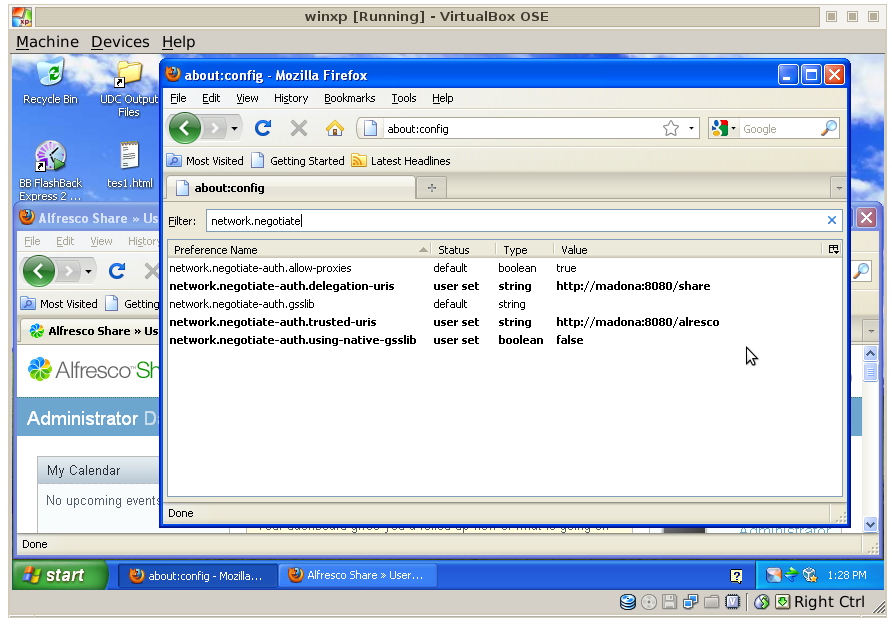

# Step 4. Kerberos client configuration

Configure the Kerberos client authentication on Windows using Chrome, Internet Explorer, WebDav, and Firefox browsers.

This task can be performed by the enterprise system administrator or the Alfresco Administrator as a part of the group policy. The enterprise domain/system administrator needs to configure the Kerberos client on each machine. The Alfresco administrator can then check, in a test environment ,if the client is working properly.

**Note:** If you are using Mac OS X, note that Microsoft Office for Mac does not support Kerberos protocol as a method of authentication.

## Kerberos client configuration for Chrome

When using Chrome on Windows to access Share, if the command-line switch is not present, the permitted list consists of those servers in the Local Machine or Local Intranet security zone. This is the behavior in Internet Explorer. For example, when the host in the URL includes a "`.`" character, it is outside the Local Intranet security zone. Treating servers that bypass proxies as being in the Intranet zone is currently not supported.

On Windows, HTTP authentication is achieved by adding the Kerberos delegation server whitelist policy, `AuthNegotiateDelegateWhitelist`. Note that the `AuthNegotiateDelegateWhitelist` policy:

-   Specifies the servers that Chrome may delegate to
-   Has a Windows registry location of HKEY\_LOCAL\_MACHINE\\SOFTWARE\\Policies\\Google\\Chrome\\AuthNegotiateDelegateWhitelist
-   Has separate multiple server names with commas
-   Allows wildcards \(\*\)
-   If you do not set this policy, Chrome does not delegate user credentials, even if a server is detected as Intranet

To set the `AuthNegotiateDelegateWhitelist` policy, follow these steps:

1.  Download the Administrative policy template from [http://dl.google.com/dl/edgedl/chrome/policy/policy\_templates.zip](http://dl.google.com/dl/edgedl/chrome/policy/policy_templates.zip).
2.  Use the command line, `gpedit.msc` to open the local group policy management.
3.  In the Group Policy Editor console tree, navigate to **Local Computer Policy \> Computer Configuration \> Administrative Templates**. 
4.  Right click on **Administrative Templates**.
5.  Click **Add/Remove Templates**.
6.  Click the **Add** button.
7.  Select windows/adm/en-US/chrome.adm from the policy\_templates.zip download.
8.  In the **Local Computer Policy Editor** console tree, navigate to **Local Computer Policy \> Computer Configuration \> Administrative Templates \> Classic Administrative Templates \(ADM\) \> Google \> Google Chrome \> Policies for HTTP Authentication \> Kerberos delegation server whitelist**.
9.  On the **Kerberos delegation server whitelist** window, click **Enabled**.
10. Specify your Share server name\(s\) as value in **Kerberos delegation server whitelist**.
11. To activate the policy, open Chrome.
12. Type chrome://policy to list the settings as viewed by Chrome.

When using Chrome on Linux as your client, follow these steps:

1.  Create a ticket on the Linux client.

    ```
    kinit -f -p user1
    klist Ticket cache: FILE:/tmp/krb5cc_1000 Default principal: user1@EXAMPLE.FOO
    Valid starting Expires Service principal 14/12/2012 12:10 14/12/2012 22:10 krbtgt/EXAMPLE.FOO@EXAMPLE.FOO renew until 15/12/2012 12:10
    ```

2.  To use Alfresco Share, use:

    ```
    google-chrome --auth-server-whitelist=madona:8080 --auth-negotiate-delegate-whitelist=madona:8080
    http://madona:8080/alfresco
    ```


## Kerberos client configuration for Internet Explorer

To configure Internet Explorer to use Kerberos authentication, rather than NTLM, ensure that:

-   Alfresco Content Services web server is in the Local Intranet security zone.

    Check **Tools \> Internet Options \> Security \> Local Intranet \> Sites \> Advanced**, and then add the necessary domain name, for example, http://server.com or http://\*.company.com.

-   Automatic log on is enabled.

    Check **Tools \> Internet Options \> Security \> Local Intranet \> Custom Level \> User Authentication \> Logon**, and then select **Automatic logon with current user name and password**.


**Note:** Microsoft Office for Mac does not support Kerberos protocol as a method of authentication.

## Kerberos client configuration for Firefox

To ensure that Firefox works with Windows on the Share URL with Kerberos SSO, modify the following variables in the `about:config` special URL:

```
network.negotiate-auth.delegation-uris
network.negotiate-auth.trusted-uris
network.negotiate-auth.using-native-gsslib 
```

For example:



When using Firefox on Linux, add your server name to `network.negotiate-auth.trusted-uris` and get a Kerberos ticket using the `kinit` command:

```
kinit -f <username>
```

For example, `kinit -f user1`, where `user1` is an Active Directory user. If the client and the server are on the same machine, go to the external interface. The loopback interface will not be able to authenticate. View your tickets using `klist`.

**Note:** The ticket might correspond to a different user than your Linux user name.

## Kerberos client configuration for WebDav

To enable a Windows Vista or Windows 7 computer to use WebDav access to a fully qualified domain name \(FQDN\) site, ensure that you create a registry entry:

1.  Click **Start**, type regedit in the **Start Search** box, and click **ENTER**.
2.  Locate and click the following registry subkey:

    ```
    HKEY_LOCAL_MACHINE\SYSTEM\CurrentControlSet\Services\WebClient\Parameters
    ```

3.  From the **Edit** menu, point to **New**, and click **Multi-String Value**.
4.  Type AuthForwardServerList, and then press **ENTER**.
5.  From the **Edit** menu, click **Modify**.
6.  In the **Value data** box, type the URL of the server that hosts the Web share, and click **OK**.

    **Note:** You can type a list of URLs in the **Value** data  box. For example, the following is a sample URL list:

    ```
    http://*.domain.local
    *.domain.local 
    ```

7.  Exit Registry Editor.
8.  Restart the WebClient \(WebDav\) service after you modify the registry.

    After creating this registry entry, WebDav works with the following URLs:

    ```
    http://alfvo.domaim.local:8080/alfresco/webdav
    http://alfvo:8080/alfresco/webdav
    ```

    **Kerberos client configuration for CIFS**

    If the CIFS keytab is correct, you will not be prompted for a password and the drive should map successfully. If it doesn't work, see [Debugging Kerberos](auth-kerberos-debug.md).

    **Note:** Use and test Microsoft Office option: Open a document in Alfresco Share, click Edit in MS Office. The expected result is that the document should open.


**Parent topic:**[Enabling Kerberos authentication](../tasks/auth-kerberos-ADconfig.md)

