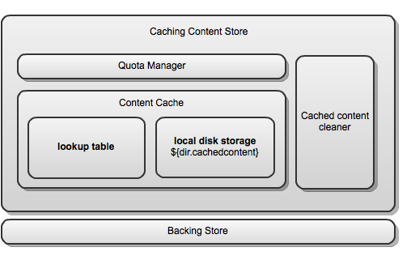

# `CachingContentStore` class overview

The `CachingContentStore` class adds transparent caching to any ContentStore implementation. Wrapping a slow ContentStore in a `CachingContentStore` improves access speed in many use cases. Example use cases include document storage using a XAM appliance or cloud-based storage, such as Amazon's S3.

The diagram shows the architecture of CCS.

The major classes and interfaces that form the Caching Content Store are:

-   **CachingContentStore:** This is the main class that implements the ContentStore interface, and can therefore, be used anywhere that a ContentStore could be used. The `CachingContentStore` handles all the high level logic of interaction between the cache and the backing store, while the caching itself is provided by a collaborating `ContentCache` object.
-   **ContentCache:** This class is responsible for putting items into and getting items from the cache. The single supplied implementation \(`ContentCacheImpl`\) for this class uses a lookup table to keep track of the files that are being managed by the cache, and a directory on the local file system to store the cached content files. The lookup table itself is a `SimpleCache` implementation instance \(for example, `DefaultSimpleCache` or `HazelcastSimpleCache`when running a clustered environment\).
-   **QuotaManagerStrategy:** The quota managers implement this interface and control how the disk usage is consumed for cached content storage. Alfresco Content Services provides two implementations for this: `UnlimitedQuotaStrategy` \(does not restrict disk usage, thereby effectively disabling the quota function\) and `StandardQuotaStrategy` \(attempts to keep usage below the maximum specified in bytes or MB\).

The `CachingContentStore` class is highly configurable and many of its components could be exchanged for other implementations. For example, the lookup table could easily be replaced with a different implementation of `SimpleCache` than that supplied.

The cached content cleaner \(`CachedContentCleaner`\) periodically traverses the directory structure containing the cached content files and deletes the content files that are not in use by the cache. Files are considered not in use by the cache if they have no entry in the lookup table managed by `ContentCacheImpl`. The content cache cleaner is not a part of the architecture but is a helper object for `ContentCacheImpl` and allows it to operate more efficiently.

**Parent topic:**[Caching content store \(CCS\)](../concepts/ccs-home.md)

