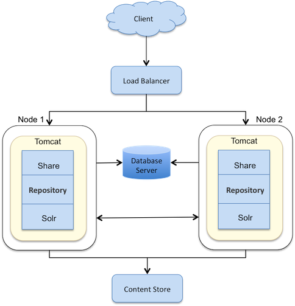

# Scenario: Clustering for redundancy

This is a scenario-based topic describing the clustering architecture for redundancy and high availability of Alfresco Content Services services.

This scenario shows a single repository database and content store, and two Tomcat nodes/web servers on two separate machines accessing the content simultaneously. The configuration does not guard against the content store or database failure, but allows multiple servers to share the web load, and provides redundancy in case of a server failure. Each server has local indexes \(in the local content store\).

This is the simplest cluster to set up and is ideal for small-scale installations. A cluster consisting of two or more machines working together provides a higher level of availability, reliability, and scalability than can be obtained from a single node.

A hardware load balancer balances the web requests among multiple servers. The load balancer must support 'sticky' sessions so that each client always connects to the same server during the session. The content store and database will reside on separate servers, which allows us to use alternative means for content store and database replication.

**Note:** All the servers in a cluster should have static IP addresses assigned to them.

**Parent topic:**[Recommendations for split architecture](../concepts/recommend-split.md)

