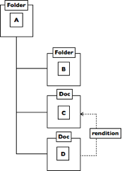

# Content modeling

Content modeling is a fundamental building block of the repository that provides a foundation for structuring and working with content.

**Note:** For more information about working with custom metadata models \(aspects, types and forms\), flexible content organization and actions in the Model Manager, see [Content modeling](admintools-cmm-intro.md).

Content modeling specifies how nodes stored in the repository are constrained, imposing a formal structure on nodes that an application can understand and enforce. Nodes can represent anything stored in the repository, such as folders, documents, XML fragments, renditions, collaboration sites, and people. Each node has a unique ID and is a container for any number of named properties, where property values can be of any data type, single or multi-valued.

Nodes are related to each other through relationships. A parent/child relationship represents a hierarchy of nodes where child nodes cannot outlive their parent. You can also create arbitrary relationships between nodes and define different types of nodes and relationships.

A content model defines how a node in the repository is constrained. Each model defines one or more types, where a type enumerates the properties and relationships that a node of that type can support. Often, concepts that cross multiple types of node must be modeled, which the repository supports through aspects. Although a node can only be of a single type, you can apply any number of aspects to a node. An aspect can encapsulate both data and process, providing a flexible tool for modeling content.

Content modeling puts the following constraints on the data structure:

-   A node must be of a given kind.
-   A node must carry an enumerated set of properties.
-   A property must be of a given data type.
-   A value must be within a defined set of values.
-   A node must be related to other nodes in a particular way.

These constraints allow the definition \(or modeling\) of entities within the domain. For example, many applications are built around the notion of folders and documents. It is content modeling that adds meaning to the node data structure.

The repository provides services for reading, querying, and maintaining nodes. Events are fired on changes, allowing for processes to be triggered. In particular, the repository provides the following capabilities based on events:

-   Policies: event handlers registered for specific kinds of node events for either all nodes or nodes of a specific type
-   Rules: declarative definition of processes based on addition, update, or removal of nodes \(for example, the equivalent of email rules\)

Models also define kinds of relationships, property data types, and value constraints. A special data type called `content` allows a property to hold arbitrary length binary data. Alfresco Content Services comes prepackaged with several content models. You can define new models for specific use cases from scratch or by inheriting definitions from existing models.

**Parent topic:**[Alfresco Content Services architecture overview](../concepts/alfresco-arch-about.md)

