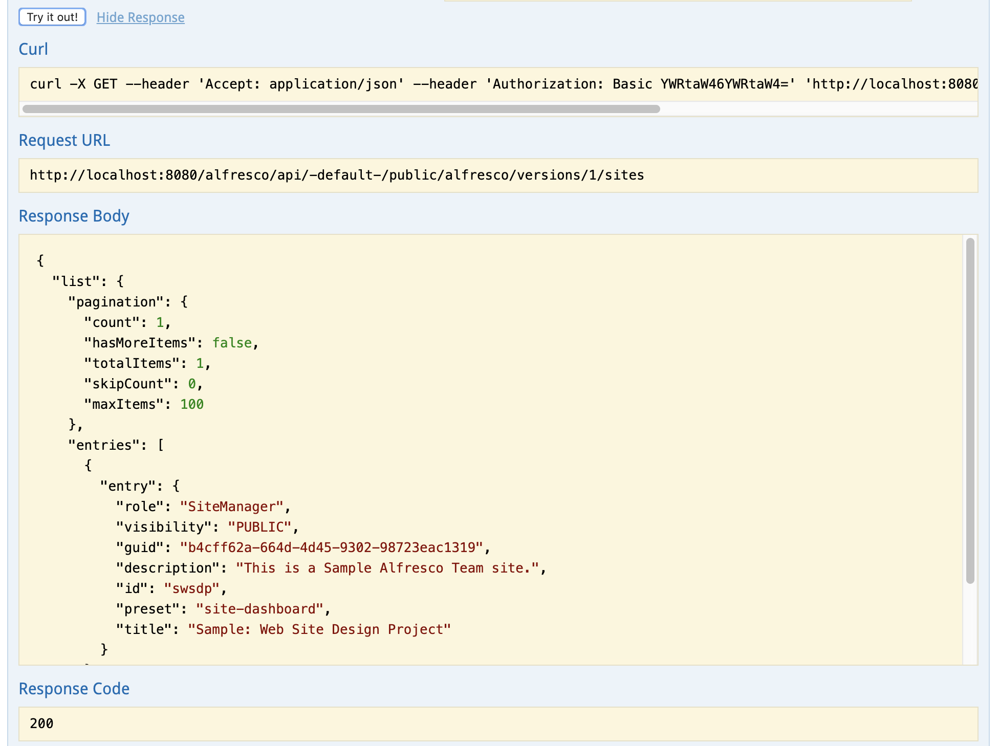

# Installing and Getting Started with the API Explorer

Information about Alfresco ReST API Explorer and how to install it and getting going with it.

## Introduction

The Alfresco ReST API v1 is described in the OpenAPI specification format \(formerly Swagger specification\). This is good as lots of different tools can read this format, and you can also use the specification to generate ReST API clients in different languages, such as Java.

Alfresco uses the Alfresco ReST API OpenAPI specification to provide an [API Explorer](https://github.com/Alfresco/rest-api-explorer), so you can easily read about all the APIs and try them out. The API Explorer comes in the format of a WAR file that needs to be installed \(dropped\) into your ACS installation.

If you just want to have a look at the latest API Explorer, then you can use an online version of it available here: [https://api-explorer.alfresco.com/api-explorer/](https://api-explorer.alfresco.com/api-explorer/)

## Installing

Most likely you would want to install the API Explorer into your local ACS installation. You can find the Alfresco API Explorer WAR file in [Alfresco’s Nexus repository](https://artifacts.alfresco.com/nexus/#nexus-search;quick~api-explorer). Pick the version that closest matches your ACS installation.

To install the WAR file follow one of two approaches. If you are using a trial version of ACS then you follow the first approach described below. If you are using the [Alfresco SDK](sdk-intro.md) you would want to follow the second approach.

***Installing the WAR file into an ACS Trial environment*:**

*1\) Stop Alfresco Content Services \(ACS\) Tomcat Server*

You would typically do this with the provided script: <ALF\_INSTALL\_DIR\> `$ ./alfresco.sh stop tomcat`

2\) *Rename the API Explorer WAR file*

Rename the downloaded API Explorer WAR file to api-explorer.war.

*3\) Copy the renamed WAR file into tomcat/webapps directory*

Copy the api-explorer.war file into the <ALF\_INSTALL\_DIR\>/tomcat/webapps directory.

*4\) Start the ACS Tomcat Server*

You would typically do this with the provided script: <ALF\_INSTALL\_DIR\> `$ ./alfresco.sh start tomcat`:

***Installing the WAR file into an Alfresco SDK AIO project:***

*1\) Verify that the API Explorer WAR is being installed*

The Alfresco SDK version 3.x will by default deploy the API Explorer WAR for you. If that is not the case verify that the property \(i.e. `enableApiExplorer`\) for this is enabled \(i.e. set to `true`\) in the Alfresco Maven plug-in configuration:

```
<plugin>
<groupId>org.alfresco.maven.plugin</groupId>
<artifactId>alfresco-maven-plugin</artifactId>
<version>${alfresco.sdk.version}</version>
<configuration>

    <!-- We need the flat file H2 database to run the Repo -->
    <enableH2>true</enableH2>
    <!-- We always need the Platform/Repo webapp - alfresco.war -->
    <enablePlatform>true</enablePlatform>
    <!-- Enable Solr webapp so we can use search -->
    <enableSolr>true</enableSolr>
    <!-- We need Share webapp, so we got a UI for working with the Repo -->
    <enableShare>true</enableShare>
    <!-- Enable the REST API Explorer -->
    <enableApiExplorer>true</enableApiExplorer>
...
```

Done!

You should now be able to access the API Explorer at [http://localhost:8080/api-explorer](http://localhost:8080/api-explorer/#/):


## Getting started

You make API requests by sending a URL using one of five HTTP API methods, GET, POST, PUT, DELETE, and OPTIONS. Here's an example of a URL to get all sites in a local Alfresco installation:

```
http://localhost:8080/alfresco/api/-default-/public/alfresco/versions/1/sites
```

You can use the ReST API Explorer to make this request:

-   In your web browser, navigate to `[http://localhost:8080/api-explorer/\#!/sites/listSites](http://localhost:8080/api-explorer/#!/sites/listSites)`. You'll see full documentation for the **GET /sites** API method, including the query and body parameter formats, and the expected and error response schemas.
-   At the end of the description you'll see the **Try it out!** button. Press it now.

    You've just made your first Alfresco ReST API request. You will see the request URL you've just invoked, the corresponding Curl command, the JSON response body that the Alfresco repository has returned, the HTTP response code, and the response headers: 


Note this call returns a list of site **entries**. All lists returned by the Alfresco ReST API are of this format.

**Parent topic:**[ReST API](../concepts/dev-api-by-language-alf-rest.md)

