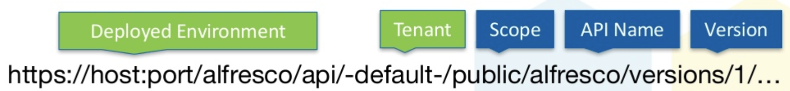
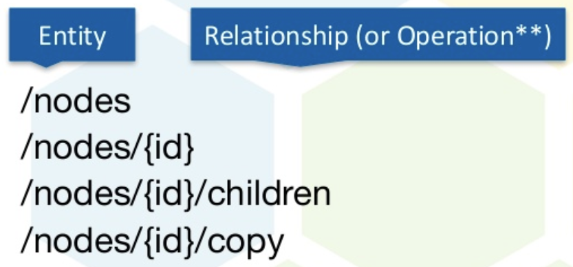

# Introduction

Introduction to the Alfresco ReST API version 1.0.

The Alfresco ReST API version 1.0 is a complete application interface that gives you access to all the features of the Alfresco Repository. The endpoint to access the API has the following format:

If you are accessing a local Repository the endpoint URL will most likely look like follows for a standard Repository installation: **https://localhost:8080/alfresco/api/-default-/public/alfresco/versions/1/...**

The tenant part will always be `-default-`, unless you are running a multi-tenant Alfresco solution where you would specify what tenant you want to operate against.

The scope is important and it denotes the accessibility of the API, `public` means it is allowed to use and `private` means that the API is for internal Alfresco use only \(can change at any time\). You can add your own scope, such as `extension`, for your own APIs. The Alfresco ReST API actually contains a number of APIs and the Core API is denoted by the **/alfresco** path. You also have the Search, Workflow, Discovery, and Authentication APIs.

To work with an object in the Repository, such as a folder or file node, you will append to this URL as follows:

An object in the Repository is referred to as an Entity. Which specific instance of an *entity* type you are working with is specified as part of the URL path \(i.e. `{id}`\). There can be Relationships between Entities and Operations applied to Entities, which are also specified as part of the URL \(i.e. `children`, `copy`\).

**Parent topic:**[ReST API](../concepts/dev-api-by-language-alf-rest.md)

