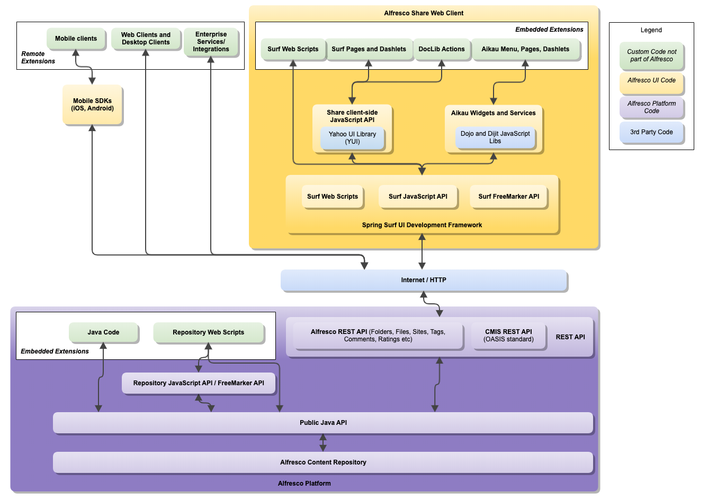

# API guide

Alfresco Content Services supports a range of APIs \(Application Programming Interfaces\) to enable developers to write applications that access the repository on-premise.

**Important:** Any APIs not covered by this documentation are unsupported and subject to significant change.

Alfresco Content Services provides a wide range of APIs.

The following diagram illustrates the key APIs:

There are three different kinds of customizations that you can build for Alfresco Content Services. Platform embedded extensions, Share embedded extensions, and remote extensions, also referred to as integrations.

On the platform \(server side\) you can add Java code and JavaScript code to extend the platform with new custom functionality such as Java Services, repository web scripts, actions, scheduled jobs and more. These extensions are embedded in the Platform application and run in the same JVM as the Platform. When developing platform extensions you use the [Public Java API](java-public-api-list.md) and the [Repository JavaScript API](API-JS-intro.md) and [Repository Freemarker Template API](../references/API-FreeMarker-intro.md).

On the web client side you can extend Alfresco Share with new pages, dashlets, document library actions and more. These extensions are embedded in the Share application and run in the same JVM as Alfresco Share. When developing Share extensions you use the [Aikau Widget and Services Reference/API](http://dev.alfresco.com/resource/docs/aikau-jsdoc/) and the [Spring Surf API](ws-presentation-intro.md).

Finally, you can also build stand-alone applications and web clients that talk to the repository remotely. These integrations will use the [ReST API](../pra/1/topics/pra-welcome.md).

The following sections give you a brief overview of the APIs, their use cases, and links to further information.

-   **[API overview](../concepts/dev-api-overview.md)**  
Provides an overview of each of the supported APIs, with links to further documentation.
-   **[Use Cases](../concepts/dev-api-use-cases.md)**  
Typical use cases when developing content management solutions, with an example of the appropriate API.
-   **[Using the APIs](../concepts/dev-api-functional-reference.md)**  
There is common functionality that is often accessed by developers in Alfresco Content Services. For example, there is often a requirement to obtain a list of users, groups or sites, or search for a list of documents.
-   **[API Reference](../concepts/dev-reference-guide.md)**  
This information provides reference materials for the various Alfresco Content Services APIs that are available.

**Parent topic:**[Developer guide](../concepts/dev-for-developers.md)

