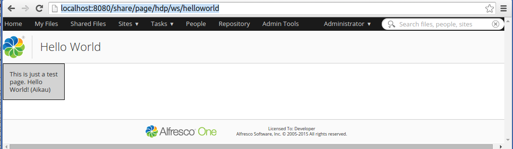

# Introduction to Aikau Pages

Use this information for a brief overview of Aikau Pages.

Let's see how we can implement a Hello World page with the new Aikau framework.

The following steps are needed to add an Aikau Page:

-   Add a Web Script descriptor \(XML\)
-   Add a Web Script template \(FTL\)
-   Add a Web Script controller \(JS\) with page layout/model
-   Add Widget to display content
-   Choose what Surf Page you want to use as a basis \(dp, hdp, rdp etc\)

OK, this might be a bit confusing, starting with a web script and then selecting a Surf page? If you have read through the [Share Architecture](dev-extensions-share-architecture-extension-points.md) page then you will remember that an Aikau page is based on a predefined Surf Page. So when you implement an Aikau page you are actually bypassing all the Site Data model stuff, and you go directly to the Web Script implementation that does the real job of fetching content and defining the presentation.

Start implementing the Aikau Page web script by creating a descriptor file called `helloworld-aikau.get.desc.xml` located in the alfresco/tomcat/shared/classes/alfresco/web-extension/site-webscripts/org/alfresco/demo directory:

```
<webscript>
    <shortname>Hello World</shortname>
    <description>Hello World page definition</description>
    <family>Share</family>
    <url>/helloworld</url>
</webscript>
```

Now implement the controller for the Web Script, create a file called `helloworld-aikau.get.js` in the same place as the descriptor:

```
model.jsonModel = {
    widgets: [
        {
            id: "SET_PAGE_TITLE",
            name: "alfresco/header/SetTitle",
            config: {
                title: "Hello World"
            }
        },
        {
            id: "DEMO_SIMPLE_MSG",
            name: "example/widgets/HelloWorldTextWidget"
        }
    ]
};      
```

The controller is where the main work is done when it comes to implementing the layout of the page. If you do not need any custom widgets then it might even be the only major thing you need to implement to get the Aikau page up and running. Now implement the template for the web script, create a file called `helloworld-aikau.get.html.ftl` in the same place as the descriptor:

```
<@processJsonModel />
```

The template just kicks off the `processJsonModel` FreeMarker template macro, which will, as it says, process the JSON model and assemble the page components.

Our page model contains an example widget that we need to implement. It is specified to be at the `example/widgets` package path. Dojo is the JavaScript framework used behind the scenes, and we need to tell it about the new package path. This can be done via a Spring Surf Module extension. Create a file called `example-widgets.xml` and put it in the alfresco/tomcat/shared/classes/alfresco/web-extension/site-data/extensions directory:

```
<extension>
  <modules>
    <module>
      <id>Example Aikau Widgets</id>
      <version>1.0</version>
      <auto-deploy>true</auto-deploy>
      <configurations>
        <config evaluator="string-compare" condition="WebFramework" replace="false">
          <web-framework>
            <dojo-pages>
              <packages>
                <package name="example" location="js/example"/>
              </packages>
            </dojo-pages>
          </web-framework>
        </config>
      </configurations>
    </module>
  </modules>
</extension>      
```

Now we can start implementing the Aikau Widget that should return the Hello World message. To do that we need to implement a new Dojo JavaScript class called `HelloWorldTextWidget`. The widget is pure client side resource stuff so we need to add the files involved into the exploded Share web app \(this is just because we are not using a build project\). Create a file called `HelloWorldTextWidget.js` and put it in the alfresco/tomcat/webapps/share/js/example/widgets directory:

```
define(["dojo/_base/declare",
        "dijit/_WidgetBase",
        "alfresco/core/Core",
        "dijit/_TemplatedMixin",
        "dojo/text!./HelloWorldTextWidget.html"
    ],
    function(declare, _Widget, Core, _Templated, template) {
        return declare([_Widget, Core, _Templated], {
            templateString: template,
            i18nRequirements: [ {i18nFile: "./HelloWorldTextWidget.properties"} ],
            cssRequirements: [{cssFile:"./HelloWorldTextWidget.css"}],
            
            buildRendering: function example_widgets_HelloWorldTextWidget__buildRendering() {
                this.helloWorldMsg = this.message('hello.world');
                this.inherited(arguments);

            }
        });
});      
```

This widget is based on an HTML template defined in a file called `HelloWorldTextWidget.html`, create this file in the same place as the Widget class:

```
<div class="helloWorldMsgStyle">${helloWorldMsg}</div>
```

The widget also uses a property called `hello.world` that needs to be available in a resource file called `HelloWorldTextWidget.properties`, create it in the same place as the Widget class:

```
hello.world=This is just a test page. Hello World! (Aikau)      
```

Finally the widget template uses a CSS style called `helloWorldMsgStyle` that needs to be available in a resource file called `HelloWorldTextWidget.css`, create it in the same place as the Widget class:

```
.helloWorldMsgStyle {
    border: 1px #000000 solid;
    padding: 1em;
    width: 100px;
    background-color:lightgrey;
}      
```

Now restart Alfresco Content Services and then access the page with the `http://localhost:8080/share/page/hdp/ws/helloworld` URL. You should see the following page in Share:



The page we choose as a basis \(that is, the Hybrid Dynamic Surf Page - `hdp`\) provides both the header and the footer for the Share web application. If you want to see the page stand-alone you can use the `dp` page as a basis.

So when we are working with Aikau pages we do not have to bother about the Site Data model and all the different kinds of XML files. We just create a web script where the controller will contain the complete layout of the page. And then the page content will go into an auto-generated region on the Surf page we select.

[Back to Introduction to Surf Pages](dev-extensions-share-architecture-extension-points-intro-surf-pages.md)

[Back to Share Architecture and Extension Points](dev-extensions-share-architecture-extension-points.md)

**Parent topic:**[Share Architecture](../concepts/dev-extensions-share-architecture-extension-points.md)

