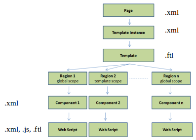
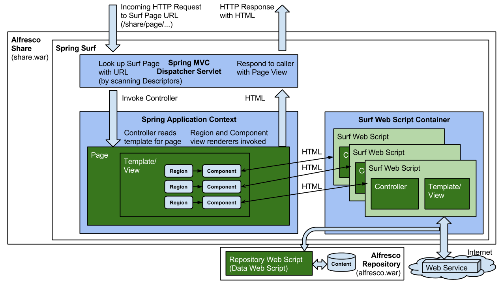

# Surf Pages

The Alfresco Share web application is built up of a main menu from which you can navigate to a number of pages. These pages are implemented with the Surf development framework. However, note that some pages have been converted and implemented with the Aikau development framework, see architecture section.

|Extension Point|Surf Pages \(It is recommended to use [Aikau Pages](dev-extensions-share-aikau-pages.md) instead\)|
|---------------|--------------------------------------------------------------------------------------------------|
|Architecture Information|[Share Architecture](dev-extensions-share-architecture-extension-points.md).|
|Description|Surf pages are the "old school" pages that most of the Share UI is built up around. But more and more pages are converted to [Aikau pages](dev-extensions-share-aikau-pages.md). All files involved in defining a Surf page are stored under /site-data and /templates.

Putting together a Surf page involves a lot of objects, such as page, template-instance, component, and so on. This is called the [siteData](../references/surf-object-xml-reference.md) model and the following picture illustrates how these objects play together:

  The definition of a [Surf page](../references/surf-object-xml-reference-page.md) is done in XML and looks like this in a Hello World example:

```
<?xml version="1.0" encoding="UTF-8"?>
<page>
    <title>Hello World</title>
    <title-id>page.helloworld.title</title-id>
    <description>Hello World Description</description>
    <description-id>page.helloworld.description</description-id>
    <template-instance>helloworldhome-three-column</template-instance>
    <authentication>none</authentication>
</page>   
```

Page definition file names follow a naming convention: `<page-id>.xml`, the above page definition could be stored in a file called helloworld.xml under site-data/pages.

The page definition refers to a [template instance](../references/surf-object-xml-reference-template-instance.md) that links to the physical template, it is defined in XML:

```
<?xml version="1.0" encoding="UTF-8"?>
<template-instance>
    <template-type>org/alfresco/training/helloworld-1-column</template-type>
</template-instance>   
```

Template instance definition file names follow a naming convention: `<template-instance-id>.xml`, the above template instance definition could be stored in a file called helloworld-1-column.xml under site-data/template-instances.

The physical template is defined in FreeMarker and looks something like this:

```
<#include "/org/alfresco/include/alfresco-template.ftl" />
<@templateHeader>
</@>

<@templateBody>
   <@markup id="alf-hd">
   <div id="alf-hd">
      <@region scope="global" id="share-header" chromeless="true"/>
   </div>
   </@>
   <@markup id="bd">
    <div id="bd">
        <@region id="body" scope="page" />
    </div>
   </@>
</@>

<@templateFooter>
   <@markup id="alf-ft">
   <div id="alf-ft">
      <@region id="footer" scope="global" />
   </div>
   </@>
</@>   
```

Template files are stored under /templates.

The page is built up of different regions, and each `region` is defined for a specific `scope`, such as `global` or `page`. If the scope is page then we always need to implement the rendition for the region. This is done via a [component](../references/surf-object-xml-reference-component.md), which is defined in XML:

```
<?xml version="1.0" encoding="UTF-8"?>
<component>
    <url>/components/helloworld/body</url>
</component>
```

Page definition file names follow a naming convention: `<scope[global|template|page]>.<region-id>.<[template-instance-id|page-id]>.xml`, the above component definition could be stored in a file called page.body.helloworld.xml under site-data/components. The component just points to a [Surf Web Script](dev-extensions-share-surf-web-scripts.md) that should render the HTML for the page region.

A Surf page is processed and generated via the Spring MVC framework. The following picture gives an overview of how it works:

 

As we can see in the picture, all dynamic content that should go onto the page is fetched indirectly via Surf Web Scripts, which can get the content from either the Alfresco Repository or from some other remote Web Service.

|
|Deployment - App Server|-   tomcat/shared/classes/alfresco/web-extension/site-data/pages/ - Page definition
-   tomcat/shared/classes/alfresco/web-extension/site-data/template-instances/ - Template instance pointing to FreeMarker template
-   tomcat/shared/classes/alfresco/web-extension/site-data/components/ - Components fetching content and rendering presentation for a specific region in the physical template
-   tomcat/shared/classes/alfresco/web-extension/templates - FreeMarker template location

 \(These paths are untouched by re-depolyments and upgrades\) For component Web Script file locations see: [Web Script](dev-extensions-share-surf-web-scripts.md) section.

|
|[Deployment All-in-One SDK project](sdk-getting-started.md).|-   aio/share-jar/src/main/resources/alfresco/web-extension/site-data/pages/
-   aio/share-jar/src/main/resources/alfresco/web-extension/site-data/template-instances/
-   aio/share-jar/src/main/resources/alfresco/web-extension/site-data/components/
-   aio/share-jar/src/main/resources/alfresco/web-extension/templates

 For component web script file locations see: [Web Script](dev-extensions-share-surf-web-scripts.md) section.|
|More Information|-   [Introduction to Surf Pages](dev-extensions-share-architecture-extension-points-intro-surf-pages.md)\) - This page contains a walk-through on how to create a Surf page, and it also has links to a page that shows how to create the same page with Aikau.
-   [Spring Surf Framework Guide](surf-fwork-intro.md) - Deep dive into the Surf framework
-   [Site Date Model Reference](../references/surf-object-xml-reference.md) - Details around all the model objects such as page, component, and template-instance.
-   [Surf root objects](../references/APISurf-rootscoped.md)
-   [Component rendering root objects](../references/APISurf-components.md)
-   [Template rendering root objects](../references/APISurf-templates.md)

|
|Sample Code|-   [Custom Surf Pages, Surf Dashlets, and Surf Web Scripts](https://github.com/Alfresco/alfresco-sdk-samples/tree/alfresco-51/all-in-one/add-surf-dashlet-and-page-share)

|
|Tutorials|-   [Adding a new Surf page.](../tasks/dev-extensions-share-tutorials-add-page.md)
-   [Making a new Surf page the default page.](../tasks/dev-extensions-share-tutorials-make-default.md)
-   [Adding content to a Surf page](../tasks/dev-extensions-share-tutorials-add-content.md)
-   [Removing/hiding content from a Surf page](../tasks/dev-extensions-share-tutorials-hide-content.md)
-   [Conditionally controlling rendering of content on Surf page](../tasks/dev-extensions-share-tutorials-subcomponent-evals.md)
-   [Exploring root objects that can be used in a template.](../tasks/surf-tutorials-exploring-root-objects.md)

|
|Developer Blogs|-   [Adding a Surf page and making it the landing page](https://hub.alfresco.com/t5/alfresco-content-services-blog/advanced-share-customization-part-1/ba-p/293015)
-   [Adding a Surf page and making it the login page](https://hub.alfresco.com/t5/alfresco-content-services-blog/advanced-share-customization-part-2/ba-p/287517)
-   [Checksum dependencies for page resources](https://hub.alfresco.com/t5/alfresco-content-services-blog/checksum-dependencies-in-surf/ba-p/287715)
-   [CSS Data Image Support in pages](https://hub.alfresco.com/t5/alfresco-content-services-blog/css-data-image-support-in-spring-surf/ba-p/287698)

|

-   **[Template markup](../concepts/dev-extensions-share-template-markup.md)**  
There are a number of additional FreeMarker template directives.

**Parent topic:**[Share Extension Points](../concepts/dev-extensions-share-extension-points-introduction.md)

