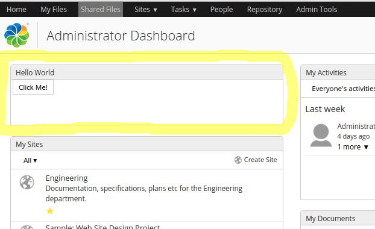

# Surf Widgets

The Share web application is built up of a main menu, pages, and dashlets. The pages and dashlets are mainly processed on the server side as web scripts. When client side processing is needed in the form of browser JavaScript and CSS then this is contained in Widgets. The Surf Widgets uses the Yahoo UI library as JavaScript framework and widget library. These widgets will eventually be replaced by Aikau Widgets.

|Extension Point|Surf Widgets|
|---------------|------------|
|Architecture Information|[Share Architecture](dev-extensions-share-architecture-extension-points.md).|
|Description|We are going to look at implementing a custom Surf widget. To do this we will implement a very simple Hello World Dashlet that uses a Surf Widget.

Creating a Surf Dashlet is the same thing as creating a Surf Web Script. Before continuing read through the [Surf Web Scripts section](dev-extensions-share-surf-web-scripts.md). The Dashlet will contain a Button that when clicked shows a message. The click handler and pop-up message will be handled by the Surf widget.

The finished Dashlet will look something like this:



When the user clicks the "Click Me!" button it will display a message in grey that fades away. If you hover over the Dashlet it will show a "?" for help in the toolbar. It will also be possible to resize the Dashlet. The Web Script controller looks like this:

```
// Dashlet widgets
var widgets = [];

// Main component
widgets.push({
    id: "HelloWorld",
    name: "MyCompany.dashlet.HelloWorld",
    options: {
        componentId: instance.object.id
    }
});

// Resizer
widgets.push({
    id : "DashletResizer",
    name : "Alfresco.widget.DashletResizer",
    initArgs : ["\"" + args.htmlid + "\"","\"" + instance.object.id + "\""],
    useMessages: false
});

// Title bar actions
var actions = [];
actions.push({
    cssClass: "help",
    bubbleOnClick:
    {
        message: msg.get("dashlet.help")
    },
    tooltip: msg.get("dashlet.help.tooltip")
});
widgets.push({
    id : "DashletTitleBarActions",
    name : "Alfresco.widget.DashletTitleBarActions",
    useMessages : false,
    options : {
        actions: actions
    }
});

model.widgets = widgets;   
```

The controller will put together a list of Spring Surf widgets that we can use. The first one is called `MyCompany.dashlet.HelloWorld` and this is the custom widget that we need to implement.

Here is the implementation of the Hello World widget:

```
/**
 * MyCompany root namespace.
 *
 * @namespace MyCompany
 */
if (typeof MyCompany == "undefined" || !MyCompany) {
    var MyCompany = {};
}

/**
 * MyCompany dashlet namespace.
 *
 * @namespace MyCompany.dashlet
 */
if (typeof MyCompany.dashlet == "undefined" || !MyCompany.dashlet) {
    MyCompany.dashlet = {};
}

/**
 * Sample Hello World dashboard component.
 *
 * @namespace MyCompany.dashlet
 * @class MyCompany.dashlet.HelloWorld
 * @author
 */
(function () {
    /**
     * YUI Library aliases
     */
    var Dom = YAHOO.util.Dom,
        Event = YAHOO.util.Event;

    /**
     * Alfresco Slingshot aliases
     */
    var $html = Alfresco.util.encodeHTML,
        $combine = Alfresco.util.combinePaths;


    /**
     * Dashboard HelloWorld constructor.
     *
     * @param {String} htmlId The HTML id of the parent element
     * @return {MyCompany.dashlet.HelloWorld} The new component instance
     * @constructor
     */
    MyCompany.dashlet.HelloWorld = function HelloWorld_constructor(htmlId) {
        return MyCompany.dashlet.HelloWorld.superclass.constructor.call(this, "MyCompany.dashlet.HelloWorld", htmlId);
    };

    /**
     * Extend from Alfresco.component.Base and add class implementation
     */
    YAHOO.extend(MyCompany.dashlet.HelloWorld, Alfresco.component.Base,
        {
            /**
             * Object container for initialization options
             *
             * @property options
             * @type object
             */
            options: {},

            /**
             * Fired by YUI when parent element is available for scripting
             *
             * @method onReady
             */
            onReady: function HelloWorld_onReady() {
                this.widgets.testButton = Alfresco.util.createYUIButton(this, "testButton", this.onButtonClick);
            },

            /**
             * Button click event handler
             *
             * @method onButtonClick
             */
            onButtonClick: function HelloWorld_onButtonClick(e) {
                Alfresco.util.PopupManager.displayMessage(
                    {
                        text: "Button clicked in Hello World Dashlet!"
                    });
            }
        });
})();   
```

This widget will create a YUI button and attach it to the element in the UI with the `testButton` id. The UI markup looks like this in the Web Script template:

```
<#-- JavaScript Dependencies -->
<@markup id="js">
    <@script type="text/javascript" src="${url.context}/res/components/dashlets/helloworld.js" group="dashlets"/>
</@>

<#-- Stylesheet Dependencies
<@markup id="css">
    <@script type="text/css" src="${url.context}/res/components/dashlets/helloworld.css" group="dashlets"/>
</@>
-->

<#-- Widget creation -->
<@markup id="widgets">
    <@createWidgets group="dashlets"/>
</@>

<@markup id="html">
    <@uniqueIdDiv>
        <#assign el = args.htmlid?html>
        <#assign dashboardconfig=config.scoped['Dashboard']['dashboard']>

        <div class="dashlet">
            <div class="title">
            ${msg("hello.world.dashletTitle")}
            </div>
            <div class="body">
                <button id="${el}-testButton">${msg('hello.world.buttonLabel')}</button>
            </div>
        </div>
    </@>
</@>
   
```

Now, to create a Dashlet Web Script you also need a descriptor, which is defined in XML and looks something like this:

```
<webscript>
    <shortname>Hello World</shortname>
    <description>Hello World Dashlet</description>
    <family>dashlet</family>
    <url>/components/dashlets/helloworld</url>
</webscript>   
```

Here we are not using any custom client side CSS. Instead we use out-of-the-box styling. In the markup you will see references to i18n labels such `${msg("hello.world.buttonLabel")}`. These messages are defined in the Web Script properties file as follows:

```
hello.world.dashletTitle=Hello World
hello.world.buttonLabel=Click Me!   
```

|
|Deployment - App Server|-   tomcat/shared/classes/alfresco/web-extension/site-webscripts/ \(Untouched by re-depolyments and upgrades\)
-   tomcat/webapps/share/components/ \(when web resources are included you need to put them directly into the exploded webapp, this is **NOT** recommended.\)

|
|[Deployment All-in-One SDK project](sdk-getting-started.md).|-   aio/share-jar/src/main/resources/alfresco/web-extension/site-webscripts/\{custom path\}
-   aio/share-jar/src/main/resources/META-INF/resources/share-jar/components \(when web resources such as CSS and JS are included\)

|
|More Information|-   [Customizing widget instantiation](dev-extensions-share-widget-customization.md)

|
|Sample Code|-   [Custom Surf Pages, Surf Dashlets, and Surf Web Scripts](https://github.com/Alfresco/alfresco-sdk-samples/tree/alfresco-51/all-in-one/add-surf-dashlet-and-page-share)

|
|Tutorials|-   [Customizing Surf Widget Instantiation](../tasks/dev-extensions-share-tutorials-customizing-widget-instantiation.md)

|
|Alfresco Developer Blogs|-   [Display pop-up a message every time that a Document Library filter is changed](https://hub.alfresco.com/t5/alfresco-content-services-blog/customizing-share-javascript-widget-instantiation-part-1/ba-p/292916)
-   [The technique behind customizing Share widgets](https://hub.alfresco.com/t5/alfresco-content-services-blog/customizing-share-javascript-widget-instantiation-part-2/ba-p/292988)
-   [Referencing JavaScript objects declared in the FreeMarker template in the widget instantiation metadata](https://hub.alfresco.com/t5/alfresco-content-services-blog/customizing-share-javascript-widget-instantiation-part-3/ba-p/293009)
-   [More on FreeMarker directives affecting widget instantiation](https://hub.alfresco.com/t5/alfresco-content-services-blog/customizing-share-javascript-widget-instantiation-part-4/ba-p/292998)

|

-   **[Customizing Surf Widget instantiation](../concepts/dev-extensions-share-widget-customization.md)**  
Use this information to understand the mechanisms behind customizing widget instantiation.

**Parent topic:**[Share Extension Points](../concepts/dev-extensions-share-extension-points-introduction.md)

