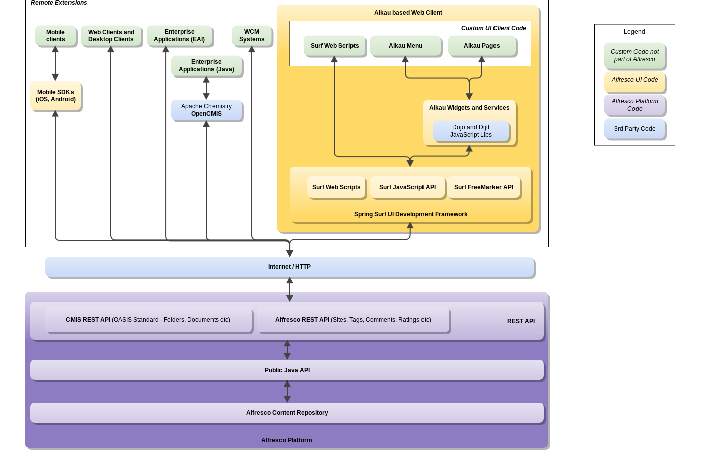

# Platform integration architecture

The platform integration architecture contains key integration points.

The following diagram illustrates the platform integration architecture and [integration points](dev-platform-integration-points.md):

The API that is mostly used for platform integrations is of course the [REST API](../pra/1/topics/pra-welcome.md). Sometimes the invocation of the REST API is hidden, such as when working with a Java client using the [OpenCMIS](http://chemistry.apache.org/java/developing/index.html) Java library. Other times we might build on the [Aikau](https://github.com/Alfresco/Aikau) development framework, which provides content management widgets and services so we don't have to start from scratch. But even Aikau calls the REST API under the hood.

**Parent topic:**[Platform integrations](../concepts/dev-platform-integrations.md)

