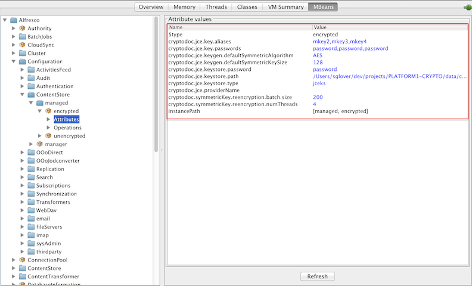

# Configuring the Encrypted content store

Use this information to configure the Encrypted content store.

The Encrypted content store is configured using the properties in the alfresco-global.properties file and can also be administered using JMX.

-   **[Encrypted content store properties](../concepts/encrypted-config-properties.md)**  
There are a number of properties that need to be set for the Encrypted content store.

**Parent topic:**[Encrypted content store](../concepts/encrypted-cs-home.md)

## Set up encryption properties using alfresco-global.properties file

To configure the Encrypted content store, set the configuration properties in the alfresco-global.properties file. For example, here is a set of properties which configure the default Java JCE provider implementation with two master keys \(override the `cryptodoc.jce.providerName` property to configure a specific provider\).

```
filecontentstore.subsystem.name=encryptedContentStore
cryptodoc.jce.keystore.path=<path_to_the_keystore>
cryptodoc.jce.keystore.password=<master_password_for_the_keystore>
cryptodoc.jce.key.aliases=<alias_for_the_key>
cryptodoc.jce.key.passwords=<password_for_the_key_itself>
cryptodoc.jce.keygen.defaultSymmetricKeySize=128
```

For detailed information on these properties, see [Encrypted content store properties](encrypted-config-properties.md).

**Note:** On Enterprise, properties edited using JMX are persisted and will override any settings in the alfresco-global.properties file. Use the JMX client to change the configuration properties on Enterprise.

## Set up encryption properties using JMX client

You can configure the Encrypted content store using the JMX client, such as JConsole on the **JMX MBeans \> Alfresco \> Configuration \> ContentStore \> managed \> encrypted \> Attributes** tab.



