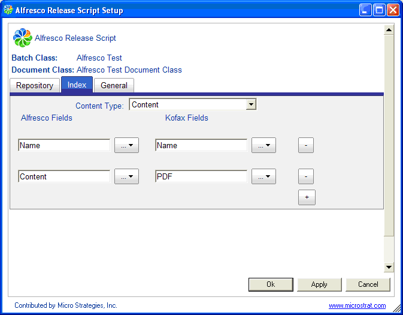

# Index tab

The Index tab defines the Alfresco Content Services document type used for released documents, and the mappings between Kofax index fields and Alfresco Content Services properties.

Each row defines the mapping between an Alfresco Content Services property and a Kofax indexing field. The **Content Type** and Alfresco Fields values available can be controlled through configuration.

-   **Content type**

    The content type that will be used for documents created by the Release script. It can be a custom content type or content.

-   **Alfresco Content Services Fields**

    Use the list to pick properties based on the available types and aspects that will be populated with Kofax Capture index data.

-   **Kofax fields**

    Use the list to pick the Kofax Capture field to map to a property. The **Text Constant** field can provide a fixed text value for the field.

**Important:** You must define a **Name** field and a **Content** field, as shown in the previous figure. The **Content** field is used to store the image file, such as Image \(TIF\), PDF, or Text \(OCR\).

**Parent topic:**[Kofax Release script configuration tabs](../concepts/kofax-relscript-config.md)

