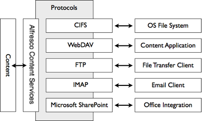

# Protocols

The content application server supports many folder and document-based protocols to access and manage content held within the repository using familiar client tools.

All the protocol bindings expose folders and documents held in the repository. This means a client tool accessing the repository using the protocol can navigate through folders, examine properties, and read content. Most protocols also permit updates, allowing a client tool to modify the folder structure, create and update documents, and write content. Some protocols also allow interaction with capabilities such as version histories, search, and tasks.

Internally, the protocol bindings interact with the repository services, which encapsulate the behavior of working with folders and files. This ensures a consistent view and update approach across all client tools interacting with the content application server.

A subsystem for file servers allows configuration and lifecycle management for each of the protocols either through property files or JMX.

Supported protocols include:

-   **CIFS \(Common Internet File System\)**

    CIFS allows the projection of Alfresco Content Services as a native shared file drive. Any client that can read and write to file drives can read and write to Alfresco Content Services, allowing the commonly used shared file drive to be replaced with an ECM system without users even knowing.

-   **WebDAV \(Web-based Distributed Authoring and Versioning\)**

    WebDAV provides a set of extensions to HTTP for managing files collaboratively on web servers. It has strong support for authoring scenarios such as locking, metadata, and versioning. Many content production tools, such as the Microsoft Office suite, support WebDAV. Additionally, there are tools for mounting a WebDAV server as a network drive.

-   **FTP \(File Transfer Protocol\)**

    FTP is a standard network protocol for exchanging and manipulating files over a network. This protocol is particularly useful for bulk loading folders and files into the repository.

-   **IMAP \(Internet Message Access Protocol\)**

    IMAP is a prevalent standard for allowing email access on a remote mail server. Alfresco presents itself as a mail server, allowing clients such as Microsoft Outlook, AppleMail, and Thunderbird to connect to and interact with folders and files held within the repository. IMAP supports three modes of operation:

    1.  Archive: allows email storage in the repository by using drag/drop and copy/paste from the IMAP client
    2.  Virtual: folders and files held in the repository are exposed as emails within the IMAP client with the ability to view metadata and trigger actions using links embedded in the email body
    3.  Mixed: a combination of both archive and virtual

-   **Microsoft SharePoint Protocols**

    Alfresco Office Services support Microsoft SharePoint Protocols. This allows Alfresco Content Services to act as a SharePoint server, creating tight integration with the Microsoft Office suite. A user who is familiar with the Microsoft task pane can view and act upon documents held within the repository. Collaborative features of Microsoft SharePoint are mapped to Alfresco Share site capabilities.

**Parent topic:**[Alfresco Content Services architecture overview](../concepts/alfresco-arch-about.md)

