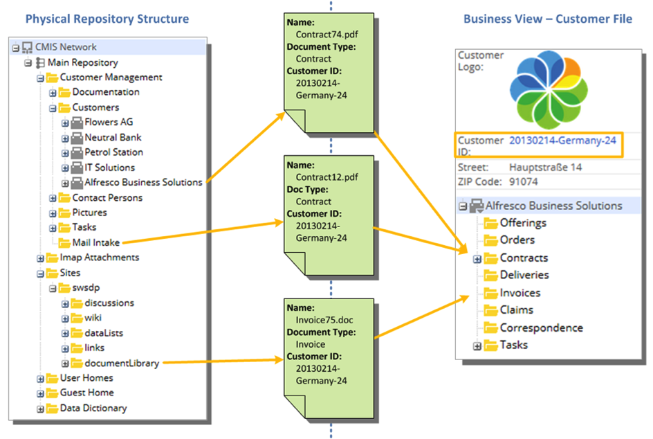

# Using Smart Folders

A Smart Folder is a way of grouping files from different locations in Alfresco Share into a single folder, so that you can quickly find similar files.

A search runs when you open the contents of the Smart Folder, and the results are displayed. It is “smart”, because there is no physical folder to represent it in the repository.

For example, a Smart Folder called My video files might be created to contain all files that I created that have a video format. Every time I open the My video files folder, the search runs, and all my video files are available in that folder, wherever in the repository I have created them.

You might not even know that you are using Smart Folders. If you see this icon, , then the folder is smart. Files are also automatically classified when they're uploaded into these folders.

The diagram shows a physical file system, and how a Smart Folder structure is created to contain files relevant to a particular customer:

Smart Folders have a limited set of actions:

-   Add/ Create: You can add files to a Smart Folder. The file is put into a physical folder, as specified by the filing rule.
-   Update: You can update files in a Smart Folder. Updating a property might result in a file being removed from the current Smart Folder \(because it no longer meets the query criteria\).
-   Delete, Edit Properties, Unzip To, Sync, Locate To, Move, and Copy actions for files are not supported.

The Smart Folder itself can't be edited in Alfresco Content Services, except through the Smart Folder Template. For more information about Smart Folder Templates, see [Applying a Smart Folder Template](../tasks/sf-using-aspects.md).

Your system administrator creates templates that you can load for different purposes, for example; a structure for a claim, or to file PDF files separately from video or audio files, or just to personalise the folder structure by user.

Take a look at the videos to learn more: [Smart Folders videos](../topics/smart-video-tutorials.md)

System administrators and business analysts can find more information here: [Configuring Smart Folders](sf-intro.md) and in the tutorial: [Smart Folders tutorial](../tasks/sf-tutorial.md).

-   **[Applying a Smart Folder Template](../tasks/sf-using-aspects.md)**  
You can apply a Smart Folder structure to a physical folder by using aspects.
-   **[Smart Folders FAQs](../references/sf-faqs.md)**  
If you have any problems with Smart Folders, try these suggestions to resolve your issue.

**Parent topic:**[Using Alfresco Share](../topics/sh-uh-welcome.md)

