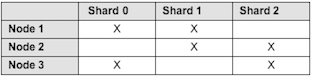
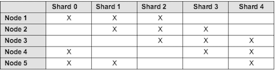

# High availability configuration

Sharding a Solr index is a highly scalable approach for improving the throughput and overall performance of large repositories. It provides high availability in case a shard/node fails.

Here are a few examples of a high availability configuration in a sharded Solr setup.

**Example 1**

In this example, you will setup a sharded cluster that contains:

-   3 hosts/machines
-   3 shards
-   2 copies



These are the steps to follow:

1.  Create machines to host Solr shards.
2.  Install and start Alfresco Content Services 5.1.
3.  Delete the alfresco and archive cores.
4.  Configure the <SOLR\_HOME\>/conf/shared.properties file.
5.  Start the Solr server.
6.  Create your new index shards and instances by configuring the properties on the URL.

    ```
    http://localhost:8090/solr4/admin/cores?action=newCore&storeRef=workspace://SpacesStore&numShards=3&numNodes=3&nodeInstance=1
    &template=rerank&property.data.dir.root=<>&shardIds=0,1&property.alfresco.port=8080
    ```

    ```
    http://localhost:8070/solr4/admin/cores?action=newCore&storeRef=workspace://SpacesStore&numShards=3&numNodes=3&nodeInstance=2
    &template=rerank&property.data.dir.root=<>&shardIds=1,2&property.alfresco.port=8080
    ```

    ```
    http://localhost:8070/solr4/admin/cores?action=newCore&storeRef=workspace://SpacesStore&numShards=3&numNodes=3&nodeInstance=3
    &template=rerank&property.data.dir.root=<>&shardIds=0,2&property.alfresco.port=8080
    ```

7.  Set the following properties in the alfresco-global.properties file.

    ```
    solr.secureComms=none
    solr.useDynamicShardRegistration=true 
    ```

8.  Restart Alfresco Content Services.

**Example 2**

Another example to setup a sharded cluster that contains:

-   5 hosts/machines
-   5 shards
-   3 copies



These are the steps to follow:

1.  Create machines to host Solr shards.
2.  Install and start Alfresco Content Services 5.1.
3.  Delete the alfresco and archive cores.
4.  Configure the <SOLR\_HOME\>/conf/shared.properties file.
5.  Start the Solr server.
6.  Create your new index shards and instances by configuring the properties on the URL.

    ```
    http://localhost:8090/solr4/admin/cores?action=newCore&storeRef=workspace://SpacesStore&numShards=5&numNodes=5&nodeInstance=1
    &template=rerank&property.data.dir.root=<>&shardIds=0,1,2&property.alfresco.port=8080
    ```

    ```
    http://localhost:8070/solr4/admin/cores?action=newCore&storeRef=workspace://SpacesStore&numShards=5&numNodes=5&nodeInstance=2
    &template=rerank&property.data.dir.root=<>&shardIds=1,2,3&property.alfresco.port=8080
    ```

    ```
    http://localhost:8070/solr4/admin/cores?action=newCore&storeRef=workspace://SpacesStore&numShards=5&numNodes=5&nodeInstance=3
    &template=rerank&property.data.dir.root=<>&shardIds=2,3,4&property.alfresco.port=8080
    ```

    ```
    http://localhost:8070/solr4/admin/cores?action=newCore&storeRef=workspace://SpacesStore&numShards=5&numNodes=5&nodeInstance=4
    &template=rerank&property.data.dir.root=<>&shardIds=0,3,4&property.alfresco.port=8080
    ```

    ```
    http://localhost:8070/solr4/admin/cores?action=newCore&storeRef=workspace://SpacesStore&numShards=5&numNodes=5&nodeInstance=5
    &template=rerank&property.data.dir.root=<>&shardIds=0,1,4&property.alfresco.port=8080
    ```

7.  Set the following properties in the alfresco-global.properties file.

    ```
    solr.secureComms=none
    solr.useDynamicShardRegistration=true 
    ```

8.  Restart Alfresco Content Services.

For more information, see [Installing and configuring Solr shards](../tasks/install-solr-shards.md).

**Parent topic:**[Installing and configuring Solr shards](../tasks/install-solr-shards.md)

