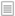

# What can I do with the site dashlets?

As well as giving you an overview of activity and information on Alfresco Share, the dashlets also give you links to various areas of Share and let you carry out a range of actions.

**Tip:** When a user name, site name, or item appears as a link, you can click it to navigate to the related page. When you hover over some dashlets additional options are displayed.

**Note:**

The RSS Feed, Alfresco Add-ons RSS Feed, and Web View site dashlets on the site dashboard are identical to those on your personal dashboard.

The My Discussions, Site Search, and Saved Search dashlets are identical to those on your user dashboard, but on the site dashboard the results displayed are specific to the current site.

Any combination of the site dashlets can appear on the dashboard:

-   **Site Members**

    Displays the current members of this site \(to a maximum of 100 members\) and their assigned roles.

    -   Click a member’s name to view their user profile.
    -   Click **All Members** to display all site members.
    -   Click **Add Users** to add users this site. This is available only if you are a site manager.
-   **Site Content**

    Lists the library content that has been added or edited in the past seven days.

    -   Click a content item name or thumbnail to preview or work with that item in the library.
    -   Select a view option: **Simple** or **Detailed**.
    -   Mark an item as a favorite or remove it from the Favorites list \(Detailed view only\).
    -   Like or unlike an item \(Detailed view only\).
    -   Click the **Comment** link to add a comment on an item \(Detailed view only\).
-   **Site Activities**

    Tracks the most recent activities performed in this site such as content additions, edits, and deletions, as well as changes in site membership.

    -   Use the filter to display the activities by ownership, type, and time period. You can display only your activities, only other users’ activities, or all activities. You can also view only a specific type of activity, such as changes in membership or status updates.
    -   Click the RSS Feed icon to subscribe to the feed to automatically receive the activity updates.
    **Note:** The only users notified of deletions are the user who made the deletion and the Alfresco Administrator.

-   **Site Profile**

    Displays a summary of the site details.

-   **Site Calendar**

    Lists the upcoming events scheduled in this site's calendar.

-   **Wiki**

    Displays a selected page from the site wiki.

    -   Click the name of the wiki page in the dashlet header to navigate to the wiki.
    -   Click the  configure icon to select a different wiki page to display in the dashlet. This is available only if you are a site manager.
-   **Site Links**

    Displays the web links compiled by site users.

    -   Click a link to open the related website.
    -   Click the  link's details icon to view the full link and any related comments.
-   **Image Preview**

    Displays a thumbnail of all images stored in the site's library.

    -   Click a thumbnail to open the image in the current window.
    -   Click the View Details icon to preview or work with the image in the library.
    -   Click the Download icon to download a copy of the image to your computer.
    -   Click the  configure icon to specify a folder. The dashlet will display the images in just that folder.
-   **Site File Type Breakdown**

    Displays a detailed breakdown of all files stored in the site's library.

    -   Hover over a section of the breakdown chart to see more details.
-   **Site Contributor Breakdown**

    Displays a breakdown of all site members contributing content to the site's library.

    -   Select a time period to view contributions for.
    -   Hover over a section of the breakdown chart to see more details on a specific contributor.
    -   Click on a section of the chart to open that users profile.
-   **Web View**

    Displays a website configured by a site manager.

    -   Click the  configure icon to select a website to display.
-   **Site Notice**

    Displays a custom message posted by a site manager

    -   Click the  configure icon to edit or change the message. This is available only if you are a site manager.
    **Tip:** This dashlet title can be customized, so the dashlet will probably have a label other than **Site Notice**.

-   **RSS Feed**

    Displays the Alfresco website feed by default.

    -   Click the  configure icon to change the RSS feed.
-   **Alfresco Add-ons RSS Feed**

    Displays the Newest Add-ons feed from the Alfresco Add-ons website by default.

    -   Click the  configure icon to change the RSS feed.
-   **Site Data Lists**

    Lists this site's data lists.

    -   Click a list to open it.
    -   Click Create Data List to create a new list for this site. This action is not available for users with the role Consumer.
-   **My Discussions**

    Shows the most recent topics created in the site discussion forum.

    -   Use the filter to choose the information you want to see.
-   **Site Search**

    Lets you search in the current site.

    -   Enter search criteria and click **Search** \(or press ENTER\).
    -   Select the maximum number of results you want to display.
-   **Saved Search**

    Displays the results of a pre-configured search.

    -   Click the  configure icon to define the search.

-   **[Configuring the RSS feed dashlets](../tasks/dashlet-rssfeed.md)**  
There are two RSS feed dashlets that you can include on your personal and site dashboards: RSS Feed and Alfresco Add-ons RSS Feed. On both dashlets you can edit the default URL to display any RSS feed.
-   **[Configuring the Wiki dashlet](../tasks/site-customize-wiki.md)**  
Configure the Wiki site dashlet to display the content of a specific wiki page.
-   **[Setting up the Site Notice dashlet](../tasks/site-customize-notice.md)**  
Setting up the Site Notice site dashlet to display a message for the site users.

**Parent topic:**[Site dashboard](../concepts/site-using-2.md)

**Related information**  

[RSS Feed dashlets](../tasks/dashlet-rssfeed.md)

[Configuring the Web View dashlet](../tasks/dashlet-webview-configure.md)

[Configuring the Saved Search dashlet](../tasks/customize-savedsearch.md)

