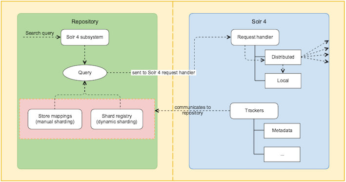
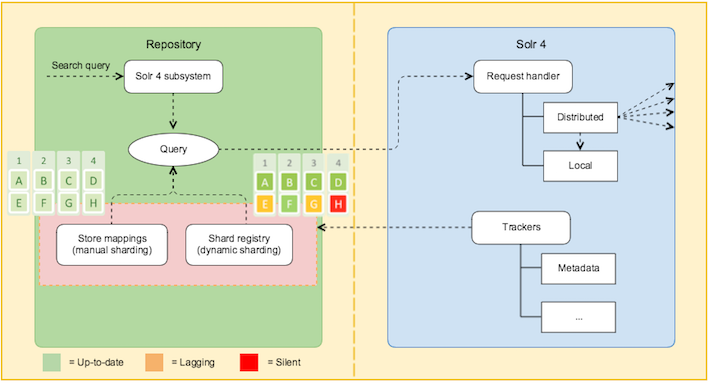
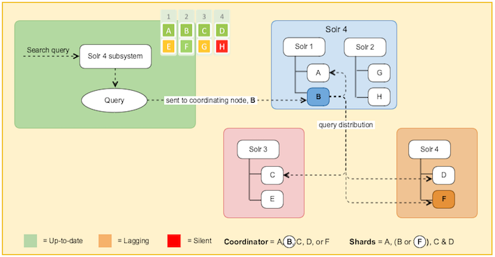

# Setting up Solr sharding

After creating the shards manually, an Alfresco Content Services administrator has to instruct Alfresco Content Services about how to find the indexes. This can either be done manually by configuring the indexes, or by allowing Alfresco Content Services to discover shards dynamically. This section describes how to create and configure Solr sharding.

As shown in the diagram below, the trackers communicate with the repository. When the user initiates a query, it can either be executed by manually mapping the stores \(explicit configuration\), or by shard registry via dynamic sharding. Dynamic sharding determines what best shards are available to answer a query. The shard registry stores all the information about that particular index, for example the status of the index, transactions in index, and so on.

The query is sent to Solr and then to the request handler. The request handler determines if the query is local or distributed. In case of distributed query, the query is sent to other parts of the index and then combined into an overall result.

The distributed query is done is two phases. Phase 1 involves query and an initial round of faceting, and Phase 2 involves pulling back information from each relevant document and facet refinement.

The following diagram shows the difference between manual and dynamic sharding. In this example, there are 4 shards \(1, 2, 3, and 4\) and 2 instances for each shard \(A & E, B & F, C & G, and D & H\). Instances A, B, C, D, and F are up-to-date, while the instances E and G are lagging behind and can't be used. Shard instance H is silent and therefore, unavailable for querying.

In manual sharding, the user is only aware of the existence of the shards and its instances but knows nothing about the status of each shard and its instance\(s\). So, the query can be sent to any instance. In dynamic sharding, Alfresco Content Services will use instance A, B, C, D, or F for querying.

At query time, Solr is aware of all the available nodes and selects one node as the coordinator \(one node from all the available green ones\) and sends the request to it. Also, the shards \(A, B, C, D or A, F, C, D\) to be used for that request are selected dynamically. In this case, Solr selects F instead of B. So, if one node lags behind or stops responding, Solr stops using it.

Click each method to know more about creating shards.

-   [Manual Solr sharding](../tasks/solr-hash-shard.md)
-   [Dynamic Solr sharding](dynamic-sharding.md)

-   **[Creating Solr shards manually](../tasks/solr-hash-shard.md)**  
You can create, configure, and register shards explicitly using ACL based hash sharding.
-   **[Dynamic shard registration](../concepts/dynamic-sharding.md)**  
In dynamic shard registration, shards register as a part of the tracking process to form indexes, thereby eliminating the need to follow the manual shard distribution pattern over Solr nodes.
-   **[Reindex documents by query](../concepts/reindex-query.md)**  
You can selectively reindex a small subset of the index based on a query. This enables a limited rebuild of the index.

**Parent topic:**[Solr sharding](../concepts/solr-shard-overview.md)

