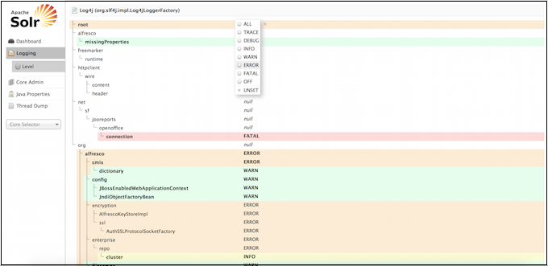
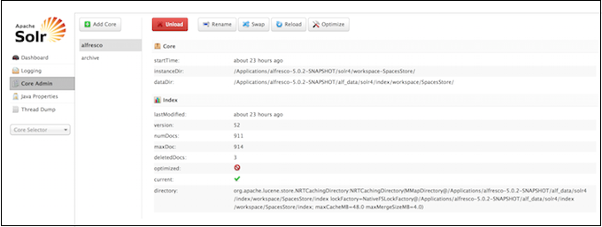
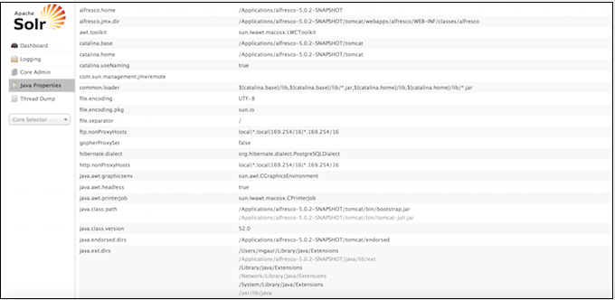
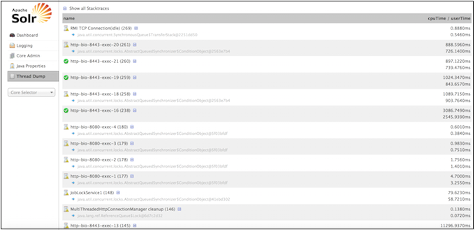

# Solr Admin UI - left panel

The left-side of the Solr Admin screen is a menu under the Solr logo that provides the navigation through the screens of the UI. The first set of links are for system-level information and configuration, and provide access to Logging, Core Admin and Java Properties, among other things.

After this information is a list of Solr cores configured for your Alfresco Content Services instance. Clicking on a core name shows a secondary menu of information and configuration options for that core specifically. Items in this list include the Schema, Config, Plugins, and an ability to perform queries on indexed data.

The different screens of the Solr Admin UI are described below:

**Logging**

The **Logging** page shows messages from Solr's log files.

Under **Logging**, when you select **Level**, you see the hierarchy of classpaths and classnames for your Level instance. A row highlighted in yellow indicates that the class has logging capabilities. Click on a highlighted row, and a menu will appear to allow you to change the log level for that class. Characters in bold indicate that the class will not be affected by level changes to root.

**Core Admin**

The **Core Admin** screen lets you manage your cores.

The buttons at the top of the screen enables you to add a new core, unload the core displayed, rename the currently displayed core, swap the existing core with one that you specify in a drop-down box, reload the current core, and optimize the current core.

The main display and available actions provide another way of working with your cores.

**Java Properties**

The **Java Properties** screen displays all the properties of the JVM running Solr, including the classpaths, file encodings, JVM memory settings, operating system, and more.

**Thread Dump**

The **Thread Dump** screen lets you inspect the currently active threads on your server.

Each thread is listed and access to the stacktraces is available where applicable. Icons to the left indicate the state of the thread. For example, threads with a green check-mark in a green circle are in a `RUNNABLE` state.

On the right of the thread name, click the down-arrow to see the stacktrace for that thread.

**Core-Specific Tools**

Click the **Core Selector** to display a list of Solr cores, with a search box that can be used to find a specific core.

When you select a core:

-   the central part of the screen shows Statistics and other information about the selected core.
-   a secondary menu opens under the core name with the administration options available for that particular core. The core-specific options are:

    |Options|Description|
    |-------|-----------|
    |Overview|This dashboard displays full statistics of the indexes. It shows the index count for each of the cores. It also provides a summary report and an FTS status report. The summary report displays information about the number of nodes in index, transactions in index, approximate transactions remaining, and so on. The FTS status report displays information about the FTS status clean, FTS status dirty, and FTS status new.|
    |Analysis|Allows data analysis according to the field, field type and dynamic rule configurations found in schema.xml.|
    |Dataimport|Displays information about the current status of the Data Import Handler. It enables you to import commands as defined by the options selected on the screen and defined in the configuration file.|
    |Documents|Provides a simple form allowing execution of various Solr indexing commands directly from the browser. The screen allows you to:    -   Copy documents in JSON, CSV or XML and submit them to the index
    -   Upload documents \(in JSON, CSV or XML\)
    -   Construct documents by selecting fields and field values
|
    |Files|Displays the current core configuration files such as solrconfig.xml and schema.xml. Configuration files cannot be edited with this screen, so a text editor must be used.|
    |Ping|Enables you to ping a named core and determine whether the core is active. The Ping option does not open a page, but the status of the request can be seen on the core overview page shown when clicking on a collection name. The length of time the request has taken is displayed next to the Ping option, in milliseconds.|
    |Plugins/Stats|Displays statistics for plugins and other installed components.|
    |Query|Enables you to submit a structured query about various elements of a core.|
    |Replication|Displays current replication status for the core and lets you enable/disable replication.|
    |Schema Browser|Displays schema data in a browser window.|

**Parent topic:**[Connecting to the SSL-protected Solr web application](../tasks/ssl-protect-solrwebapp.md)

