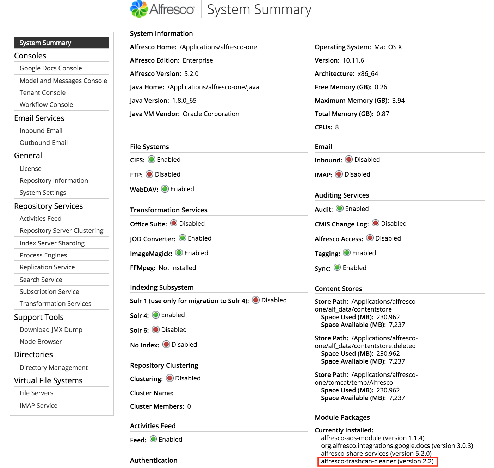

# Configuring the Trashcan Cleaner

The Trashcan Cleaner is a scheduled job that periodically purges old content from your Alfresco Content Services trashcan.

When content is deleted, the content store can be configured to move the deleted content into a trashcan. The deleted content can easily recovered from the trashcan, if it is deleted by mistake. The content remains in the trashcan until it is purged or cleaned by the Trashcan Cleaner. The Trashcan Cleaner is a scheduled job that will empty your Alfresco Content Services trashcan.

The Trashcan Cleaner is disabled by default. To configure the Trashcan Cleaner, set the following properties in the alfresco-global.properties file:

|Property|Description|Example|
|--------|-----------|-------|
|`trashcan-cleaner.cron`|Specifies the cron schedule for the Trashcan Cleaner job. See [Scheduled Jobs](../references/dev-extension-points-scheduled-jobs.md).|`0 30 * * * ?`|
|`trashcan-cleaner.keepPeriod`|Specifies the period for which trashcan items are kept \(in the `java.time.Duration` format\).|`P1D`|
|`trashcan-cleaner.deleteBatchCount`|Specifies the number of trashcan items to delete per job run.|`1000`|

For example, to configure the scheduled process to clean all the deleted items older than one day to a maximum of 1000 \(each execution\) each hour at the middle of the hour \(30 minutes\), add the following properties in the alfresco-global.properties file:

```
trashcan-cleaner.cron=0 30 * * * ?
trashcan-cleaner.keepPeriod=P1D
trashcan-cleaner.deleteBatchCount=1000
```

To enable debug logging, set the `log4j.logger.org.alfresco.trashcan` property in the log4j.properties file:

```
log4j.logger.org.alfresco.trashcan=debug
```

The trashcan cleaner is a [Simple Module](dev-extensions-packaging-techniques-jar-files.md) which appears in the Admin Console under the Module Packages section.

```
[http://localhost:8080/alfresco/s/enterprise/admin/admin-systemsummary](http://localhost:8080/alfresco/s/enterprise/admin/admin-systemsummary)
```



To disable the Trashcan Cleaner, add the following to the alfresco-global.properties file:

```
trashcan-cleaner.cron=* * * * * ? 2099
```

**Parent topic:**[Setting up content stores](../concepts/manage-cs-home.md)

