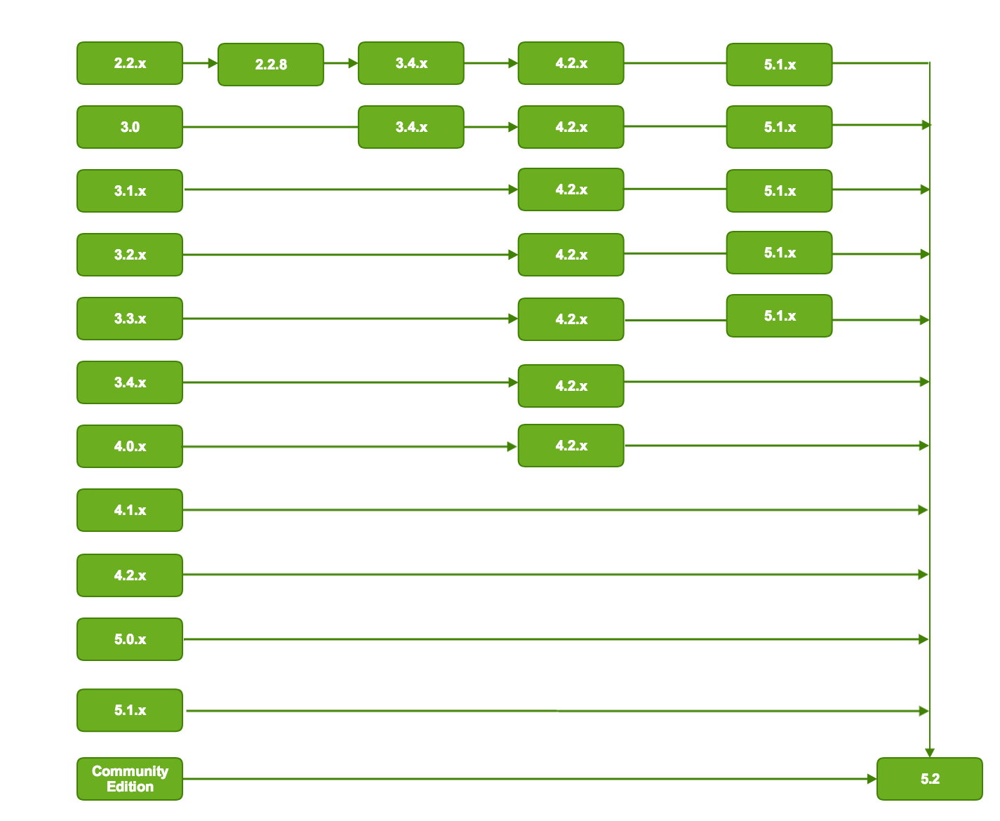

# Alfresco Content Services upgrade paths

When you upgrade Alfresco Content Services, it is recommended that you follow a structured upgrade path between versions.

The following diagram shows the upgrade paths for major versions:

The upgrade path recommendations are:

-   Direct upgrades to Alfresco Content Services 5.2.7 are supported from only 4.1.x and later, with the latest Service Pack applied.
-   See [Upgrading from Alfresco Community Edition](upgrade-community.md) for guidance on upgrades from Alfresco Community Edition.
-   Upgrades from Alfresco 4.x using Lucene require migration to Solr 1.4 before being able to upgrade to Alfresco 5.0 with Solr 1.4. Once Alfresco 5.0 and Solr 1.4 are running, then migration to 5.0 with Solr 4 will complete the upgrade. See [Upgrading search subsystems](search-migration.md) for more information.
-   Upgrades from Alfresco 3.x require the latest service pack of version 4.x before upgrading to version 5.1, and then upgrading to 5.2.7.
-   Upgrades from Alfresco 2.2.x require the service pack 2.2.8 to be applied first, followed by the latest service pack of version 3.4.x, and then the latest service pack of version 4.x before being able to upgrade to 5.0.

**Note:** If you are upgrading from an earlier release that is not shown on this diagram, contact Alfresco Support for assistance.

**Parent topic:**[Upgrading](../concepts/ch-upgrade.md)

