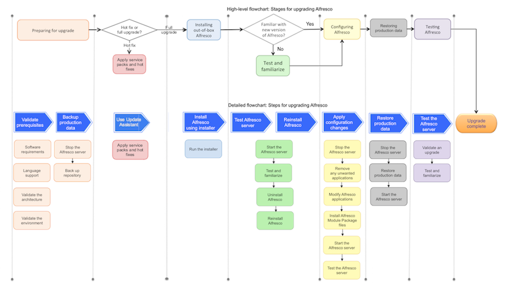

# Upgrading on a single instance

Use this information to upgrade a single instance of Alfresco Content Services.

The main stages involved in upgrading and configuring are shown in the diagram. These include preparing your system for upgrade, installing as an out-of-box application, configuring it based on your requirements, restoring production data, and finally, testing and getting familiar with Alfresco Content Services.

Each of these main stages consist of sub-steps, as shown in the diagram, which displays the sub-steps that need to be performed in order to complete each main stage.

**Note:** Note that the steps shown in the diagrams have a colour code. For example, Restoring production data stage consists of three sub-steps: Stop the Alfresco Content Services server, restore production data, and start the server.

**Note:** We recommend that you upgrade in a test environment before you upgrade it in your production environment. This allows you to address any problems during the upgrade process more effectively. You can also verify that applications and scripts work properly before upgrading your production environment. In addition, you can assess the time that it takes to upgrade the database, to finalize your upgrade plan.

To get started quickly with upgrading a single instance, follow the process shown.

**Parent topic:**[Upgrade guide](../concepts/quick-upgrade.md)

