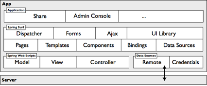

# Web application framework

Alfresco Share and all new web applications are built on Surf. This web application framework provides the typical features of this kind of framework and supports web content management needs.

At the heart of Surf is a site assembly framework that bundles a full site construction object model and toolkit for building websites and applications.

Its features include:

-   A Site Dispatcher to create pages easily, link them to the overall navigation of a website, and build pages in a way that promotes reusability.
-   Templates for defining a page layout once and then reusing it across a large set of pages. You can develop pages using FreeMarker, JSP, HTML, or Java.
-   A UI Library containing reusable UI components comprising back-end application logic and front-end presentation code that can be bound into regions \(or slots\) within a page or template.
-   Pages that you can render in multiple formats, such as print, PDF, or mobile device.
-   AJAX support for integration with the Yahoo! User Interface \(YUI\) library.
-   Forms in a rich forms engine for rendering and collecting data.

Surf embeds Spring web scripts, allowing developers to use the same techniques that were used when building content application server RESTful APIs. Often, a Surf website requires access to and management of content held within the application content server, such as to support user-generated content, dynamic site artifacts, personalized presentation, and tagging. To support this, Surf provides the following integration services:

-   Remote: encapsulates any number of data sources with out-of-the-box support for the content application server
-   Credentials: manages user authentication with out-of-the-box support for the content application server

With the CMIS client API, Surf provides an open stack for implementing web-based, content-enabled applications.

Alfresco Content Services 5.2.7 includes the UI framework built on Surf, [Aikau](aikau-intro.md). Aikau provides a modern, higher-level approach to developing custom UI applications, and features a simplified method for creating pages and widgets. New pages with standard widgets can be created through JSON code, and then extended as required using JavaScript.

**Parent topic:**[Alfresco Content Services architecture overview](../concepts/alfresco-arch-about.md)

**Related information**  

[Working with the Surf framework](surf-fwork-intro.md)

